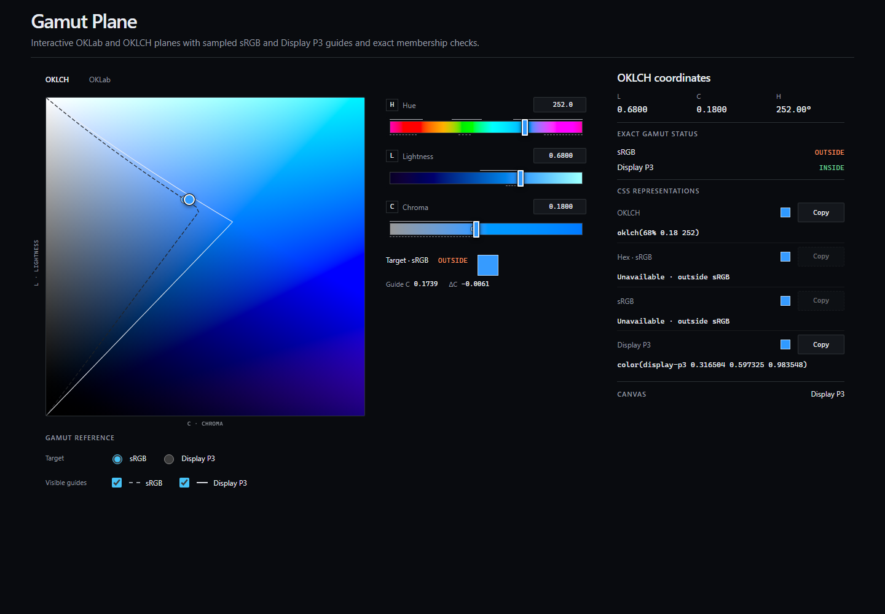

# Gamut Plane



**Status:** v0.1.0 release candidate on `dev`, awaiting final release review and deployment.

**Live demo:** The production link will be placed here after the reviewed Cloudflare Pages deployment.

**Planes:** OKLCH lightness/chroma and OKLab `a`/`b`.

**Gamuts:** sRGB and Display P3.

## Overview

Gamut Plane is a standalone technical instrument for inspecting and editing one canonical color through two perceptual coordinate planes. It shows precise sRGB and Display P3 membership next to deterministic boundary contours, so crossing a boundary remains visible without clamping or rewriting the authored color.

The boundaries matter because a color may fit Display P3 while falling outside sRGB. Gamut Plane keeps that distinction explicit: exact membership and serialization come from direct color conversion, while the contours explain where the current plane crosses each display gamut.

Both coordinate views are working instruments. OKLCH edits lightness and chroma at a fixed hue; OKLab edits `a` and `b` at a fixed OKLab lightness while preserving one canonical OKLCH authority.

## Live demo

The public URL is intentionally unset until the v0.1.0 production deployment has passed release review. The final release procedure adds the deployed URL here and to the GitHub repository homepage; it does not hardcode an unverified canonical address.

## Capabilities

- Edit OKLCH lightness and chroma at a fixed hue.
- Edit OKLab `a` and `b` at a fixed OKLab lightness.
- Inspect exact Display P3 and sRGB membership for the active color.
- Compare solid Display P3 and dashed sRGB boundary contours without clamping the color.
- Inspect the nearest sRGB boundary projection as a separate guide.
- Copy CSS Color 4 output only when the active color is inside the requested gamut.
- Operate both planes with pointer or complete keyboard input.
- Keep boundary visibility as view state rather than output policy.
- Render at the browser's actual device pixel ratio and adapt to element resizing.

## Exact facts versus sampled geometry

Gamut Plane deliberately separates three concepts that color tools often collapse:

1. the canonical authored color;
2. the editable plane's geometric domain;
3. an RGB display gamut.

Exact inside/outside facts use direct linear-light conversion in `@gamut-plane/core`. Boundary contours, ticks, valid intervals, and the sRGB boundary projection interpolate checked-in `Float32Array` tables. Those sampled guides are deterministic visualization, not membership tests. The circular OKLab editing domain is likewise an instrument constraint, not an RGB gamut.

## Rendering architecture

`@gamut-plane/core` contains framework-neutral OKLab and OKLCH conversion, gamut, serialization, parsing, and picker-plane contracts. The Vue application owns Canvas 2D rendering, SVG annotations, interaction, responsive layout, clipboard behavior, and generated visualization tables. Dependency direction is one-way: the app depends on core.

The renderer remains in `apps/web`. There is no extracted renderer package, WebGL/WebGPU layer, worker protocol, or plugin abstraction in v0.1.0.

## Performance

The instrument remains responsive by separating field invalidation from marker movement:

- pointer movement keeps the latest point and schedules at most one pending animation frame;
- same-plane visible-axis edits move annotations without rebuilding the field or contours;
- fixed-axis, size, device-pixel-ratio, plane, or Canvas color-space changes invalidate the field;
- the OKLab field uses one reusable 80 × 80 offscreen buffer with 24 color samples per row;
- generated boundary data and mutable drawing scratch values are reused.

These are workload-shape contracts, not universal frame-time guarantees. Reproducible measurement guidance and contextual observations are maintained in [Performance](docs/performance.md).

## Repository structure

- `packages/core` — framework-independent color types, conversion, gamut math, parsing, serialization, picker-plane contracts, and boundary analysis.
- `apps/web` — the Vue/Vite instrument, Canvas 2D renderer, controls, generated visualization tables, production assets, and browser tests.
- `docs` — architecture, deployment, testing, release, provenance, performance constraints, and accepted decisions.

`@gamut-plane/core` has a deliberately narrow barrel. It does not import Vue, browser APIs, app state, or generated web assets.

## Development

Requirements:

- Node.js 24 or newer
- pnpm 11.9.0

```powershell
pnpm install --frozen-lockfile
pnpm dev
```

The development server prints its local URL. The application has no backend, account, persistence, analytics, telemetry, or runtime network dependency.

Regenerate the deterministic gamut tables only after an intentional algorithm or setting change:

```powershell
pnpm --filter @gamut-plane/web generate:gamut-tables
```

Regenerate the reviewed README screenshot and 1200 × 630 Open Graph image with the pinned Chromium:

```powershell
pnpm generate:release-assets
```

See [Testing](docs/testing.md) for the visual-snapshot and release-asset policy.

## Validation

```powershell
pnpm format:check
pnpm lint
pnpm typecheck
pnpm test
pnpm check:gamut-tables
pnpm build
pnpm check:build
pnpm test:e2e
pnpm test:production
pnpm audit --prod
```

The browser suite covers semantics, accessibility, pointer and keyboard interaction, responsive geometry, 200% text, Canvas capability reporting, and platform-specific visual references. `test:production` serves the built artifact with the checked-in Cloudflare Pages header rules rather than relying on Vite development mode.

## Browser support

Gamut Plane targets current browsers with Canvas 2D, Pointer Events, SVG, and CSS Color 4 parsing/rendering. It requests a Display P3 Canvas 2D context and reports whether the browser grants Display P3, falls back to sRGB, or makes Canvas unavailable. That capability affects painted preview colors only; exact gamut facts remain mathematical.

CI validates the pinned Playwright Chromium on Linux. Windows Chromium references remain reviewed separately because browser rasterization and system fonts differ by platform.

## Provenance

Gamut Plane is a clean-room standalone extraction with a filtered provenance baseline preserved on `main`. The `dev` branch contains the standalone instrument and release candidate. Historical provenance is documented without recreating excluded product contracts or rewriting author metadata.

See [Architecture](docs/architecture.md), [Provenance](docs/provenance.md), and [Release](docs/release.md) for the maintained boundaries and controlled promotion procedure.

## License

Copyright © 2026 Maikel Eckelboom. Released under the [MIT License](LICENSE). Runtime and development-tool notices are maintained in [Third-Party Notices](THIRD_PARTY_NOTICES.md).
