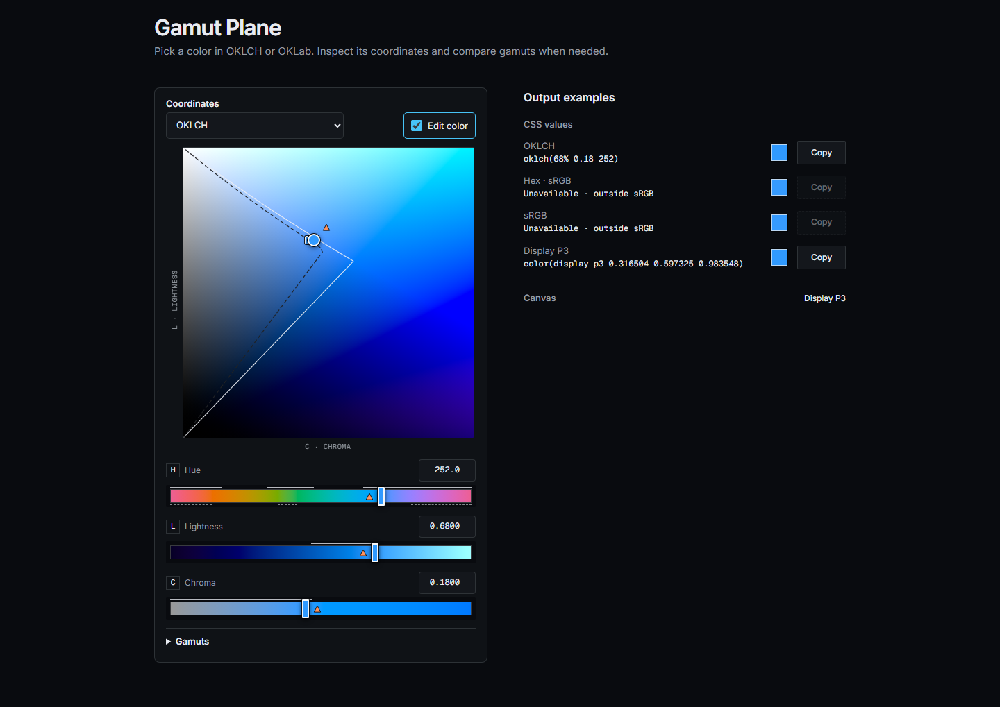

# Gamut Plane

Gamut Plane provides one compact color instrument in native Vue and React. Pick in OKLCH or OKLab, or inspect OKLCH, OKLab, sRGB, and Display P3 coordinates without changing the authored `ColorValue`. Exact gamut checks and sampled boundaries are independent requests behind a small disclosure. The standalone Vue app hosts the same instrument beside CSS output examples.

**Live demo:** [gamut-plane.eckelboommaikel.workers.dev](https://gamut-plane.eckelboommaikel.workers.dev)

The selected `ColorValue` retains its defining representation. Changing the selected representation or editor observes that value; an edit creates a new `ColorValue` authored in the selected editor:

- **OKLCH:** lightness and chroma at a fixed hue.
- **OKLab:** `a` and `b` at a fixed lightness.

Alpha and ordinary out-of-gamut coordinates are preserved. `analyzeGamut` reports exact `inside`, `within-tolerance` or `outside` status independently of the sampled guides. Editing never silently maps into a display gamut; `mapToGamut` is explicit. Strict CSS and Hex output use explicit `serializeCss` and `serializeHex` policies and can reject a value.



The source is public under the MIT license. All workspace packages are private and **not published to npm**. Both adapters provide controlled color, numeric editing, requested gamut guides, and normal SSR/hydration.

## Run the app

Use Node.js 24+ and pnpm 11.9.0, as specified in `package.json`:

```powershell
git clone --branch dev https://github.com/maikeleckelboom/gamut-plane.git
cd gamut-plane
pnpm install --frozen-lockfile
pnpm dev
```

Open the URL printed by Vite. The app runs entirely in the browser, with no backend, account, persistence, telemetry, or runtime network dependency.

`pnpm dev` performs an initial package build before starting the app. After changing reusable package code, run `pnpm build:packages` to refresh the full core/render/UI/adapter build and copied stylesheet output. Individual package watchers can help with narrow work, but there is currently no authoritative all-package watcher that reproduces the complete shared UI, stylesheet-copy and adapter build pipeline.

## Use the Vue component

After [installing the local packages](#install-local-packages), import the component and its stylesheet:

```vue
<script setup lang="ts">
import { ref } from "vue";
import { createColorValue } from "@gamut-plane/core";
import { GamutPlane, type ColorValue, type GamutPlaneState } from "@gamut-plane/vue";
import "@gamut-plane/vue/style.css";

const initial = createColorValue({ space: "oklch", channels: [0.68, 0.18, 252], alpha: 1 });
if (!initial.ok) throw new Error("Invalid initial color");
const color = ref<ColorValue>(initial.value);
const state = ref<GamutPlaneState>({
  selection: { representationId: "oklch", editorId: "oklch-lc" },
  checkedGamuts: ["display-p3-gamut", "srgb-gamut"],
  referenceGamutId: "srgb-gamut",
  visibleGuides: ["display-p3-boundary", "srgb-boundary"],
});
</script>

<template>
  <GamutPlane v-model="color" v-model:state="state" />
</template>
```

Vue 3.5+ is required. The component includes its controls, renderer, styles, and gamut tables. It inherits the host font, remains at most 480px wide, and adapts to narrower hosts. Import the stylesheet once; use `--gamut-plane-accent` to customize focus and selection emphasis.

Without an explicit state, the instrument starts in the OKLCH editor with both exact statuses and sampled boundaries requested, with sRGB as Reference. `v-model:state` gives the parent ownership; `defaultState` initializes local ownership. Either boundary can be hidden independently of exact checks. Edit events, Canvas capability reporting, and the `field-legend` slot are documented in the [Vue package README](packages/vue/README.md).

## Use the React component

```tsx
import { useState } from "react";
import { createColorValue } from "@gamut-plane/core";
import { GamutPlane, type ColorValue, type GamutPlaneState } from "@gamut-plane/react";
import "@gamut-plane/react/style.css";

export function ColorEditor() {
  const [color, setColor] = useState<ColorValue>(() => {
    const initial = createColorValue({ space: "oklch", channels: [0.68, 0.18, 252], alpha: 1 });
    if (!initial.ok) throw new Error("Invalid initial color");
    return initial.value;
  });
  const [state, setState] = useState<GamutPlaneState>({
    selection: { representationId: "oklab", editorId: "oklab-ab" },
    checkedGamuts: ["display-p3-gamut", "srgb-gamut"],
    referenceGamutId: "srgb-gamut",
    visibleGuides: ["display-p3-boundary", "srgb-boundary"],
  });
  return (
    <GamutPlane value={color} onValueChange={setColor} state={state} onStateChange={setState} />
  );
}
```

React / React DOM 19.3.x are the pinned peer policy. Color is controlled-only; instrument state can be controlled with `state` / `onStateChange` or initialized with `defaultState`. The [React API](packages/react/README.md) documents native section props/ref, `legend`, callback ordering, CSS and Next usage. The [parity map](docs/react-parity.md) connects product contracts to tests.

### Install local packages

From this checkout, build and pack the Vue adapter and its private dependencies into a temporary directory:

```powershell
$artifacts = Join-Path $env:TEMP "gamut-plane-artifacts"
New-Item -ItemType Directory -Force -Path $artifacts
pnpm build:packages
pnpm --filter @gamut-plane/core pack --pack-destination $artifacts --json
pnpm --filter @gamut-plane/render pack --pack-destination $artifacts --json
pnpm --filter @gamut-plane/ui pack --pack-destination $artifacts --json
pnpm --filter @gamut-plane/vue pack --pack-destination $artifacts --json
```

Use the filenames returned by `pnpm pack --json` and copy the tarballs into an `artifacts` directory in your Vue application. With the 0.2.0 private package artifacts, add this override to that application's `pnpm-workspace.yaml`, merging it with any existing overrides:

```yaml
overrides:
  "@gamut-plane/core": "file:./artifacts/gamut-plane-core-0.2.0.tgz"
  "@gamut-plane/render": "file:./artifacts/gamut-plane-render-0.2.0.tgz"
  "@gamut-plane/ui": "file:./artifacts/gamut-plane-ui-0.2.0.tgz"
```

Then install them from the application root:

```powershell
pnpm add ./artifacts/gamut-plane-core-0.2.0.tgz ./artifacts/gamut-plane-render-0.2.0.tgz ./artifacts/gamut-plane-ui-0.2.0.tgz ./artifacts/gamut-plane-vue-0.2.0.tgz
```

The overrides resolve all unpublished transitive dependencies from their local artifacts. UI is an internal dependency; application code imports only its adapter and adapter `style.css`. `pnpm test:package` exercises this installation in an isolated Vue consumer. For React, pack/install `@gamut-plane/react` instead of Vue, keeping the three dependency tarballs and overrides. `pnpm test:react-vite` verifies ordinary React consumption; `pnpm test:next` verifies Next App Router and root Strict Mode. These checks do not verify registry installation. For framework-independent color math, see [the core package](packages/core/README.md).

Reference is independent semantic focus on sRGB, Display P3, or `null`. It enables neither Status nor Boundary. A requested boundary can supply one sampled Reference swatch and connector for a boundary excursion when its endpoint fits the current editor geometry. Accepted exact Inside or Within tolerance suppresses that spatial feedback; with Status disabled, only the sampled excursion controls it. Only an accepted exact `outside` result for the explicitly checked Reference gamut produces a warning. The Gamuts disclosure groups Status, Boundary, Reference and requested exact results by gamut, with a No Reference radio option. The Coordinates selector only changes how the same authored color is observed.

## Color and editing behavior

When requested, the solid contour shows Display P3 and the dashed contour shows sRGB. Contours and channel intervals interpolate generated tables. `analyzeGamut(ColorValue)` supplies exact `inside`, `within-tolerance` or `outside` status independently of those guides. Check and guide requests can each be empty, single, or both and never mutate the authored color. Strict CSS and Hex output may reject a value within boundary tolerance. Mapping is available only through explicit `mapToGamut`.

The field's chroma limit and OKLab disc radius are both 0.4. These define the editing geometry, not either display gamut. The OKLCH chroma number field can exceed the slider range. Colors outside the visible geometry keep their values, with the marker projected to the edge.

Drag the plane or use arrow keys. Shift increases the step; Home and End move to horizontal limits. Numeric fields apply a draft on Enter or blur and discard it on Escape. Escape during a plane drag restores its starting color. Edits preserve alpha and unedited channels. See [the interaction contract](docs/architecture.md#interaction-lifecycle) for cancellation and parent-update behavior.

The standalone app's output examples copy full-precision OKLCH and `color()` values, plus quantized 8-bit sRGB Hex. Hex and sRGB CSS copy are available only inside sRGB; clipboard failures do not show success.

## Browser and rendering limits

- Canvas 2D may grant Display P3, fall back to sRGB, or be unavailable. The component reports the granted context. Visible wide-gamut color also depends on the display; exact gamut status does not.
- Modern CSS color support is required. Without container queries, the component keeps its one-column layout.
- Pointer updates are coalesced per frame. Visible-axis edits reuse the field and contours; fixed-axis edits redraw them. Hue dragging uses a lower-resolution preview. See [performance measurements and limits](docs/performance.md).
- The normal ESM entry supports SSR and hydration. Controls, authored values, markers, SVG gamut guides and CSS field geometry render on the server; Canvas painting starts after mount. `pnpm test:nuxt` verifies the packed package in Nuxt development, production SSR and generated pages. See [Vue SSR usage](packages/vue/README.md#ssr-and-nuxt).
- Browser automation uses pinned Chromium with Windows and Linux visual references. Other engines, physical devices, and manual assistive-technology use have not been verified.

## Repository guide

| Location          | Contents                                                                                                                                                           |
| ----------------- | ------------------------------------------------------------------------------------------------------------------------------------------------------------------ |
| `packages/core`   | Authored color/domain truth, exact gamut analysis, mapping, serialization, and plane/domain math                                                                   |
| `packages/render` | Canvas renderer, sampled visualization data, and shared presentation/geometry algorithms                                                                           |
| `packages/ui`     | Private shared instrument anatomy, canonical stylesheet, glyph geometry, and framework-neutral interaction policies                                                |
| `packages/vue`    | Vue native markup/component API, reactivity/lifecycle, adapter geometry/presentation, VueUse environment integration, and Canvas resource hookup                   |
| `packages/react`  | React native markup/component API, committed lifecycle, adapter geometry/presentation, Canvas/environment resource integration, and packed React/Next verification |
| `apps/web`        | Standalone host, CSS output examples, clipboard UI, and deployment assets                                                                                          |

[Architecture](docs/architecture.md) explains package boundaries and interaction contracts. [Testing](docs/testing.md) covers local checks, browser setup, snapshots, and packed consumption. The [release runbook](docs/release.md) contains the full clean-checkout gate and promotion sequence; [deployment](docs/deployment.md) covers Cloudflare Workers Static Assets and Workers Builds.

Copyright © 2026 Maikel Eckelboom. [MIT License](LICENSE). See [Provenance](docs/provenance.md) and [Third-Party Notices](THIRD_PARTY_NOTICES.md).
