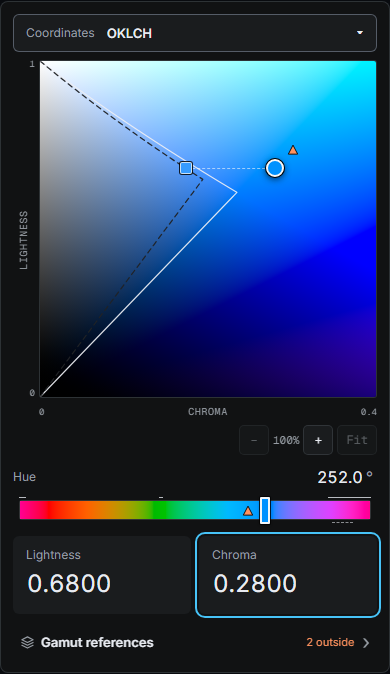
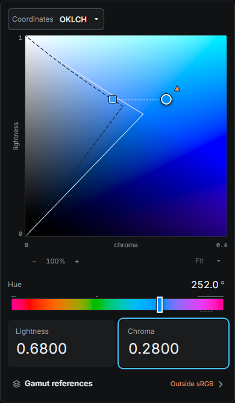

# Phase 2P: Instrument chrome and navigation

## Design and behavior contract

Phase 2P.1–2P.3 form one integrated refinement of the accepted compact instrument. The 480px maximum, dominant scientific field, one geometry-aware fixed-axis rail, two numeric cards, independent comparison requests and single authored ColorValue remain authoritative. Phase 2O's camera and empirical guide contract are retained.

### Coordinates

The compact closed selector aligns with instrument controls. Its listbox contains named Perceptual and RGB groups: OKLCH / L · C · H, OKLab / L · a · b, sRGB / R · G · B and Display P3 / R · G · B. A quiet selected indicator is distinct from the keyboard candidate. Requested exact RGB statuses remain passive badges; unchecked gamuts have none. Area remains a separate selector.

The existing shared selector controller owns arrows, Home/End, typeahead, activation, accepted/rejected reconciliation, focus, Escape and light dismissal. Adapters render named role=group containers and native select-only combobox markup. Group headings are not navigation stops. No second popup lifecycle is introduced.

### Warnings and native boundaries

The rail has no warning triangle or thumb annotation. Its range, intervals, overflow and numeric semantics stay intact, including accessible descriptions of selected Reference Outside status. The selected point retains its spatial warning. Exact text belongs to Gamut references, with detailed status beside each gamut in the popup; open disclosure avoids repeating its closed exceptional cue.

Render presentation suppresses the selected RGB editor's own gamut contour and hit path, across all three Areas and all fixed coordinates (including successful empty and degenerate slices). Suppression does not remove a request, change analysis, intervals or Reference geometry, or imply Paused/Unavailable. Other requested contours remain available. Neither contour visibility nor fitting infers exact membership.

### Field toolbar and axes

A quiet toolbar occupies a dedicated row immediately below the axis gutter, outside editable coordinates. Zoom out, tabular percentage and zoom in form one group; directly accessible Fit and an adjacent compact framing disclosure form the other. Buttons have restrained surfaces, consistent targets and visible keyboard focus. Axis names and endpoints remain in their physical gutters; the vertical name centers on the actual square, not the square plus lower chrome. Enlarged text increases gutter allocation rather than covering color data.

### Fit to Reference Boundary

The framing disclosure names the selected Reference and offers **Fit to Reference Boundary**. Ineligibility is explicit: no Reference, Boundary not requested, no renderable field/contour, redundant native self-boundary, or no visible contour in the nominal domain. Activation never falls back to ordinary Fit. It remains independent of whether exact Status is requested or Outside.

Render computes bounds from genuine resolved contour segments and points, including a closed contour's closing segment. It clips to the nominal enclosing unit square, and to the nominal disc for OKLab; it does not add domain edges or inspect raster pixels. Current viewport crop and authored marker location are not inputs. Open, clipped, point and line contours retain their geometry; empty and nonfinite geometry cannot fit.

The square camera targets 10% padding on each side of the larger bounds extent. Its existing 1x–8x zoom and center constraints provide the closest valid fit when padding is impossible. Zero or small extents cap at 8x, with finite constrained centers. A domain-spanning boundary resolves to ordinary 1x through the same constraints. The pose enters the existing camera's show port, under the same gesture ownership guard as other toolbar commands, replacing unpresented requests and presenting all layers coherently. There is no serialized camera state or second viewport system.

Fitting changes no ColorValue, selection, exact requests, visible-guide requests, Reference or mapping state. A panned-away contour is discoverable. Accepted semantic changes refresh eligibility without refitting automatically. Geometry changes retain Phase 2O's reset behavior.

### Accessibility and parity

Both adapters share metadata, copy, selector/popup/input policy, render geometry and the canonical stylesheet. Framework-native mounted/committed lifecycles remain authoritative. SSR renders Fit and closed popup markup; client mounting creates no DOM at import time. Unavailable fitting remains discoverable with a focusable aria-disabled action and adjacent reason. Popups share the existing single-owner registry and reentrancy-safe native lifecycle, including nested host popovers. Pointer gestures block popup/camera commands. Keyboard and native numeric behavior are preserved.

## Validation plan

Owner tests cover selector groups and exact badges, native self-suppression versus retained intervals/requests, segment clipping (square/disc, open/closed, tangent, line/point, empty/unavailable) and constrained poses. Shared adapter contracts cover parity, accepted/rejected selection, viewport-only fitting, semantic refresh and lifecycle. Browser checks cover native suppression, grouped navigation, popup replacement/dismissal, fit eligibility and no color/state mutation. Real captures cover 320/375/390/480px, all representations, multiple Areas, Inside/Outside, overflow, focus and enlarged text. Intentional Windows/Linux baselines are reviewed before replacement. Exit gates include verify:prepush, both browser aggregates, production, installed Vue/React Vite, Nuxt and Next hydration/production checks and exact-commit CI.

## Implementation

| Owner           | Changed contracts and primary files                                                                                                                                                                                                                                                                                                                                                                 |
| --------------- | --------------------------------------------------------------------------------------------------------------------------------------------------------------------------------------------------------------------------------------------------------------------------------------------------------------------------------------------------------------------------------------------------- |
| Render          | `current/nativeBoundary.ts` and `generalizedDisplay.ts` suppress only native self-contour presentation. `current/referenceBoundaryFit.ts` resolves eligibility; `viewport/boundaryFit.ts` bounds clipped resolved geometry. These remain sibling-package internal entries.                                                                                                                          |
| UI              | `selectionShell.ts` supplies grouping and notation without changing controller order. `viewportCopy.ts` supplies explicit fit reasons. Existing selector and disclosure controllers clamp the actual popup border box; `gamutInteraction.ts` also supports the small framing disclosure. `viewportInteraction.ts` exposes its existing guarded show route. `style.css` owns all anatomy and layout. |
| Vue / React     | Native `Selector`, `ColorChannelControl`, `ColorPlane` and `FieldFraming` components consume those contracts. Main adapters derive eligibility and omit self-suppression from Paused feedback. The shared Reference test contract checks viewport-only behavior in both frameworks.                                                                                                                 |
| Web / consumers | `instrumentChrome.spec.ts` covers the integrated experience. Existing visual, Reference and RGB contracts reflect intentional presentation changes. Packed Vite and Next/Nuxt fixtures exercise installed grouping, suppression, framing and hydration. `scripts/packedConsumer.mts` proves the revised internal inventories and geometry with no DOM declarations.                                 |

The axis layout uses separate square, axis, toolbar and capability-legend rows. A 28px minimum vertical gutter reserves signed zoomed endpoint labels under both platform font inventories. The sRGB Canvas fallback legend occupies its own row below the toolbar. Neither change adjusts mathematical projection. Popup replacement tests use exposed pointer targets; the shell-only fixture is enlarged within that matrix so a disclosure cannot cover its entire field. Every directed replacement and console diagnostic assertion remains.

Public color/state APIs, core science, sampling, dependencies, camera constraints and serialized state are unchanged. There is no visible Inspect mode, extra slider, automatic mapping or deployment.

## Visual evidence

These are real standalone-app captures at the same allocated 390px width and authored OKLCH coordinates (L 0.68, C 0.28, H 252), with sRGB selected as Reference. The before capture comes from the starting dev tree after the accepted compact redesign and popover lifecycle fix. The after capture uses the final Phase 2P layout.

| Before                                                                                  | After                                                                                                 |
| --------------------------------------------------------------------------------------- | ----------------------------------------------------------------------------------------------------- |
|  |  |

Real viewport captures were also inspected at 320, 375, 390 and 480px for OKLCH, OKLab, sRGB and Display P3; all six RGB Areas at 390px; inside/outside and extended values; selector and references popups; keyboard focus; small-boundary fitting; and 200% text. The instrument had no horizontal overflow in that capture matrix. Intentional app and packed React references were reviewed on Windows and Linux without changing screenshot thresholds. The repository retains 60 visual references.

## Local validation record

Validation ran on 8–9 October 2026 with Node.js 24.16.0, pnpm 11.9.0 and Playwright 1.61.1 Chromium. Linux used Noble with the DejaVu font inventory required by the existing visual contract. All 448 hashed runtime and verification inputs matched between Windows and Linux, after normalizing text line endings.

| Gate                           | Windows                                                                                                         | Linux                                                            |
| ------------------------------ | --------------------------------------------------------------------------------------------------------------- | ---------------------------------------------------------------- |
| `verify:prepush`               | Passed: formatting, lint, builds, typechecks, 1,062 unit/component/app tests and production artifact inspection | Browser/consumer runtime packages built from the matching inputs |
| Full product browser aggregate | 184 passed                                                                                                      | 184 passed                                                       |
| Served production smoke checks | 2 passed                                                                                                        | 2 passed                                                         |
| Fresh packed Vue / Vite        | 4 passed; installed declarations, graph and browser-free SSR/import checks passed                               | Same                                                             |
| Fresh packed React / Vite      | 8 passed; installed declarations, graph and browser-free SSR/import checks passed                               | Same                                                             |
| Fresh packed Nuxt              | Development 8, production SSR 8, generated 6 passed; 2 intentional generated skips                              | Same                                                             |
| Fresh packed Next              | Development 8, production 8, root Strict Mode 10 passed                                                         | Development 8, production 8, root Strict Mode 10 passed          |

Core no-DOM typechecking and packed-domain checks also passed. The new render tests include square/disc segment clipping, genuine closing edges, tangent/line/point geometry, off-domain/empty geometry, large constrained fits, nonfinite input and arithmetic collapse. Native presentation tests cover every RGB Area at fixed coordinates −0.1, 0, 0.5, 1 and 1.1, retaining requests and rail intervals. Product browser tests additionally exercise a panned-away small contour, exact-check independence, absent/unrequested/self/empty eligibility, nested host popovers and unchanged ColorValue/state/events.

An earlier Linux aggregate had two signed-label containment failures; the gutter correction passed the exact failed checks before the final complete aggregates above. The initial packed React popup matrix had a covered field-center target; selecting an exposed corner corrected that test's physical setup. These failures were investigated, not classified as flakes. Earlier evidence remains in the local artifact folder.

Nuxt's generated skips are existing explicit exclusions for request-time query state and independent-request isolation, which static build-time documents cannot supply. Both cases passed on development and production SSR servers. Browser diagnostics found no reentrant native popover warnings or hydration errors in the passing flows.

Local logs, captures, candidate review sheets and input manifests are retained in `.artifacts/phase-2p/`, including `verify-prepush-final.log`, `windows-e2e-final.log`, `linux-e2e-final.log`, platform production/consumer logs, `runtime-inputs.json`, `runtime-parity.json` and `review/metrics.json`. Remote CI is checked against the single pushed commit and reported separately; this local record does not substitute for that result.

## Limits

Framing uses the accepted sampled contour, with Phase 2O's existing empirical visual contract; it makes no new exact membership or continuous-topology claim. The existing 1x–8x and nominal-square camera constraints can limit padding, especially at edges and for point geometry. Arithmetic collapse produces an explicit unavailable result rather than a fabricated fit. Browser evidence covers the repository's Chromium targets on Windows/Linux; manual screen-reader and other-browser testing was not performed.
