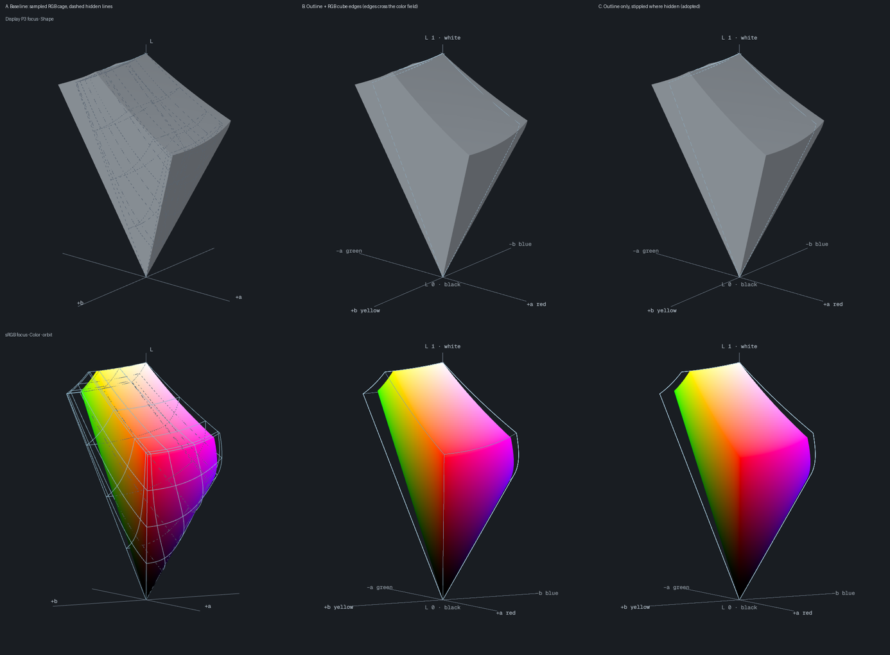
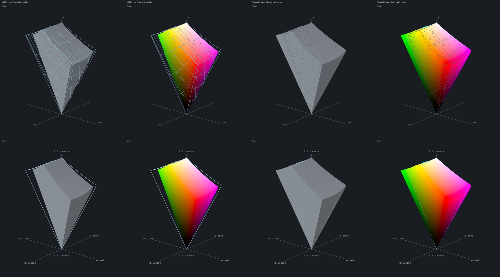
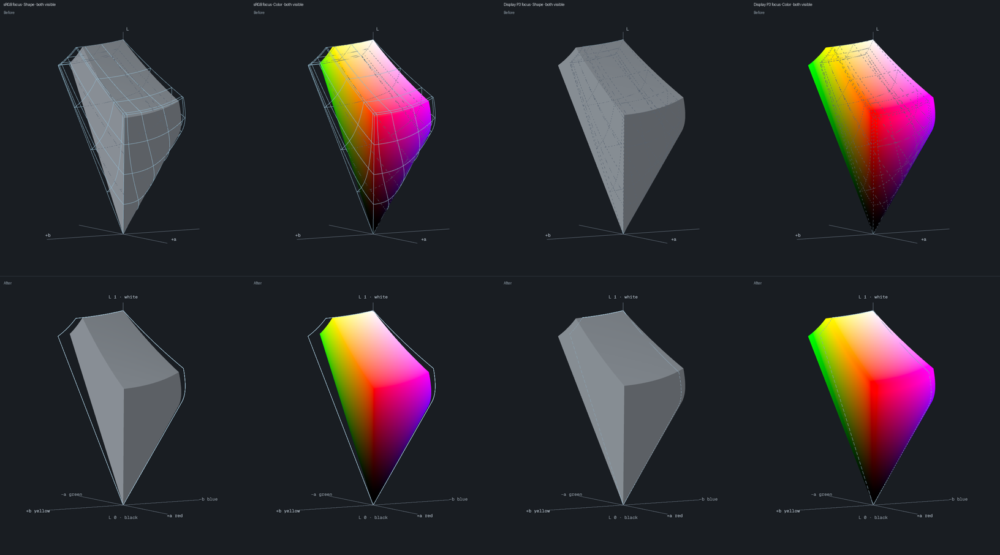
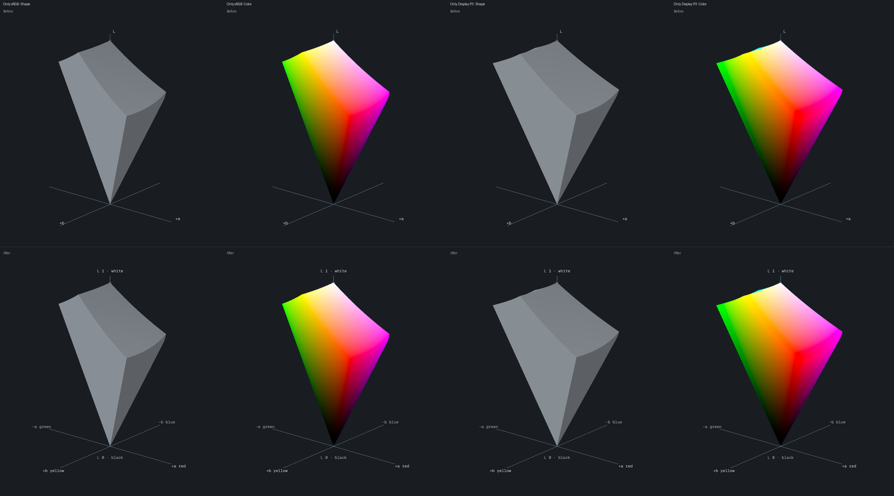
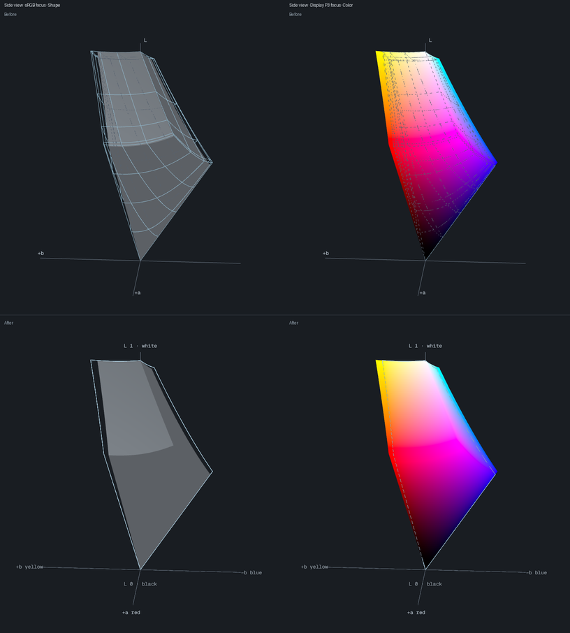
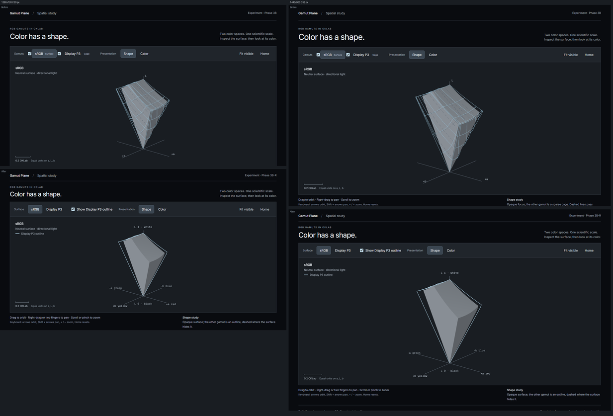
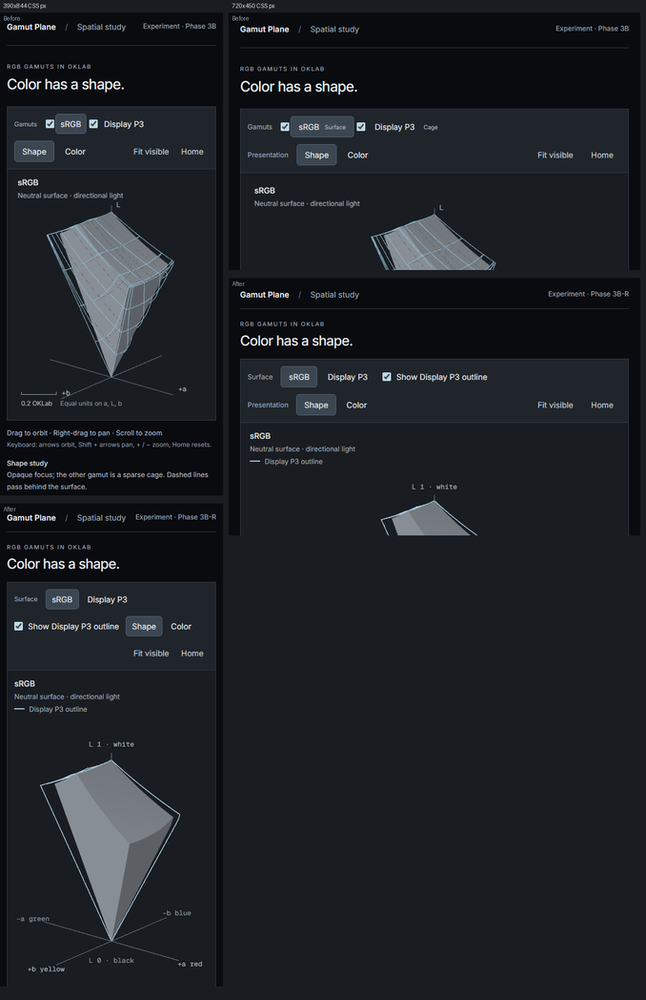
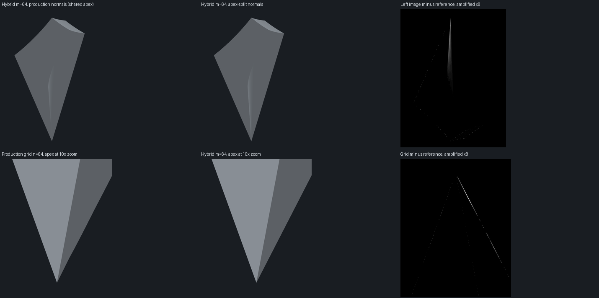

# Phase 3B-R: Spatial refinement and geometry qualification

Starting commit `6afc47d6517071afe4f239657d20e49636b5b838`. Evidence labels used throughout: **[observed]** a directly inspected fact, **[measured]** a finite sampled result with its method stated, **[judgment]** an engineering decision, **[proposed]** a target not adopted as a gate, **[unverified]** a hypothesis that was not tested.

## Summary

1. The comparison presentation was the largest real problem and is replaced. The focused gamut stays an opaque surface; the other gamut is now an **outline** (solid where visible, screen-space stippled where the surface hides it). The sampled RGB "cage" is gone.
2. Presentation references no longer depend on tessellation. The outline is derived from the scientific boundary triangles by an explicit silhouette rule; nothing is chosen from sampling knots.
3. Orientation: plain-language axis labels (including the negative ends), black/white anchors, labels that hide when the focused body would occlude them, and a layout that fits laptop viewports and reflows on narrow stages.
4. Controls are reduced to three independent concepts: which gamut is the surface, whether to show the other as an outline, and Shape/Color.
5. The conical premise is **correct**, and stronger than proposed: the lower faces are exact cones and the whole gamut is a radial graph with a closed-form radial function. A radial hybrid tessellation with sRGB-spaced upper knots has about **40× lower sampled geometric error at half the production triangle count**, exact lower boundaries in hue sections, and generation in single-digit milliseconds. It also needs a **per-triangle apex normal**; without it the hybrid shades worse than the grid despite being more accurate.
6. Every gate in the brief is met by the radial hybrid in both spaces, so it is adopted as the spatial scene's boundary in a separate, independently revertible commit. The fixed-grid generator remains, unchanged apart from a `topology` label.
7. The Phase 3B bounded-adaptive result reproduces exactly, but on a common held-out, whole-mesh metric it also contains about 400 locally orientation-inverted triangles that its own gates could not detect. It is not recommended.

## 1. Independent findings and severity

Severity is the effect on a user's understanding or on correctness: **High** misleads or obscures, **Medium** degrades clarity or robustness, **Low** polish.

| #   | Finding                                                                                                                                                                                                                                                                                                                | Class                                                | Severity | Status                                           |
| --- | ---------------------------------------------------------------------------------------------------------------------------------------------------------------------------------------------------------------------------------------------------------------------------------------------------------------------- | ---------------------------------------------------- | -------- | ------------------------------------------------ |
| 1   | Hidden cage lines are drawn dashed over the focused surface. When Display P3 is focused, all of sRGB's cage is hidden, so every line is a dash drawn across the surface's colors. They read as surface texture or noise ([images](#8-screenshots-and-observed-differences)).                                           | Visual communication                                 | High     | Fixed                                            |
| 2   | In-front cage lines (the other gamut's shell, which sits outside the focused surface) cross the focused surface and its real colors, which the project's own rule forbids ("do not overlay the color field").                                                                                                          | Visual communication                                 | High     | Fixed                                            |
| 3   | The cage levels are tessellation knots. The cage selects every `n/4`-th knot of the **cubic** sample vector, so its constant-channel curves sit at linear RGB 0.016, 0.125, 0.42 (encoded about 0.13, 0.39, 0.68). They are arbitrary, change if the sampling policy changes, and carry no color meaning.              | Technical debt: presentation coupled to tessellation | Medium   | Fixed                                            |
| 4   | Dash length is in scene units (0.009), so it changes with zoom. Dash phase is accumulated by `computeLineDistances` in buffer order, which follows triangle emission order rather than curve order, so phase is discontinuous along each curve. **[observed]** in `three@0.186.1` `LineSegments.computeLineDistances`. | Defect                                               | Medium   | Replaced                                         |
| 5   | Native WebGL lines are one device pixel. At DPR 2 the old lines were 0.5 CSS px.                                                                                                                                                                                                                                       | Defect                                               | Medium   | Fixed (verified at DPR 1 and 2)                  |
| 6   | Two controls per gamut (a visibility checkbox and a focus button) with an invalid empty state ("No active surface"). Focus and visibility were two names for one idea.                                                                                                                                                 | Interaction clarity                                  | Medium   | Fixed                                            |
| 7   | Axis labels named only `L`, `+a`, `+b`; negative ends unlabeled; no black/white anchors; at some orbits a far-side label floated over the color field.                                                                                                                                                                 | Orientation                                          | Medium   | Fixed                                            |
| 8   | Phone: the caption overlapped the top label and the ruler collided with the `+b` label. At 1280×720 the stage was cut by 6 px.                                                                                                                                                                                         | Defect                                               | Medium   | Fixed                                            |
| 9   | In Color mode, surfaces below roughly L = 0.2 are indistinguishable from the stage background (#191d22), so the black end of the shape disappears.                                                                                                                                                                     | Visual communication                                 | Medium   | **Not fixed** ([§11](#11-remaining-limitations)) |
| 10  | The preview note said colors outside sRGB "are clipped" generically. For Display P3 the truth is stronger: **100%** of the sampled surface is outside sRGB ([§3](#3-chosen-visual-and-interaction-changes)).                                                                                                           | Scientific disclosure                                | Medium   | Fixed (text)                                     |
| 11  | Fixed-grid error near black: 6.0e-4 OKLab (sRGB), 4.6 px at 12×. Known and documented in Phase 3B.                                                                                                                                                                                                                     | Scientific limitation                                | Medium   | Resolved by the radial hybrid (§4–§10)           |
| 12  | A one-directional probe sample under-reports the worst grid error: true-to-mesh probes found 9.8e-5 where mesh-to-true found 6.0e-4. The worst region is a tiny cell near black that few probes land in.                                                                                                               | Measurement gap                                      | Medium   | Both directions are now reported                 |
| 13  | The Phase 3B silhouette metric measured the sagitta of the mesh's own silhouette edges, not distance to the true silhouette. It said so; the true distance is now measured.                                                                                                                                            | Measurement gap                                      | Low      | Added                                            |
| 14  | Phase 3B's gates (closed manifold, positive area, Euler 2) cannot detect orientation inversion; see the adaptive mesh in [§5](#5-experimental-methods-and-reproducible-results).                                                                                                                                       | Measurement gap                                      | Medium   | Added an orientation-by-true-normal diagnostic   |
| 15  | Experimental banner, n = 64, `unqualified-reference` status.                                                                                                                                                                                                                                                           | Intentional experimental limitation                  | n/a      | Kept                                             |
| 16  | Hue half-planes, constant-lightness sections, a linked compact instrument, a public API.                                                                                                                                                                                                                               | Reserved for Phase 3C                                | n/a      | Not started                                      |

Not treated as defects, and retained: the camera, the equal-unit scientific scale, the Lambert Shape material, the unlit Color shader, the sRGB output declaration.

## 2. Presentation approaches investigated

**[observed]** sRGB is contained in Display P3. When sRGB is focused, the P3 outline lies entirely outside it and is always visible. When P3 is focused, the sRGB outline is entirely hidden. No opaque technique can show the inner body without a convention for "behind"; only a section can show it properly (Phase 3C).

| Approach                                                                | Result                                                                                                                           |
| ----------------------------------------------------------------------- | -------------------------------------------------------------------------------------------------------------------------------- |
| A. Baseline: sampled RGB cage, solid in front, dim dashes behind        | Rejected: findings 1–4.                                                                                                          |
| B. Outline plus the twelve RGB cube edges, hidden edges omitted         | Rejected: edges in front of the surface cross the real colors and add no information the outline lacks.                          |
| C. Outline only: solid where visible, screen-space stipple where hidden | **Adopted.**                                                                                                                     |
| D. Alpha-blended or order-independent transparency                      | Rejected: the brief asks for no expensive transparency without a demonstrated advantage, and C already communicates containment. |
| E. Stencil mask so reference lines never draw over the surface          | Not needed once B was rejected: the outline cannot cross the focused surface except where the two gamuts genuinely touch.        |
| F. Inverted-hull outline or screen-space edge detection                 | Not needed: the outline is a geometric property of the mesh and is exact for what is rendered.                                   |
| G. Native `LineBasicMaterial`, or three's `LineMaterial` with dashes    | Native lines cannot be thick. `LineMaterial` dashes are in object units and cumulative in buffer order.                          |
| H. Constant-L rings or hue spokes as references                         | Valuable, but they are sections. Reserved for Phase 3C.                                                                          |



_A, B and C at identical camera poses. A and B come from an intermediate build that still used the fixed grid; only the line style differs._

### Why the outline derives from the mesh

The reference outline is the set of mesh edges whose two chord normals disagree in facing for the current view direction. Because the camera is orthographic, one view vector serves every vertex, so extraction is a single loop over the edge adjacency (37,440 edges for the radial mesh at m = 64; 73,728 for the grid) and is cached until the view direction changes. It is the outline of exactly what the renderer would draw, and it has no dependence on knots. Tests prove two independent properties: the outline forms closed loops (even degree at every vertex), and its screen extent equals the whole mesh's (the extremal vertex in any screen direction lies on the silhouette of a closed mesh).

### Line rendering, depth and width

- Width is in CSS pixels. A small instanced-quad shader draws round-capped segments, converting to drawing-buffer pixels with the backing ratio. The same CSS width and dash rhythm appear at DPR 1 and 2 **[observed]**.
- Hidden parts are drawn by a second pass with `GreaterDepth`; the cleared depth makes background pixels fail it, so only occluded parts are drawn.
- A fixed screen-space stipple (`mod(gl_FragCoord.x + gl_FragCoord.y, period)`) is continuous across unordered segments by construction and independent of zoom. This is the simplest correct answer to "dash continuity": there is no per-segment phase to get wrong.
- A constant pull of 0.003 scene units toward the viewer makes a line that exactly coincides with a surface (the two gamuts share black, white and the yellow-white edge) read as in front instead of z-fighting between solid and stippled **[judgment]**. **[measured]** All 49 sampled points of sRGB's yellow–white edge lie on Display P3's boundary; none of the other four edges tested does.
- No blending, no transparency, no extra render targets. Updates write a preallocated buffer in place, so camera motion allocates nothing.

## 3. Chosen visual and interaction changes

1. **Surface, Compare, Presentation.** `Surface: sRGB | Display P3` (native radios), `Show <other> outline` (a checkbox labeled with whichever gamut is not the surface), `Presentation: Shape | Color`. The invalid "no gamut" state no longer exists. Every state the brief lists is reachable: only sRGB (surface sRGB, compare off), only P3, both with either focused, in Shape or Color.
2. **Orientation.** `+a red`, `−a green`, `+b yellow`, `−b blue`, `L 1 · white`, `L 0 · black` (the OKLab opponent axes in plain words). A label whose anchor is behind the focused body is hidden, using a presentation-only point-in-solid ray march through the core-owned matrices the color shader uses. It is not an authoritative membership check and is documented as such. Labels carry a small halo so they stay legible where they genuinely lie over color.
3. **Layout.** The stage fits common laptop viewports (it did not at 1280×720). On a stage under 760 px the caption and ruler leave the canvas so they never cover the scene. Focus rings are visible on every control, and each radio group is a single tab stop. **[measured]** At browser-zoom equivalents of 200% (720×450 CSS px) and 400% (320×256) the page has no horizontal overflow, and the browser tests check that every control stays inside the viewport at 390 and 320 px.
4. **Display-preview clipping.** I investigated an indicator. **[measured]** On the cubic n = 128 mesh, every triangle centroid of the Display P3 boundary (all six faces, area-weighted, and also the whole projected area at the Home view) lies outside sRGB, with a 1e-9 tolerance; the sRGB boundary is inside sRGB by definition. An overlay would therefore be all or nothing and would paint every P3 pixel. The right correction is a sentence, not a mark on the color field. sRGB: "This surface lies inside sRGB, so the preview shows its colors without clipping." P3: "Nearly all of this surface lies outside sRGB. The preview clips those colors for display, so they are not P3 colors." Scientific data, exact checks and copyable output are untouched.
5. **Camera: unchanged.** Home direction, target, extent and zoom bounds are identical, so every before/after pair is a true matched pose. The brief asked me to review composition. I did, and found no defect a camera change would fix; the composition faults were chrome and label placement (above).

Not added: permanent controls that duplicate the compact instrument, animation, bloom, glass, or any new dependency.

## 4. Mathematical geometry alternatives

### The radial premise

The conversion is F(q) = B · cbrt(A · q), with A the linear-RGB-to-LMS matrix and B the LMS′-to-OKLab matrix. Since cbrt(t·x) = t^(1/3) · cbrt(x) for every real x and t > 0:

> **F(t · q) = t^(1/3) · F(q)**, for all real q (including extended coordinates) and t > 0.

**[measured]** relative violation 3.8e-14 over 40,000 random extended points spanning 17 decades of scale, against the independent CSS Color 4 XYZ route. Consequences:

1. Every ray from RGB black maps to a **straight** ray from OKLab black (reparameterized by t^(1/3)). The three faces through black (R=0, G=0, B=0) are exact cones over their outer rim curves, the six cube edges R–Y, Y–G, G–C, C–B, B–M, M–R, shared between the three faces.
2. The cube is star-shaped about black and so is its image. The gamut is a radial graph over a solid angle. Writing q(d) = F⁻¹(d) for a unit direction d, F⁻¹(λd) = λ³ · q(d), so the exact radial gamut function is **r(d) = max_i(q_i(d))^(−1/3)** for directions with q(d) ≥ 0. **[measured]** It reproduces |F(q)| to 1.35e-15 relative error over 40,000 boundary points in both spaces. This is a derived corollary used to explain the geometry; no product code uses it and it is not an authoritative membership implementation.
3. The lower boundary of a constant-hue slice is a straight line from black to the cusp, exactly.
4. A triangle (black, rim_i, rim_i+1) differs from the true cone only by the **lateral sag of one rim chord**, which scales with distance from the apex (zero at the apex). The fixed grid has no such property: its cells collapse toward the cube-root singularity.

### Where a naive reading of the proposal goes wrong

- A grid triangle with an edge on a black axis ray is **also** exactly radial (92 of 384 lower-face triangles at n = 8). The grid's lower faces are not uniformly non-radial; it is the _interior_ grid chords that are poor.
- "Hybrid" must also choose the upper-face knots. The proposal's implicit **cubic** spacing is justified near the singularity, which the upper faces do not contain (the lowest L on them is the blue corner, 0.452 for sRGB). See below.
- A radial mesh with the production upload policy is **less correct** at shading time ([§7](#7-topology-approximation-silhouette-and-normal-limitations)), whatever its geometric accuracy.

### Candidates

| #    | Candidate                              | Construction                                                                                                                             |
| ---- | -------------------------------------- | ---------------------------------------------------------------------------------------------------------------------------------------- |
| 1    | Fixed cubic grid (production)          | six n×n grids, cubic knots                                                                                                               |
| 2    | Bounded conforming-adaptive (Phase 3B) | reproduced from `measureSpatialAdaptive.ts`: n=32 start, centroid fans, at most 10 rounds and 150k triangles                             |
| 3    | Radial hybrid                          | three upper-face grids plus three fans from black to the rim. V = 3m²+3m+2, F = 6m²+6m, E = 9m²+9m, Euler 2                              |
| 3a–c | Hybrid knot policies                   | linear, encoded (sRGB-decoded spacing), cubic, for the upper faces                                                                       |
| 4    | Justified alternative                  | the radial hybrid with **encoded** upper knots and **per-triangle apex normals**: candidate 3 with the two choices the evidence requires |

Considered and rejected without building: a fully radial parameterization of the upper surface (a spherical grid of directions evaluated through r(d)). It would cut across the real creases where the largest channel changes (the R=1, G=1, B=1 seams), so silhouette and shading at those creases would be wrong unless it were crease-aligned, at which point it is the cube-face grid again.

Why encoded knots. **[measured]** At m = 90 (the production triangle budget) the maximum sampled error is 7.5e-6 (encoded), 1.07e-5 (cubic) and 1.03e-4 (linear) in sRGB, and 8.0e-6, 1.14e-5 and 5.1e-5 in P3. Encoded spacing is dense at small linear values, where the upper faces' curvature concentrates (small cone responses near the blue corner). Its error falls by 3.95–3.99× per doubling of m from m = 8 (8.7e-4 → 2.2e-4 → 5.5e-5 → 1.4e-5), where linear knots fall by only 2.5×, 3.0×, 3.4× over the same steps. **[unverified]** whether an optimized or curvature-equidistributed knot vector would beat it; I did not build one because 7.5e-6 is already about 9× under the proposed target at 12× zoom.

## 5. Experimental methods and reproducible results

### Method

- **Truth.** The independent CSS Color 4 linear-RGB → XYZ D65 → LMS → OKLab route (`experiments/spatial/oracle.ts`), with analytic Jacobians. Sections use core's `gamutRayCrossings` as the authority. The production conversion kernel only generates candidates.
- **Common held-out set.** 62,304 points per space on the _true_ surface, identical for every candidate and never used to choose knots or splits: 24,576 uniform in linear RGB (Halton), 24,576 uniform in encoded RGB, 864 geometric near-black (the Phase 3A values), 12,288 along the twelve cube edges.
- **Two directions, never one.** _True → mesh:_ nearest triangle of the **whole** mesh (grid-accelerated exact distance), not the corresponding triangle. _Mesh → true:_ four samples per triangle, exact distance to the true surface: Gauss-Newton projection onto the true face for upper faces, exact distance to the cone's generator rays for lower faces. Each is a distance to a real point of the other surface, so each is an upper bound in its direction. The report takes the maximum of the two.
- **Projected error.** Declared envelope: a 900 CSS px tall stage showing 1.42 scene units at zoom 1 (633.8 px/unit), zooms 1, 4 and 12. The 0.5 CSS px target is retained for comparison; it is a **[proposed]** target, not a gate that was adopted.
- **Separate questions, separate metrics.** Geometric error, projected error, silhouette error, section correspondence, normal error and rendered appearance are reported separately.
- **The metrics were checked.** The grid accelerator equals a brute-force search to 1e-12 on 300 random points; Gauss-Newton recovers known offsets from the true surface to 1e-6; the cone distance is below 2e-6 on the true cone, including at geometric radii down to 1e-6.
- **Reproduce first.** `measureSpatialAdaptive.ts` was re-run unchanged. **[measured]** It reproduces the committed JSON exactly: sRGB 54,662 vertices, 109,320 triangles, held-out max 3.766750e-5, 0.34378 px; P3 61,079, 122,154, 3.693616e-5, 0.33711 px. Generation took 4.0 s and 7.2 s here against 4.7 s and 7.7 s recorded.

Reproduce everything:

```powershell
pnpm build:packages
node packages/render/scripts/qualifySpatialGeometry.ts > report.json          # about 16 minutes; --quick runs two candidates
node packages/render/scripts/exportSpatialCandidates.ts geometry              # renderer upload geometry
pnpm --filter @gamut-plane/web dev                                            # any server for apps/web
node apps/web/scripts/captureSpatialCandidates.ts geometry appearance http://127.0.0.1:5173
pnpm --filter @gamut-plane/render exec vitest run test/spatialCandidates.test.ts test/spatialRadialBoundary.test.ts
```

Results are in [phase-3b-refinement-geometry.json](phase-3b-refinement-geometry.json) (every number below) and [phase-3b-refinement-appearance.json](phase-3b-refinement-appearance.json). Environment: Node 24.19.0, Windows x64, AMD Ryzen 7 8845HS. Timings are single local observations with JIT and GC variability.

### Results

Every column comes from the JSON. "Upload vertices" are vertices after splitting by source face (and per-triangle apex vertices for the hybrid); GPU bytes are position and normal Float32 plus Uint32 indices.

#### sRGB: budget and sampled geometric error

| Candidate                           | Triangles | Upload vertices | GPU bytes | Generation (median ms) | Max error, OKLab | Max near black (L<0.05) | Max elsewhere | Projected, 1× / 4× / 12× (CSS px) |
| ----------------------------------- | --------: | --------------: | --------: | ---------------------: | ---------------: | ----------------------: | ------------: | --------------------------------: |
| Fixed grid, cubic n=64 (production) |    49,152 |          25,353 | 1,198,296 |                    5.8 |          6.00e-4 |                 6.00e-4 |       2.15e-4 |             0.380 / 1.520 / 4.561 |
| Fixed grid, cubic n=45              |    24,300 |          12,699 |   596,376 |                    4.9 |          8.53e-4 |                 8.53e-4 |       3.95e-4 |             0.541 / 2.162 / 6.487 |
| Fixed grid, cubic n=96              |   110,592 |          56,457 | 2,682,072 |                    8.9 |          4.00e-4 |                 4.00e-4 |       1.02e-4 |             0.253 / 1.014 / 3.041 |
| Bounded adaptive (3B experiment)    |   109,320 |          55,340 | 2,640,000 |                3,838.5 |          4.93e-5 |                 4.93e-5 |       3.72e-5 |             0.031 / 0.125 / 0.375 |
| Radial hybrid, encoded, m=64        |    24,960 |          13,446 |   622,224 |                    4.4 |          1.50e-5 |                 9.88e-7 |       1.50e-5 |             0.009 / 0.038 / 0.114 |
| Radial hybrid, encoded, m=90        |    49,140 |          25,926 | 1,211,904 |                   11.0 |          7.54e-6 |                 5.37e-7 |       7.54e-6 |             0.005 / 0.019 / 0.057 |
| Radial hybrid, encoded, m=135       |   110,160 |          57,111 | 2,692,584 |                   14.3 |          3.33e-6 |                 1.18e-7 |       3.33e-6 |             0.002 / 0.008 / 0.025 |
| Radial hybrid, linear knots, m=90   |    49,140 |          25,926 | 1,211,904 |                    7.9 |          1.03e-4 |                 3.04e-6 |       1.03e-4 |             0.065 / 0.260 / 0.780 |
| Radial hybrid, cubic knots, m=90    |    49,140 |          25,926 | 1,211,904 |                    6.4 |          1.07e-5 |                 4.51e-7 |       1.07e-5 |             0.007 / 0.027 / 0.082 |

#### sRGB: direction-separated error (max, OKLab)

| Candidate                           | True → mesh (held-out, nearest triangle of whole mesh) | Mesh → true (4 samples/triangle, exact distance to true face) | Mesh → true, cone faces | Mesh → true, upper faces |
| ----------------------------------- | -----------------------------------------------------: | ------------------------------------------------------------: | ----------------------: | -----------------------: |
| Fixed grid, cubic n=64 (production) |                                                9.75e-5 |                                                       6.00e-4 |                 6.00e-4 |                  1.61e-5 |
| Fixed grid, cubic n=45              |                                                1.90e-4 |                                                       8.53e-4 |                 8.53e-4 |                  3.26e-5 |
| Fixed grid, cubic n=96              |                                                5.72e-5 |                                                       4.00e-4 |                 4.00e-4 |                  7.18e-6 |
| Bounded adaptive (3B experiment)    |                                                3.63e-5 |                                                       4.93e-5 |                 4.93e-5 |                  3.72e-5 |
| Radial hybrid, encoded, m=64        |                                                1.44e-5 |                                                       1.50e-5 |                 1.50e-5 |                  1.39e-5 |
| Radial hybrid, encoded, m=90        |                                                7.29e-6 |                                                       7.54e-6 |                 7.54e-6 |                  7.01e-6 |
| Radial hybrid, encoded, m=135       |                                                3.24e-6 |                                                       3.33e-6 |                 3.33e-6 |                  3.12e-6 |
| Radial hybrid, linear knots, m=90   |                                                8.72e-5 |                                                       1.03e-4 |                 8.88e-5 |                  1.03e-4 |
| Radial hybrid, cubic knots, m=90    |                                                1.04e-5 |                                                       1.07e-5 |                 1.07e-5 |                  8.17e-6 |

#### sRGB: silhouette (screen px at zoom 1, 900 px stage)

| Candidate                           | Home true→mesh max / p99 | Home mesh→true max / p99 | Blue true→mesh max | Blue mesh→true max | Side true→mesh max | Side mesh→true max |
| ----------------------------------- | -----------------------: | -----------------------: | -----------------: | -----------------: | -----------------: | -----------------: |
| Fixed grid, cubic n=64 (production) |            0.855 / 0.016 |            0.224 / 0.061 |              0.046 |              0.050 |              0.004 |              0.035 |
| Fixed grid, cubic n=45              |            1.018 / 0.027 |            1.532 / 1.504 |              0.066 |              0.066 |              0.007 |              0.035 |
| Fixed grid, cubic n=96              |            0.855 / 0.008 |            0.149 / 0.033 |              0.031 |              0.050 |              0.002 |              0.035 |
| Bounded adaptive (3B experiment)    |            0.855 / 0.013 |        128.016 / 119.034 |              0.012 |            106.861 |              0.004 |            100.549 |
| Radial hybrid, encoded, m=64        |            1.078 / 0.005 |            0.113 / 0.006 |              0.005 |              0.050 |              0.002 |              0.035 |
| Radial hybrid, encoded, m=90        |            0.601 / 0.003 |            0.059 / 0.003 |              0.003 |              0.050 |              0.001 |              0.035 |
| Radial hybrid, encoded, m=135       |            0.279 / 0.001 |            0.051 / 0.001 |              0.001 |              0.050 |              0.000 |              0.035 |
| Radial hybrid, linear knots, m=90   |            1.842 / 0.002 |            0.051 / 0.001 |              0.003 |              0.050 |              0.004 |              0.035 |
| Radial hybrid, cubic knots, m=90    |            1.018 / 0.005 |            0.051 / 0.004 |              0.004 |              0.050 |              0.002 |              0.035 |

#### sRGB: sections against core's exact solver (max, OKLab)

| Candidate                           | Const-L plane distance | Const-L near black (L<0.05) | Const-L chroma error (grazing-sensitive) | Count mismatches | Const-hue boundary distance | Const-hue lower boundary (L<0.05) |
| ----------------------------------- | ---------------------: | --------------------------: | ---------------------------------------: | ---------------: | --------------------------: | --------------------------------: |
| Fixed grid, cubic n=64 (production) |                6.00e-4 |                     6.00e-4 |                                  8.68e-4 |         0 / 4680 |                     8.02e-4 |                           8.02e-4 |
| Fixed grid, cubic n=45              |                7.20e-4 |                     7.20e-4 |                                  2.11e-3 |         0 / 4680 |                     1.16e-3 |                           1.16e-3 |
| Fixed grid, cubic n=96              |                4.37e-4 |                     4.37e-4 |                                  8.68e-4 |         0 / 4680 |                     5.56e-4 |                           5.56e-4 |
| Bounded adaptive (3B experiment)    |                4.38e-5 |                     1.80e-5 |                                  1.19e-4 |         1 / 4680 |                     6.28e-5 |                           2.90e-5 |
| Radial hybrid, encoded, m=64        |                1.50e-5 |                     5.98e-7 |                                  1.33e-4 |         0 / 4680 |                     1.49e-5 |                           1.11e-6 |
| Radial hybrid, encoded, m=90        |                7.57e-6 |                     3.03e-7 |                                  6.13e-5 |         0 / 4680 |                     7.53e-6 |                           6.01e-7 |
| Radial hybrid, encoded, m=135       |                3.39e-6 |                     1.35e-7 |                                  3.00e-5 |         0 / 4680 |                     3.33e-6 |                           2.65e-7 |
| Radial hybrid, linear knots, m=90   |                3.46e-5 |                     1.57e-6 |                                  4.38e-4 |         0 / 4680 |                     2.54e-5 |                           2.63e-6 |
| Radial hybrid, cubic knots, m=90    |                1.07e-5 |                     4.12e-7 |                                  5.08e-5 |         0 / 4680 |                     1.24e-5 |                           9.27e-7 |

#### sRGB: normals (interpolated vertex normal vs true surface normal)

| Candidate                           | Policy        |    Max | Area-weighted p95 / p99 | Area above 1° | Area above 5° |
| ----------------------------------- | ------------- | -----: | ----------------------: | ------------: | ------------: |
| Fixed grid, cubic n=64 (production) | area-weighted | 28.22° |         0.065° / 0.241° |         0.22% |         0.03% |
| Fixed grid, cubic n=64 (production) | apex-split    | 22.76° |         0.065° / 0.241° |         0.22% |         0.03% |
| Fixed grid, cubic n=64 (production) | analytic      | 11.32° |         0.031° / 0.093° |         0.06% |         0.01% |
| Fixed grid, cubic n=45              | area-weighted | 28.22° |         0.117° / 0.465° |         0.45% |         0.06% |
| Fixed grid, cubic n=45              | apex-split    | 22.76° |         0.117° / 0.465° |         0.45% |         0.06% |
| Fixed grid, cubic n=45              | analytic      | 11.33° |         0.041° / 0.142° |         0.13% |         0.03% |
| Fixed grid, cubic n=96              | area-weighted | 28.22° |         0.039° / 0.123° |         0.10% |         0.01% |
| Fixed grid, cubic n=96              | apex-split    | 22.76° |         0.039° / 0.123° |         0.10% |         0.01% |
| Fixed grid, cubic n=96              | analytic      | 11.31° |         0.026° / 0.069° |         0.03% |         0.00% |
| Bounded adaptive (3B experiment)    | area-weighted | 89.25° |         0.117° / 0.214° |         0.03% |         0.01% |
| Bounded adaptive (3B experiment)    | apex-split    | 89.25° |         0.117° / 0.214° |         0.03% |         0.00% |
| Bounded adaptive (3B experiment)    | analytic      |  2.50° |         0.024° / 0.054° |         0.00% |         0.00% |
| Radial hybrid, encoded, m=64        | area-weighted | 20.42° |       12.608° / 17.787° |        32.55% |        14.87% |
| Radial hybrid, encoded, m=64        | apex-split    |  0.29° |         0.196° / 0.255° |         0.00% |         0.00% |
| Radial hybrid, encoded, m=64        | analytic      |  0.29° |         0.195° / 0.253° |         0.00% |         0.00% |
| Radial hybrid, encoded, m=90        | area-weighted | 20.40° |       12.636° / 17.876° |        32.52% |        14.82% |
| Radial hybrid, encoded, m=90        | apex-split    |  0.26° |         0.138° / 0.183° |         0.00% |         0.00% |
| Radial hybrid, encoded, m=90        | analytic      |  0.25° |         0.140° / 0.184° |         0.00% |         0.00% |
| Radial hybrid, encoded, m=135       | area-weighted | 20.42° |       12.654° / 17.788° |        32.52% |        14.80% |
| Radial hybrid, encoded, m=135       | apex-split    |  0.21° |         0.094° / 0.129° |         0.00% |         0.00% |
| Radial hybrid, encoded, m=135       | analytic      |  0.25° |         0.094° / 0.129° |         0.00% |         0.00% |
| Radial hybrid, linear knots, m=90   | area-weighted | 20.60° |       12.714° / 17.712° |        32.52% |        14.74% |
| Radial hybrid, linear knots, m=90   | apex-split    |  1.65° |         0.164° / 0.410° |         0.09% |         0.00% |
| Radial hybrid, linear knots, m=90   | analytic      |  0.76° |         0.155° / 0.347° |         0.00% |         0.00% |
| Radial hybrid, cubic knots, m=90    | area-weighted | 20.43° |       12.774° / 17.774° |        32.48% |        14.77% |
| Radial hybrid, cubic knots, m=90    | apex-split    |  0.30° |         0.171° / 0.218° |         0.00% |         0.00% |
| Radial hybrid, cubic knots, m=90    | analytic      |  0.30° |         0.172° / 0.217° |         0.00% |         0.00% |

#### sRGB: topology and numerics

| Candidate                           | Closed oriented | Euler | Inward vs true normal | Inward from black | Radial (contain black) | Slivers (<1° or >179°) | Min angle | Max aspect | Float32 max dev | Degenerate after Float32 |
| ----------------------------------- | :-------------: | ----: | --------------------: | ----------------: | ---------------------: | ---------------------: | --------: | ---------: | --------------: | -----------------------: |
| Fixed grid, cubic n=64 (production) |       yes       |     2 |                     0 |            10,659 |                  3,334 |                  4,910 |   0.0034° |     16,896 |         3.30e-8 |                        0 |
| Fixed grid, cubic n=45              |       yes       |     2 |                     0 |             5,334 |                  1,532 |                  2,418 |   0.0069° |      8,350 |         3.26e-8 |                        0 |
| Fixed grid, cubic n=96              |       yes       |     2 |                     0 |            23,421 |                  8,577 |                 11,067 |   0.0015° |     38,029 |         3.34e-8 |                        0 |
| Bounded adaptive (3B experiment)    |       yes       |     2 |                   403 |            41,220 |                  1,580 |                  4,324 |   0.0039° |     22,470 |         3.33e-8 |                        0 |
| Radial hybrid, encoded, m=64        |       yes       |     2 |                     0 |                 0 |                    384 |                    384 |   0.0184° |      3,110 |         3.22e-8 |                        0 |
| Radial hybrid, encoded, m=90        |       yes       |     2 |                     0 |                 0 |                    540 |                    540 |   0.0131° |      4,375 |         3.38e-8 |                        0 |
| Radial hybrid, encoded, m=135       |       yes       |     2 |                     0 |                 0 |                    810 |                    810 |   0.0087° |      6,564 |         3.38e-8 |                        0 |
| Radial hybrid, linear knots, m=90   |       yes       |     2 |                     0 |                 0 |                    540 |                    529 |   0.0829° |        692 |         3.28e-8 |                        0 |
| Radial hybrid, cubic knots, m=90    |       yes       |     2 |                     0 |                 0 |                    542 |                  6,204 |   0.0000° |  2,737,590 |         3.33e-8 |                        0 |

#### Display P3: budget and sampled geometric error

| Candidate                           | Triangles | Upload vertices | GPU bytes | Generation (median ms) | Max error, OKLab | Max near black (L<0.05) | Max elsewhere | Projected, 1× / 4× / 12× (CSS px) |
| ----------------------------------- | --------: | --------------: | --------: | ---------------------: | ---------------: | ----------------------: | ------------: | --------------------------------: |
| Fixed grid, cubic n=64 (production) |    49,152 |          25,353 | 1,198,296 |                    7.5 |          6.42e-4 |                 6.42e-4 |       2.30e-4 |             0.407 / 1.628 / 4.885 |
| Fixed grid, cubic n=45              |    24,300 |          12,699 |   596,376 |                    5.0 |          9.13e-4 |                 9.13e-4 |       4.26e-4 |             0.579 / 2.316 / 6.947 |
| Fixed grid, cubic n=96              |   110,592 |          56,457 | 2,682,072 |                   12.0 |          4.28e-4 |                 4.28e-4 |       1.09e-4 |             0.271 / 1.086 / 3.257 |
| Bounded adaptive (3B experiment)    |   122,154 |          61,776 | 2,948,472 |                4,409.8 |          3.86e-5 |                 3.86e-5 |       3.74e-5 |             0.024 / 0.098 / 0.294 |
| Radial hybrid, encoded, m=64        |    24,960 |          13,446 |   622,224 |                    3.9 |          1.59e-5 |                 9.55e-8 |       1.59e-5 |             0.010 / 0.040 / 0.121 |
| Radial hybrid, encoded, m=90        |    49,140 |          25,926 | 1,211,904 |                    6.4 |          7.99e-6 |                 1.73e-8 |       7.99e-6 |             0.005 / 0.020 / 0.061 |
| Radial hybrid, encoded, m=135       |   110,160 |          57,111 | 2,692,584 |                   16.2 |          3.53e-6 |                 2.23e-8 |       3.53e-6 |             0.002 / 0.009 / 0.027 |
| Radial hybrid, linear knots, m=90   |    49,140 |          25,926 | 1,211,904 |                    6.3 |          5.09e-5 |                 1.66e-6 |       5.09e-5 |             0.032 / 0.129 / 0.387 |
| Radial hybrid, cubic knots, m=90    |    49,140 |          25,926 | 1,211,904 |                    9.0 |          1.14e-5 |                 1.40e-7 |       1.14e-5 |             0.007 / 0.029 / 0.087 |

#### Display P3: direction-separated error (max, OKLab)

| Candidate                           | True → mesh (held-out, nearest triangle of whole mesh) | Mesh → true (4 samples/triangle, exact distance to true face) | Mesh → true, cone faces | Mesh → true, upper faces |
| ----------------------------------- | -----------------------------------------------------: | ------------------------------------------------------------: | ----------------------: | -----------------------: |
| Fixed grid, cubic n=64 (production) |                                                1.06e-4 |                                                       6.42e-4 |                 6.42e-4 |                  1.31e-5 |
| Fixed grid, cubic n=45              |                                                2.02e-4 |                                                       9.13e-4 |                 9.13e-4 |                  2.65e-5 |
| Fixed grid, cubic n=96              |                                                6.21e-5 |                                                       4.28e-4 |                 4.28e-4 |                  5.83e-6 |
| Bounded adaptive (3B experiment)    |                                                3.64e-5 |                                                       3.86e-5 |                 3.86e-5 |                  3.73e-5 |
| Radial hybrid, encoded, m=64        |                                                1.53e-5 |                                                       1.59e-5 |                 1.59e-5 |                  8.71e-6 |
| Radial hybrid, encoded, m=90        |                                                7.74e-6 |                                                       7.99e-6 |                 7.99e-6 |                  4.40e-6 |
| Radial hybrid, encoded, m=135       |                                                3.44e-6 |                                                       3.53e-6 |                 3.53e-6 |                  1.96e-6 |
| Radial hybrid, linear knots, m=90   |                                                4.79e-5 |                                                       5.09e-5 |                 4.86e-5 |                  5.09e-5 |
| Radial hybrid, cubic knots, m=90    |                                                1.11e-5 |                                                       1.14e-5 |                 1.14e-5 |                  6.63e-6 |

#### Display P3: silhouette (screen px at zoom 1, 900 px stage)

| Candidate                           | Home true→mesh max / p99 | Home mesh→true max / p99 | Blue true→mesh max | Blue mesh→true max | Side true→mesh max | Side mesh→true max |
| ----------------------------------- | -----------------------: | -----------------------: | -----------------: | -----------------: | -----------------: | -----------------: |
| Fixed grid, cubic n=64 (production) |            0.196 / 0.012 |            0.626 / 0.489 |              0.072 |              0.072 |              0.003 |              0.036 |
| Fixed grid, cubic n=45              |            0.260 / 0.025 |            0.396 / 0.310 |              0.103 |              0.103 |              0.006 |              0.036 |
| Fixed grid, cubic n=96              |            0.544 / 0.007 |            0.123 / 0.032 |              0.048 |              0.053 |              0.001 |              0.036 |
| Bounded adaptive (3B experiment)    |            0.195 / 0.015 |        149.615 / 119.462 |              0.015 |            126.053 |              0.003 |            110.416 |
| Radial hybrid, encoded, m=64        |            0.639 / 0.006 |            0.052 / 0.005 |              0.006 |              0.053 |              0.002 |              0.036 |
| Radial hybrid, encoded, m=90        |            0.351 / 0.003 |            0.052 / 0.003 |              0.003 |              0.053 |              0.001 |              0.036 |
| Radial hybrid, encoded, m=135       |            0.190 / 0.001 |            0.052 / 0.001 |              0.001 |              0.053 |              0.000 |              0.036 |
| Radial hybrid, linear knots, m=90   |            0.106 / 0.001 |            0.052 / 0.001 |              0.002 |              0.053 |              0.004 |              0.036 |
| Radial hybrid, cubic knots, m=90    |            0.190 / 0.004 |            0.396 / 0.346 |              0.005 |              0.053 |              0.002 |              0.036 |

#### Display P3: sections against core's exact solver (max, OKLab)

| Candidate                           | Const-L plane distance | Const-L near black (L<0.05) | Const-L chroma error (grazing-sensitive) | Count mismatches | Const-hue boundary distance | Const-hue lower boundary (L<0.05) |
| ----------------------------------- | ---------------------: | --------------------------: | ---------------------------------------: | ---------------: | --------------------------: | --------------------------------: |
| Fixed grid, cubic n=64 (production) |                6.96e-4 |                     6.96e-4 |                                  7.10e-4 |         0 / 4680 |                     6.08e-4 |                           6.08e-4 |
| Fixed grid, cubic n=45              |                7.55e-4 |                     7.55e-4 |                                  7.72e-4 |         0 / 4680 |                     8.90e-4 |                           8.90e-4 |
| Fixed grid, cubic n=96              |                4.62e-4 |                     4.62e-4 |                                  4.77e-4 |         0 / 4680 |                     4.25e-4 |                           4.25e-4 |
| Bounded adaptive (3B experiment)    |                6.46e-5 |                     2.05e-5 |                                  7.43e-5 |         0 / 4680 |                     4.32e-5 |                           2.15e-5 |
| Radial hybrid, encoded, m=64        |                1.55e-5 |                     6.18e-7 |                                  3.95e-5 |         0 / 4680 |                     1.50e-5 |                           1.29e-6 |
| Radial hybrid, encoded, m=90        |                7.88e-6 |                     3.15e-7 |                                  2.02e-5 |         0 / 4680 |                     7.14e-6 |                           6.14e-7 |
| Radial hybrid, encoded, m=135       |                3.43e-6 |                     1.37e-7 |                                  1.16e-5 |         0 / 4680 |                     3.46e-6 |                           2.84e-7 |
| Radial hybrid, linear knots, m=90   |                3.51e-5 |                     1.59e-6 |                                  1.99e-4 |         0 / 4680 |                     2.83e-5 |                           2.84e-6 |
| Radial hybrid, cubic knots, m=90    |                1.08e-5 |                     4.32e-7 |                                  3.67e-5 |         0 / 4680 |                     1.06e-5 |                           6.32e-7 |

#### Display P3: normals (interpolated vertex normal vs true surface normal)

| Candidate                           | Policy        |    Max | Area-weighted p95 / p99 | Area above 1° | Area above 5° |
| ----------------------------------- | ------------- | -----: | ----------------------: | ------------: | ------------: |
| Fixed grid, cubic n=64 (production) | area-weighted | 27.62° |         0.055° / 0.205° |         0.19% |         0.02% |
| Fixed grid, cubic n=64 (production) | apex-split    | 22.06° |         0.055° / 0.205° |         0.19% |         0.02% |
| Fixed grid, cubic n=64 (production) | analytic      | 11.13° |         0.026° / 0.066° |         0.05% |         0.01% |
| Fixed grid, cubic n=45              | area-weighted | 27.62° |         0.101° / 0.391° |         0.38% |         0.05% |
| Fixed grid, cubic n=45              | apex-split    | 22.06° |         0.101° / 0.391° |         0.38% |         0.05% |
| Fixed grid, cubic n=45              | analytic      | 11.14° |         0.034° / 0.114° |         0.09% |         0.02% |
| Fixed grid, cubic n=96              | area-weighted | 27.62° |         0.032° / 0.097° |         0.08% |         0.01% |
| Fixed grid, cubic n=96              | apex-split    | 22.06° |         0.032° / 0.097° |         0.08% |         0.01% |
| Fixed grid, cubic n=96              | analytic      | 11.12° |         0.022° / 0.046° |         0.02% |         0.00% |
| Bounded adaptive (3B experiment)    | area-weighted | 88.37° |         0.105° / 0.191° |         0.03% |         0.01% |
| Bounded adaptive (3B experiment)    | apex-split    | 88.37° |         0.105° / 0.191° |         0.02% |         0.00% |
| Bounded adaptive (3B experiment)    | analytic      |  2.12° |         0.021° / 0.038° |         0.00% |         0.00% |
| Radial hybrid, encoded, m=64        | area-weighted | 20.22° |       12.512° / 17.737° |        29.09% |        13.44% |
| Radial hybrid, encoded, m=64        | apex-split    |  0.27° |         0.188° / 0.239° |         0.00% |         0.00% |
| Radial hybrid, encoded, m=64        | analytic      |  0.27° |         0.186° / 0.240° |         0.00% |         0.00% |
| Radial hybrid, encoded, m=90        | area-weighted | 20.21° |       12.477° / 17.779° |        29.08% |        13.53% |
| Radial hybrid, encoded, m=90        | apex-split    |  0.20° |         0.134° / 0.173° |         0.00% |         0.00% |
| Radial hybrid, encoded, m=90        | analytic      |  0.20° |         0.134° / 0.173° |         0.00% |         0.00% |
| Radial hybrid, encoded, m=135       | area-weighted | 20.22° |       12.476° / 17.737° |        29.18% |        13.48% |
| Radial hybrid, encoded, m=135       | apex-split    |  0.14° |         0.090° / 0.120° |         0.00% |         0.00% |
| Radial hybrid, encoded, m=135       | analytic      |  0.15° |         0.090° / 0.120° |         0.00% |         0.00% |
| Radial hybrid, linear knots, m=90   | area-weighted | 20.40° |       12.515° / 17.896° |        29.12% |        13.52% |
| Radial hybrid, linear knots, m=90   | apex-split    |  1.01° |         0.150° / 0.270° |         0.07% |         0.00% |
| Radial hybrid, linear knots, m=90   | analytic      |  0.47° |         0.144° / 0.245° |         0.00% |         0.00% |
| Radial hybrid, cubic knots, m=90    | area-weighted | 20.23° |       12.546° / 17.724° |        29.11% |        13.51% |
| Radial hybrid, cubic knots, m=90    | apex-split    |  0.23° |         0.163° / 0.209° |         0.00% |         0.00% |
| Radial hybrid, cubic knots, m=90    | analytic      |  0.24° |         0.164° / 0.211° |         0.00% |         0.00% |

#### Display P3: topology and numerics

| Candidate                           | Closed oriented | Euler | Inward vs true normal | Inward from black | Radial (contain black) | Slivers (<1° or >179°) | Min angle | Max aspect | Float32 max dev | Degenerate after Float32 |
| ----------------------------------- | :-------------: | ----: | --------------------: | ----------------: | ---------------------: | ---------------------: | --------: | ---------: | --------------: | -----------------------: |
| Fixed grid, cubic n=64 (production) |       yes       |     2 |                     0 |            10,971 |                  2,709 |                  4,613 |   0.0046° |     12,377 |         3.33e-8 |                        0 |
| Fixed grid, cubic n=45              |       yes       |     2 |                     0 |             5,466 |                  1,274 |                  2,266 |   0.0094° |      6,115 |         3.28e-8 |                        0 |
| Fixed grid, cubic n=96              |       yes       |     2 |                     0 |            24,313 |                  6,777 |                 10,435 |   0.0021° |     27,861 |         3.35e-8 |                        0 |
| Bounded adaptive (3B experiment)    |       yes       |     2 |                   404 |            46,481 |                  1,388 |                  4,326 |   0.0011° |     68,338 |         3.39e-8 |                        0 |
| Radial hybrid, encoded, m=64        |       yes       |     2 |                     0 |                 0 |                    384 |                    384 |   0.0259° |      2,209 |         3.31e-8 |                        0 |
| Radial hybrid, encoded, m=90        |       yes       |     2 |                     0 |                 0 |                    540 |                    540 |   0.0184° |      3,107 |         3.37e-8 |                        0 |
| Radial hybrid, encoded, m=135       |       yes       |     2 |                     0 |                 0 |                    810 |                    810 |   0.0123° |      4,663 |         3.36e-8 |                        0 |
| Radial hybrid, linear knots, m=90   |       yes       |     2 |                     0 |                 0 |                    540 |                    530 |   0.1055° |        543 |         3.34e-8 |                        0 |
| Radial hybrid, cubic knots, m=90    |       yes       |     2 |                     0 |                 0 |                    542 |                  5,971 |   0.0000° |  1,943,922 |         3.34e-8 |                        0 |

#### Pairwise embedding diagnostic (small resolutions)

| Space      | Mesh              | Candidate pairs | Intersecting pairs |
| ---------- | ----------------- | --------------: | -----------------: |
| srgb       | grid-cubic-n8     |           1,294 |                  0 |
| srgb       | hybrid-encoded-m8 |             983 |                  0 |
| srgb       | hybrid-linear-m12 |           2,157 |                  0 |
| display-p3 | grid-cubic-n8     |           1,228 |                  0 |
| display-p3 | hybrid-encoded-m8 |             916 |                  0 |
| display-p3 | hybrid-linear-m12 |           2,002 |                  0 |

### Reading the tables

1. **Production n = 64 fails the proposed 0.5 px at 12×** (4.6 px sRGB, 4.9 px P3), reproducing Phase 3B's conclusion by a different method. **Cubic n = 96 still fails** (3.0 and 3.3 px). Resolution is not the fix: the error is a property of the parameterization near black.
2. **The adaptive result holds on a common metric.** At 109k and 122k triangles the whole-mesh, two-directional maximum is 4.9e-5 and 3.9e-5, or 0.375 and 0.294 px at 12×, close to Phase 3B's reported 0.34 px. The claim is correct.
3. **The radial hybrid at m = 64 beats it with about 4.4–4.9× fewer triangles:** 1.5e-5 and 1.6e-5, or 0.114 and 0.121 px at 12×, a 4× margin under the proposed target, generated in about 4 ms instead of 3.8–7.2 s. At the production triangle budget (m = 90) it is 7.5e-6; at the adaptive budget (m = 135) it is 3.3e-6.
4. **Near black is exact.** The hybrid's near-black maximum is 9.9e-7 (sRGB) and 9.6e-8 (P3): the cone faces are exact up to rim sag. The grid's is 6.0e-4 and 6.4e-4.
5. **Sections.** Constant-hue lower boundary: 1.1e-6 versus 8.0e-4 for the grid; the hybrid's lower boundary is a straight ray from black, as the mathematics predicts. In the constant-lightness plane the hybrid is at most 1.5e-5 at every tested lightness, versus 6.0e-4 for the grid. There are no crossing-count mismatches for the hybrid in 4,680 rays (the adaptive sRGB mesh has one).
6. **A confound worth recording.** Ray-parameterized chroma error ΔC reaches 1.3e-4 for the hybrid and 8.7e-4 for the grid in sRGB. It is the plane distance multiplied by up to **13–14×** for both candidates, because the section plane grazes a nearly horizontal part of the surface (slope near 1/14). That amplification belongs to the surface, not the tessellation, and Phase 3C must compare section **curves**, not chroma along rays, when it sets tolerances.
7. **The adaptive mesh has orientation inversions.** 403 (sRGB) and 404 (P3) triangles have chord normals that oppose the true outward normal; areas are 8e-10 to 4e-7, 47% are near black and the rest scattered, and the area-weighted normal error reaches 89°. Phase 3B's topology gates (closed manifold, positive area, Euler 2) cannot see this. Whether each is a fold-over or an extreme sliver was not determined **[observed]**. The fixed grid and the hybrid have none.
8. **Silhouette (screen px at zoom 1).** The p99 is far below a pixel for every candidate. Maxima for the Home view are 0.86 (grid), 0.86 (adaptive) and 1.08 (hybrid) in sRGB, and 0.20, 0.19 and 0.64 in P3. For the hybrid, the worst true-silhouette samples cluster about 16 px below the projected white vertex (86 of 68,415 samples above 0.3 px), where the three upper faces meet at a grazing angle; I did not locate the equivalent samples for the other candidates. The hybrid does **not** beat the grid on this maximum; it does lower the p99 (0.005 versus 0.016 px in sRGB). A bound on the _outer_ outline (the boundary of the filled region) follows from projection being 1-Lipschitz applied to the surface error (at most 0.114 px at 12×), but only for bodies without thin features, and I did not test it independently **[unverified]**. The appearance experiment below is the supporting direct evidence.
9. **Slivers.** Both meshes contain extreme slivers: the grid 4,910 triangles under 1° or over 179° (minimum angle 0.003°, aspect ratio 16,896), the hybrid 384 (all fan triangles; minimum 0.018°, aspect 3,110). Float32 upload moves a vertex by at most 3.3e-8 and creates no degenerate triangle in either.
10. **Topology.** All candidates are closed oriented manifolds with Euler characteristic 2. The pairwise intersection diagnostic (small resolutions, about 900 to 2,200 candidate pairs each) finds none for the grid or the hybrid. The hybrid is also **star-shaped about black with zero inward-facing triangles** (the production grid has 10,659): every non-fan triangle is outward as seen from black and every fan triangle contains black exactly. That is a stronger structural certificate than the pairwise diagnostic because it holds at full resolution **[measured, finite precision]**.

## 6. Evidence supporting conical geometry

- The premise: **[measured]** 3.8e-14 relative at 40,000 extended points, plus the algebraic argument in [§4](#4-mathematical-geometry-alternatives).
- Accuracy: about 40× lower maximum error at half the triangles; near-black exactness; independent two-directional metric ([§5](#5-experimental-methods-and-reproducible-results)).
- Sections: the lower hue boundary is exact; every lightness plane is within 1.5e-5; zero count mismatches.
- Structure: closed, oriented, one component, no zero-area triangles, exact face provenance, star-shaped about black.
- The production generator equals the independent experiment implementation **bit for bit** across 30 configurations (two spaces; n = 1, 2, 7, 16, 64; three knot policies).

## 7. Topology, approximation, silhouette and normal limitations

### Normals

A cone's normal is constant along each ray. A single shared apex vertex, whose normal is the area-weighted average of a whole face's fan, interpolates that face-wide average along every ray.

**[measured]** Interpolated vertex normal versus the true surface normal, four samples per triangle, area-weighted (sRGB shown; P3 is within about 1° and 4 area-percentage points of these values, see the JSON):

| Mesh and policy                                             | Max   | p99   | Area above 1°                             |
| ----------------------------------------------------------- | ----- | ----- | ----------------------------------------- |
| Hybrid m=64, production policy (shared apex, area-weighted) | 20.4° | 17.8° | **32.6%** (sRGB), 29.1% (P3)              |
| Hybrid m=64, **apex-split**                                 | 0.29° | 0.26° | 0.0%                                      |
| Hybrid m=64, analytic vertex normals                        | 0.29° | 0.25° | 0.0%                                      |
| Production grid n=64, production policy                     | 28.2° | 0.24° | 0.2%                                      |
| Adaptive (109k), production policy                          | 89.3° | 0.21° | 0.0% (the 89° are the inverted triangles) |

Giving each apex-touching fan triangle its own apex vertex with the mean of its two rim normals is sufficient. It matches the cone to within the rim spacing and needs no analytic derivative at the singular black point. Real cube creases are still never smoothed (vertices are split by source face), including along the six rim edges and along the three rays between cones. The shipped upload does this only for `topology === "radial-hybrid-v1"`; the grid path is exactly as before. A test checks the shipped normals against an independently computed cone normal (a central difference of the oracle's rim) to under one degree in both spaces.

**[observed]** What this costs visually: with the naive policy, in the Blue view (which looks at the lower faces) the hybrid shows up to 8 eight-bit levels of difference over 3.2% of the surface pixels, as a faint streak along one ray; apex-split is at the noise floor ([geometry-appearance.png](phase-3b-refinement/geometry-appearance.png)). In the Home and Side views the cones face away from the camera, so the defect is invisible there. It is a subtle error, but a systematic one.

### Smooth shading versus creases

Face-local normals only, with no averaging across the three RGB creases. Geometric accuracy and shading quality are different properties: the hybrid's sliver fans (aspect up to 3,110) are exact geometry and shade correctly **on the one software renderer tested**. **[unverified]** on physical GPUs.

### Other limits

- No continuous Hausdorff bound or embedding proof exists for any candidate. The star-shape check, the oracle-based distances and the small-resolution pairwise test are finite-precision diagnostics.
- The 14 section-fixture boundary points and the 4,680 rays are finite fixtures.
- Embedding of the adaptive mesh at full resolution was not checked (the pairwise test is quadratic).
- `quality.status` stays `unqualified-reference` for both generators: no continuous guarantee is claimed.

## 8. Screenshots and observed differences

All pairs use the same Playwright Chromium, a 1600-wide viewport, DPR 1, reduced motion, an **identical 1510×758 canvas**, and identical camera poses (Home, plus keyboard-driven orbit and side poses applied through the same key sequence). They were captured by the same script before and after the change, and the images were inspected, not merely generated.



_Before (top) and after (bottom): sRGB focus in Shape and Color, then Display P3 focus in Shape and Color. The P3 Color panels show what finding 1 was: the baseline paints a grid of dashes across every color; the new view shows one quiet stippled outline._







_One gamut only is identical in surface but gains the plain-language labels and anchors._





_At 1280×720 the stage now fits; at 390 px the caption and ruler no longer cover the scene._

Geometry candidates through the application's own materials:



**[measured]** Pixel differences versus a very fine analytic-normal reference (hybrid m=181 with analytic normals), over the surface pixels, in 8-bit levels, Shape mode, sRGB. A second reference (the grid at n=128 with analytic normals) gives the method's own floor.

| View                                               | Reference B, grid n=128 | Production grid n=64 | Hybrid m=64 apex-split | Hybrid m=64 naive normals                  |
| -------------------------------------------------- | ----------------------- | -------------------- | ---------------------- | ------------------------------------------ |
| Home                                               | mean 0.032, p99 1       | mean 0.037, p99 1    | mean 0.024, p99 1      | mean 0.024 (cones face away)               |
| Blue                                               | mean 0.052, p99 1       | mean 0.053, p99 1    | mean 0.034, p99 1      | mean 0.259, **p99 8**, 3.2% above 2 levels |
| 10× apex zoom: silhouette coverage-mismatch pixels | 94                      | **303**              | 0                      | 0                                          |

**Caveat.** The primary reference is itself a radial hybrid, so geometry error common to the family would cancel in this comparison; the independent geometric truth is the oracle-based measurement in §5. This experiment isolates appearance (shading and rasterization), not geometry.

The rendered difference between the production grid and the hybrid at current magnifications is **not visible to the eye**: the 10× apex zoom shows, at ×8 amplification, a one-pixel line along one ray for the grid. The production grid is **visually adequate for the surface today**; the hybrid's value is accuracy headroom, half the triangles and exact sections, not a visible change. This is a single software-rendered Chromium (4× MSAA); physical GPUs are unqualified.

## 9. Performance and resource implications

- **Triangles:** 24,960 per gamut (was 49,152). Upload vertices 13,446 (was 25,353). GPU geometry about 0.62 MB per gamut (was 1.2 MB). Scientific typed arrays about 0.9 MB (was 1.82 MB). Generation 3.9–4.4 ms in Node (the grid was 5.8–7.5 ms), with no adaptive build step.
- **Outline:** one preallocated 16,384-segment (393 KB) instance buffer per gamut, written in place. Edge adjacency is built lazily and once per gamut. Extraction is a loop over 37,440 edges and runs only when the view direction changes. Idle frames are unchanged: one `requestAnimationFrame` per change and none when settled.
- **Draw calls:** surface, outline in front, outline stippled, axes: four (two with the comparison off), the same as before.
- **No new dependency.** Three's thick-line addons were evaluated and not used.
- **Disposal and context recovery:** geometries and programs return to zero after dispose; restore reuses the scientific arrays and the shared buffers re-upload; the lifecycle test passes with updated draw-call and triangle accounting.
- **Unqualified:** physical integrated-GPU frame time, thermal behavior, sustained interaction, and the sliver fans' behavior on real rasterizers. The environment is Chromium on ANGLE SwiftShader.

## 10. Final geometry recommendation

Adopt the radial hybrid with sRGB-encoded upper knots at m = 64 and apex-split normals as the spatial scene's boundary, and treat the fixed grid as the legacy reference. The gates the brief specified:

| Gate                   | Evidence                                                                                                                                                                                                                  | Result                              |
| ---------------------- | ------------------------------------------------------------------------------------------------------------------------------------------------------------------------------------------------------------------------- | ----------------------------------- |
| Topology               | closed oriented sphere, V/F/E formulas exact, one component, no zero-area triangles, exact face provenance, 0 triangles inward by the true normal, star-shaped about black (0 inward), pairwise intersection diagnostic 0 | Pass                                |
| Numerical              | max 1.5e-5 and 1.6e-5 OKLab, 0.114 and 0.121 px at 12× on the 900 px stage, versus a 0.5 px proposed target                                                                                                               | Pass, 4× margin                     |
| Section correspondence | hue lower boundary 1.1e-6; lightness planes at most 1.5e-5; 0 mismatches in 4,680 rays; the 10 fixture configurations (14 boundary points) at most 3e-5, where the grid's gate was 7e-4                                   | Pass                                |
| Renderer normals       | apex-split: max 0.29°, 0.0% above 1°; the shipped upload is checked against an independent cone normal                                                                                                                    | Pass, **conditional on apex-split** |
| Visual                 | matched poses; no visible regression; the improvement is measurable only at 10× zoom                                                                                                                                      | Pass                                |
| Resources              | half the triangles and bytes; milliseconds to generate                                                                                                                                                                    | Pass                                |

It was adopted in its own commit so it can be reverted without touching the presentation work. The fixed-grid generator, its tests and the Phase 3A/3B measurement scripts are unchanged, apart from one new field on `BoundaryMesh`.

Not recommended: the bounded-adaptive refinement (orientation inversions, 4–7 s generation, 109k or more triangles, no near-black guarantee beyond its training probes) and further fixed-grid refinement (n = 96 still fails the proposed target).

A caveat that should travel with the recommendation: the fan triangles are extreme slivers. On this renderer they are exact and show no artifact. If a physical GPU shows shimmer along the rim, subdividing the fans radially (extra rings, still exact) is the remedy; it costs triangles but not accuracy **[unverified]**.

## 11. Remaining limitations

1. **Color mode hides the dark end of the body** against the dark stage (finding 9). Options for Phase 3C: a lighter stage in Color mode, or an outline on the focused surface. I did not choose one because an outline on the focused surface would sit on the real colors.
2. **P3 Color mode is a clipped preview.** The disclosure is now exact, but the colors shown are sRGB-clipped; physical P3 reproduction remains unqualified.
3. **Physical GPU timing, thermal behavior, sustained interaction and P3 hardware** are unqualified.
4. **The reference outline includes the inner contour folds** of the other gamut's mesh, not only its outer boundary. They are correct contours and are drawn alike. Distinguishing them would need a visibility pass.
5. **Silhouette position is accurate to O(h²) of the mesh;** in the worst grazing region near white the Home-view maximum is about 1 px at zoom 1 (§5 item 8).
6. **Touch:** one-finger drag orbits, so a one-finger scroll starting on the canvas orbits instead of scrolling the page (standard for viewers; the page stays scrollable outside the canvas).
7. **Perspective projection and viewing the lower cones from inside** are untested; the scene is orthographic.
8. **Constant-lightness section tolerance** must use plane distance, not chroma along a ray (§5 item 6).

## 12. Phase 3C entry requirements

1. **Section substrate.** Build sections on the radial boundary. A hue half-plane meets the lower faces in exact rays from black and the upper faces in chords of the grid. Compute each section's authoritative crossings with core's `gamutRayCrossings` and use the mesh only for drawing.
2. **Section tolerance in the plane.** Gate on the distance between the drawn section polyline and the exact crossings (the hybrid meets 1.5e-5 at m = 64), never on ray-parameterized chroma, which amplifies by 13–14× where a plane grazes the surface.
3. **Preserve** disconnected components, tangencies, points and multiple chroma intervals; never fill a section with a convex hull. Include the notch fixtures (L = 0.44, h = 264.1 and L = 0.006, h = 264.125 for sRGB, three crossings each).
4. **Reference system.** Constant-lightness rings and hue spokes are the explicit "perceptual references". Give them scientific provenance and keep them separate from tessellation, as the outline now is. Reuse `lineLayer.ts` (CSS-pixel width, continuous stipple, in-place buffers) for section curves.
5. **Composition.** The caption and legend sit top-left and the ruler bottom-left; the right of the stage is free for a section inset or the compact instrument. On a stage under 760 px those overlays already leave the canvas, so a section panel can follow the same rule.
6. **Selection.** `createBodyProbe` and `isOccluded` are presentation-only occlusion. A pick or handle-visibility rule should reuse them and never treat them as membership.
7. **Keep the contracts:** a single authoritative `ColorValue`, Float64 scientific geometry, correct OKLab coordinates, equal scale, a renderer-independent mesh contract, demand-driven rendering, lazy loading.
8. **Open decisions:** a public Vue/React Spatial Explorer API; whether the fan sliver risk needs radial subdivision after a physical-GPU check; whether the linked compact instrument owns selection.
9. **Physical evidence still owed:** integrated-GPU frame time, thermal behavior, physical P3 output.

## Validation record

Run on the final tree, Windows x64, Node 24.19.0, Playwright Chromium on ANGLE SwiftShader.

| Check                                                                                                 | Result                                                                                       |
| ----------------------------------------------------------------------------------------------------- | -------------------------------------------------------------------------------------------- |
| `pnpm verify:prepush` (format, lint, build, typecheck, all unit tests, production build, build check) | pass; 1,119 unit tests (core 244, ui 201, render 335, react 146, vue 143, web 50; was 1,026) |
| Browser suite, `pnpm test:e2e` (compact instrument, accessibility, visual baselines, spatial)         | 192 of 192 pass                                                                              |
| Spatial specs alone (8, including context loss, disposal, idle frames, orbit sweep, labels, fit)      | pass                                                                                         |
| `pnpm test:production` (lazy chunk, `/spatial` route, headers)                                        | 3 of 3 pass                                                                                  |
| Packed Vue consumer, packed React/Vite consumer                                                       | pass                                                                                         |
| Packed Nuxt (development, production, generated), packed Next (development, production, Strict Mode)  | pass; see the note on Next below                                                             |
| Lazy-loading boundary (`check:build`): eager graph excludes the spatial chunk                         | pass                                                                                         |

Two things the packed gates taught: `scripts/packedConsumer.mts` enumerates the exports of `@gamut-plane/render/internal/spatial` exactly, so the three new internal exports needed an intentional contract update (done, with a runtime check that the installed generator works); and the production and Next configurations use fixed ports (4178 and 4181) that collide with any other local server.

**Not run as committed.** On this machine port 4181 was held by an unrelated project's preview server, so the packed Next gate was run once with the consumer's port temporarily changed to 4191 in `package.json` and `playwright.config.ts`, then restored byte for byte; no committed file differs. The exact-SHA CI run on a clean Linux runner is the confirmation with the committed values.

**Cannot run here:** physical integrated-GPU frame time, thermal behavior, physical Display P3 output, and the Linux visual baselines (the spatial route has none; the compact instrument's Linux baselines are untouched and are exercised by CI).

## Appendix: new and changed code

| Path                                                                                                                                                                         | Purpose                                                                                                                   |
| ---------------------------------------------------------------------------------------------------------------------------------------------------------------------------- | ------------------------------------------------------------------------------------------------------------------------- |
| `apps/web/src/spatial/lineLayer.ts`                                                                                                                                          | instanced thick-line layer: CSS-pixel width, round caps, screen-space stipple, depth bias, in-place updates               |
| `apps/web/src/spatial/silhouette.ts`                                                                                                                                         | edge adjacency and per-view outline extraction                                                                            |
| `apps/web/src/spatial/occlusion.ts`                                                                                                                                          | presentation-only body probe and label occlusion                                                                          |
| `apps/web/src/spatial/uploadGeometry.ts`                                                                                                                                     | cage removed; apex-split normals for the radial topology                                                                  |
| `apps/web/src/spatial/spatialScene.ts`, `spatialApp.vue`, `spatial.css`                                                                                                      | comparison model, labels, layout                                                                                          |
| `packages/render/src/spatial/radialBoundaryMesh.ts`                                                                                                                          | the production radial generator, and `BoundaryMesh.topology`                                                              |
| `packages/render/experiments/spatial/*`                                                                                                                                      | independent oracle, candidates, distances, silhouette, sections, normals, topology (typechecked, never built or exported) |
| `scripts/packedConsumer.mts`                                                                                                                                                 | the packed contract for `internal/spatial` admits the radial generator and checks it at runtime                           |
| `packages/render/scripts/qualifySpatialGeometry.ts`, `exportSpatialCandidates.ts`; `apps/web/scripts/captureSpatialCandidates.ts`; `apps/web/e2e/spatialCandidateHarness.ts` | the reproducible qualification and appearance comparison                                                                  |
