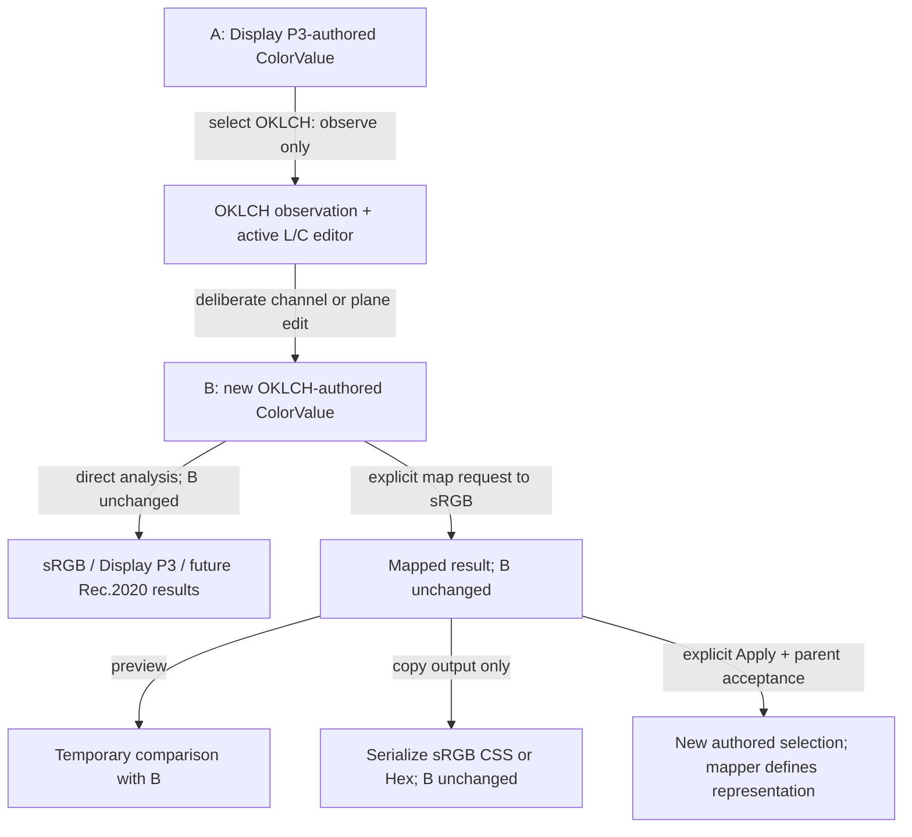
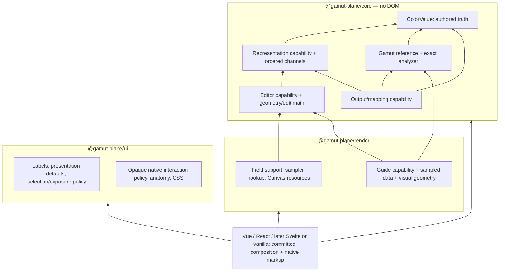

# vNext product capability model (Phase 2A, hardened by Phase 2A.1)

## 1. Status and baseline

Status: completed product/domain design, 2026-09-27. The durable decisions are recorded in [ADR 0003](decisions/0003-vnext-product-capability-model.md). This document contains the source audit, alternatives, illustrative contracts, stress tests and implementation sequence. Proposed names are design vocabulary, not new package exports or component signatures.

Phase 2B implements the internal core inventory in section 30; see the source record in section 27. Phase 2C now consumes editor/geometry definitions through render-owned field and guide support, as recorded in section 31. The Phase 2A/2A.1 audit and broader illustrative contracts below retain their design context. Phase 2D implements shared UI metadata and current product admission as recorded in section 32. Generalized public selection/check/guide state and scoped availability remain later work.

Phase 2A.1 hardens editor, operation, exposure and interaction identity without replacing the accepted capability-family architecture. Before this documentation-only pass, local `dev`, `origin/dev` and remote `dev` were verified at `5e2af6be7e7b5841c472d57a55bcf42f23b1a1a7` (`docs(architecture): define vnext capability model`), with a clean worktree and successful exact-SHA [Phase 2A CI 36337076108](https://github.com/maikeleckelboom/gamut-plane/actions/runs/36337076108). Local/tracking/remote `main` remained `bfdd4aa5b42b4b434fcc59e549062d149aca4fbe`. Node 24.16.0 and pinned pnpm 11.9.0 were reconfirmed. The table below preserves the earlier Phase 2A starting evidence.

The prerequisite was verified before editing:

| Check                                      | Observed starting state                                                                                                              |
| ------------------------------------------ | ------------------------------------------------------------------------------------------------------------------------------------ |
| Branch and worktree                        | `dev`, clean                                                                                                                         |
| Local `dev`, `origin/dev`, remote `dev`    | `50ff6ff4759ac3a71caf120f345eac863e4f50f4`                                                                                           |
| Latest commit                              | `docs(release): include shared ui artifacts`                                                                                         |
| Exact-SHA Phase 1B CI                      | [36334633661](https://github.com/maikeleckelboom/gamut-plane/actions/runs/36334633661), completed successfully for that SHA on `dev` |
| Local `main`, `origin/main`, remote `main` | `bfdd4aa5b42b4b434fcc59e549062d149aca4fbe`                                                                                           |
| Toolchain                                  | Node 24.16.0, repository-pinned pnpm 11.9.0                                                                                          |

The stale link in [Testing](testing.md) was corrected to `release.md#2-certify-a-clean-checkout` before substantive design writing. Phase 1B remains closed. Its [foundation record](ui-foundation-phase-1b.md) and [implemented plane ownership](plane-controller-decomposition.md#phase-1b4b-implemented-ownership) govern current responsibilities. The older [Phase 1A audit](vnext-ui-foundation-audit.md) is historical evidence, including proposals subsequently superseded by Phase 1B.

The audit also read [ADR 0001](decisions/0001-coordinate-plane-projections.md), [ADR 0002](decisions/0002-vnext-instrument-architecture.md), [Architecture](architecture.md), [React parity](react-parity.md), [Performance](performance.md), the [root README](../README.md), and the [core](../packages/core/README.md), [Vue](../packages/vue/README.md) and [React](../packages/react/README.md) READMEs in full. Source, rather than historical descriptions, determines the findings below.

## 2. Scope and non-goals

Define the reusable instrument's capability families and state before redesigning its surface. Select an architecture that can express four current representations, two current planes, separate gamut checks and guides, explicit mapping, and independent output choices. Use one additional representation, XYZ D65, only as a design stress case; Rec.2020 appears in set/flow examples as a future gamut reference, not a delivered capability.

This pass changes documentation only. It does not add a catalog, alter ColorValue, move renderer algorithms, change public APIs, add dependencies, change CSS, regenerate data or images, change package versions, or implement Phase 2B. The 430–480px desktop popover direction and mobile usability remain product constraints, not a new pixel specification or a claim of rendered verification.

## 3. Current v0.3 model

### Source evidence and consequences

| Source authority                                                                                                                                                    | Current fact                                                                                                                                                                                                             | Consequence for vNext                                                                                                                                                                    |
| ------------------------------------------------------------------------------------------------------------------------------------------------------------------- | ------------------------------------------------------------------------------------------------------------------------------------------------------------------------------------------------------------------------ | ---------------------------------------------------------------------------------------------------------------------------------------------------------------------------------------- |
| [Representation types](../packages/core/src/color/representation.ts), [ColorValue](../packages/core/src/color/value.ts)                                             | Four defining representations: `oklch`, `oklab`, `srgb`, `display-p3`. Correlated three-coordinate tuples; alpha is separate. Definitions are copied/frozen, not normalized. Equality uses `Object.is`.                  | Representation identity already exceeds editor identity. Retain correlated coordinate types and exact defining identity.                                                                 |
| [Observation](../packages/core/src/color/represent.ts)                                                                                                              | Observes any of those four; same-representation observation preserves coordinates. Cross-representation conversion can fail with `numerical-range`. Linear RGB is an implementation detail, not a public representation. | Static support is different from availability for a particular value. Do not advertise the dependency's entire space list.                                                               |
| [Snapshots](../packages/core/src/color/snapshot.ts)                                                                                                                 | `ColorSnapshotV1` carries definition, alpha, `null`, and an explicit `"-0"` number encoding.                                                                                                                             | Color transport remains core-owned; plain JSON of a runtime ColorValue is not its transport contract.                                                                                    |
| [Plane definitions](../packages/core/src/picker/plane.ts), [geometry](../packages/core/src/picker/geometry.ts), [keyboard](../packages/core/src/picker/keyboard.ts) | `PickerPlaneId` uses the same two strings as representations. L/C rectangle at fixed H; a/b disc at fixed L. Plane objects currently combine technical axes, English labels, contour math and sampler references.        | Introduce explicit editor identity without moving the existing mathematical authorities. New descriptors reference these operations.                                                     |
| [Plane edits](../packages/core/src/picker/edit.ts)                                                                                                                  | Channel patches preserve unedited observed coordinates and alpha. Point edits constrain to the instrument. Missing hue can block a chromatic edit.                                                                       | A numeric patch and a numeric control constrained through a plane are different operations.                                                                                              |
| [Exact analysis](../packages/core/src/gamut/analyze.ts)                                                                                                             | `GamutId` already differs from `ColorSpaceId`: `srgb-gamut`, `display-p3-gamut`. Three statuses; strict encoded and linear checks, then a linear tolerance of `1e-9`.                                                    | Apply the same status independently to selected references. “Exact” means direct domain analysis under this policy, not infinite-precision arithmetic.                                   |
| [Mapping](../packages/core/src/gamut/map.ts)                                                                                                                        | One explicit method, `oklch-chroma-reduction-v1`; strict inside can return the original object. A changed result is OKLCH-authored, even when its destination is sRGB. Mapping can fail.                                 | Destination does not determine defining representation. Preview, apply and output-only mapping must be different actions.                                                                |
| [CSS](../packages/core/src/output/css.ts), [Hex](../packages/core/src/output/hex.ts)                                                                                | CSS preserves coordinates or requires strict containment; it can reject required CSS normalization. Hex requires sRGB coordinates, strict containment and an explicit alpha choice; it quantizes to RGB8/RGBA8.          | A representation, output syntax, containment policy and quantization are independent concepts.                                                                                           |
| [Sampled analysis](../packages/core/src/picker/analysis.ts), [boundary math](../packages/core/src/gamut/boundary.ts)                                                | Numeric search/interpolation supplies approximate contours, intervals and guide colors; no exact membership authority.                                                                                                   | Reuse core mathematical primitives; do not treat their tables as gamut definitions.                                                                                                      |
| [Picker presentation](../packages/render/src/pickerPresentation.ts), [boundary presentation](../packages/render/src/boundaryPresentation.ts)                        | Eagerly project both views and check both gamuts; choose one `boundaryTarget`; contain English copy, gradients, exact statuses and sampled overlays. Failures can throw.                                                 | This is a two-view composition, not the future capability catalog. Resolve independent operations and structured availability before component use.                                      |
| [Field renderer](../packages/render/src/fieldRenderer.ts), [generated data](../packages/render/src/generated/gamutTables.ts)                                        | Canvas consumes a numeric sampler, uses reusable buffers/cache keys, and negotiates its context after mount. Static tables decode on import.                                                                             | A selectable representation must not imply a renderer, generated table or per-pixel ColorValue allocation.                                                                               |
| [Vue orchestrator](../packages/vue/src/components/GamutPlane.vue), [React orchestrator](../packages/react/src/GamutPlane.tsx)                                       | View-specific markup, H/L/C and a/b edit wiring, local Hue reference, independent guide flags and fixed Display P3 warning. Hue edits normalize in adapters; core authorship itself retains numeric hue.                 | Migrate capability consumption in later bounded steps; preserve shared controllers and framework lifecycle integration.                                                                  |
| [App](../apps/web/src/App.vue), [output presentation](../apps/web/src/colorPresentation.ts)                                                                         | App owns comparison controls, full output rows, clipboard feedback and rounded display strings. Its `CssRepresentation` union includes `hex`.                                                                            | Output must become reusable product capability; retire this local conflation when migrating the app. Copy uses serializer text, never rounded display text or boundary-preview swatches. |

The [core root exports](../packages/core/src/index.ts) expose the four-space types, two-gamut types, snapshots, exact analysis, mapping, serializers, two-plane operations and sampled math. The [render exports](../packages/render/src/index.ts) include the existing presentation and renderer contracts. [UI exports](../packages/ui/src/index.ts) supply anatomy, glyphs and opaque native interaction policies. [Vue](../packages/vue/src/index.ts) and [React](../packages/react/src/index.ts) expose closed two-view adapter types. None exports a general capability catalog, arbitrary registry, XYZ or a linear-RGB ColorValue.

### Four different bounds concepts already exist

1. **Authored validity:** finite L/a/b/R/G/B coordinates may be extended; OKLCH C must be nonnegative, hue may be any finite number, and `null` hue is accepted only at C = 0. Alpha is finite within [0, 1].
2. **Technical nominal/reference range:** L and encoded RGB have the reference interval [0, 1]; it does not constrain stored definitions. Hue's period is 360 degrees; C has no universal reference maximum of 0.4, and a/b have no authored disc bound.
3. **Editing geometry constraint:** L/C point edits use L [0, 1], C [0, 0.4]. a/b point edits use radius 0.4. The numeric a/b helper first clamps the requested coordinate to ±0.4, then constrains the coupled point radially. Raw channel patches do neither.
4. **UI control bounds:** Hue range/number expose [0, 360], Lightness range/number [0, 1], Chroma range [0, 0.4] but number [0, ∞), and a/b numbers [-0.4, 0.4]. Numeric completion bounds and native range limits do not tighten authored validity; explicit Hue normalization is an edit policy, not a bound.

Visualization/output prerequisites are separate again: numeric OKLCH samples require L [0, 1]; CSS rejects some otherwise valid definitions requiring normalization. Finite, valid definitions can exceed numerical conversion/projection limits.

These distinctions are proved by the existing [value](../packages/core/test/domain/value.test.ts), [neutral](../packages/core/test/domain/neutral.test.ts), [plane-edit](../packages/core/test/domain/planeEdit.test.ts), [mapping](../packages/core/test/domain/map.test.ts), [CSS](../packages/core/test/domain/cssOutput.test.ts) and [Hex](../packages/core/test/domain/hexOutput.test.ts) tests and their source. Tests were inspected, not rerun for this documentation pass. Source also shows that a valid extended L can reach a sample assertion even when observation succeeds: `createPickerPresentation` passes observed L into `getPickerGuide`/`assertOklchSample`. Conversion success alone is therefore insufficient to promise full instrument presentation. This is a future availability requirement, not a Phase 1B reopening or a runtime fix in this pass.

## 4. Terminology

| Term                             | Decision                                                                                                                                                                                                                                                     |
| -------------------------------- | ------------------------------------------------------------------------------------------------------------------------------------------------------------------------------------------------------------------------------------------------------------ |
| Color space                      | A defined mathematical coordinate space or color encoding space. Use in technical descriptions precisely; it is not the universal type name for every product choice.                                                                                        |
| Color model                      | A coordinate/model family used for technical classification and selector grouping. It is metadata, not a class hierarchy, runtime state or dispatch mechanism.                                                                                               |
| Representation                   | The internal umbrella: a precisely identified coordinate interpretation usable for observation and, when supported, authorship. `RepresentationDefinition` describes a kind; existing `ColorRepresentation` is a value in that kind.                         |
| Defining representation          | The representation and exact coordinates retained by ColorValue. Read it from `definitionOf`; never maintain a second writable “authored representation” state.                                                                                              |
| Encoding / transfer function     | A technical part of representation identity. Encoded and linear RGB need distinct IDs even when their channel symbols match. Output text encoding is a separate use of the word; contracts use `format` for that.                                            |
| White point / adaptation context | Core technical authority. A built-in ID fixes its required reference context. Any future selectable context that changes coordinate meaning must be explicit in a versioned core definition, never a UI preference. No adaptation engine is introduced here. |
| Observation representation       | The representation requested for inspection; selecting it does not author a value.                                                                                                                                                                           |
| Editing representation           | The representation in which a selected editor authors an edit. It is obtained from that editor's core definition, not inferred from a label.                                                                                                                 |
| Editor                           | A persistent primary editing context with its own stable identity and authoring semantics; currently L/C or a/b. It is not each widget or every callable operation.                                                                                          |
| Edit operation                   | A core semantic operation or explicit static composition of existing operations, independently described from its product exposure. Range and number can invoke the same operation.                                                                          |
| Companion control                | A UI binding of a channel and edit operation within a primary context, with its own temporary input policy. It is not another persistent editor selection.                                                                                                   |
| Authorable / editable / exposed  | Authorable: core can validate/create a definition. Editable: an implemented edit operation exists under defined semantics. Exposed: the instrument actually binds that operation into its product surface. None implies the next.                            |
| Plane / editing geometry         | A coordinate interaction domain and its projection/constraint/edit math. “Plane” is reserved for a two-dimensional editor, not every representation.                                                                                                         |
| View                             | General presentation language. Retire the two-string `view` as the domain abstraction; future product selection pairs representation and editor. Existing APIs keep their names until an explicit migration.                                                 |
| Gamut reference                  | An independently identified membership criterion with a core analysis capability. It is neither a representation nor a table.                                                                                                                                |
| Visual guide / boundary          | A sampled/projected aid. “Boundary” describes a contour or related overlay, not exact status or a directional operation.                                                                                                                                     |
| Destination / target             | The endpoint of a mapping or constrained output operation. Reserve “target” for this directional meaning.                                                                                                                                                    |
| Mapping                          | An explicit potentially lossy operation, with named method, destination, result and failure. It is not conversion for observation.                                                                                                                           |
| Output format                    | A serialized syntax such as CSS or Hex, with supported coordinate encodings and policies. Hex is never a representation; sRGB is never synonymous with Hex.                                                                                                  |

Technical terminology was checked against [CSS Color 4's predefined spaces](https://www.w3.org/TR/2026/CRD-css-color-4-20260926/#predefined): encoded sRGB and linear sRGB differ by transfer function; Display P3 uses different primaries from sRGB while sharing its transfer curve and D65 white. [Missing and powerless components](https://www.w3.org/TR/2026/CRD-css-color-4-20260926/#missing) are distinct concepts. These standards facts support terminology; the repository's deliberately narrower missing-coordinate, validity and serialization rules remain authoritative. This document does not claim full CSS Color conformance.

Retire or narrow in future product copy: ordinary `boundaryTarget`, “target guide” for a sampled comparison, “CSS representations” when including Hex, and “space” used to imply an editor/gamut/output bundle. Use **Representation** for the conceptual selector label; ordinary entries remain familiar names such as OKLCH and sRGB, with technical qualifiers where needed. “Color space” can remain explanatory language, but should not imply that selecting an entry converts authorship.

## 5. Problems with the current model as a vNext foundation

- `view` selects representation and geometry together. This cannot express an observation-only representation, numeric-only editing, or two geometries for one representation.
- Two eager projections, two hardcoded analyses, boolean guide flags and one privileged reference couple independent capabilities. A missing visual operation can currently stop the whole presentation.
- Plane labels/ranges, rendering policy and adapter control choices do not yet form separate reusable catalogs. Copying the current plane objects into UI would import mathematical authority and sampler assumptions with them.
- `boundaryTarget` mixes the chosen comparison result with sampled guide emphasis. It is not a mapping destination and cannot become the permanent comparison selector.
- A fixed Display P3 warning and two-label visual containment cannot serve as the semantic N-gamut result model. The underlying three-state enum already can.
- Current app output functionality would make a future standalone host uniquely capable unless incorporated into the reusable instrument's product model.

These are limits of the v0.3 product model. They do not invalidate the shared Phase 1B interaction, styling or lifecycle work.

## 6. Design principles

1. One immutable authored value; observation and selection do not rewrite it.
2. Separate representation, editor, gamut reference, guide and output identities. Associate them where an actual capability exists.
3. Keep mathematical validity, operation availability, useful editing range and visual fallback distinct.
4. Keep technical definitions and operations in their current domain owner. UI describes exposure and copy; adapters integrate native frameworks.
5. Resolve immutable built-ins during setup or meaningful state changes; keep catalog composition out of pointer and sampling loops.
6. Prefer explicit data, pure functions and a few meaningful discriminated variants. No universal descriptor, class hierarchy, arbitrary plugin graph or dozens of support booleans.
7. Keep state serializable through stable IDs and immutable arrays. Resolve runtime capabilities locally rather than transporting functions or descriptor objects.
8. Preserve independent successful capabilities when another operation fails. No global “ready” flag and no empty checked set presented as a passing validation.

## 7. Representation capability model

### Alternatives considered

| Criterion            | A: monolithic representation descriptor                                    | B: ownership-partitioned definitions and explicit relations                                                | C: generic runtime capability registry/graph                                          |
| -------------------- | -------------------------------------------------------------------------- | ---------------------------------------------------------------------------------------------------------- | ------------------------------------------------------------------------------------- |
| Clarity              | Convenient single lookup, but representation appears to own every feature. | Separate families match existing source authorities; a resolved view provides convenient consumption.      | Uniform IDs/edges, but simple built-ins require graph concepts.                       |
| Correctness          | Encourages representation = gamut = editor and false support flags.        | Can express independent observation, authorship, editors, analysis, guides and output prerequisites.       | Expressive, but validity moves toward runtime graph checking.                         |
| Package ownership    | Either core imports UI/render, or UI becomes owner of color facts.         | Core, render and UI keep authoritative definitions; no reverse imports.                                    | One registry tends to import every provider or requires registration/bootstrap order. |
| Extensibility        | Every entry grows and many consumers branch on space.                      | Add a built-in within its owner plus real relation rows and metadata; consumers branch on capability kind. | Excellent for arbitrary plugins that this project does not require.                   |
| Runtime cost         | Cheap access, potentially eager loading of all associated data.            | Static lookup plus pre-resolved active bundle; no graph traversal on input.                                | Registration, validation and indirection need additional discipline.                  |
| Type complexity      | Many nullable fields or booleans with undocumented combinations.           | Small closed unions, correlated representation tuples and exhaustive owner-local records.                  | Generic ID/edge typing or loss of correlation behind strings.                         |
| SSR serialization    | Easy to accidentally pass function-rich entries as state.                  | Only IDs, arrays and versioned snapshots cross boundaries.                                                 | Can serialize IDs, but must reconstruct equivalent registrations on both sides.       |
| UI consumption       | Initially simple; grows into special cases.                                | One read-only resolved capability view plus structured per-operation availability.                         | Flexible querying, but each adapter risks reconstructing graph policy.                |
| Cross-layer coupling | High by construction.                                                      | Explicit and testable; the composition boundary receives facts, not ownership.                             | Hidden coupling through providers, ordering and generic dependency edges.             |

**Select B.** Use stable keyed lookup as an implementation technique, without C's runtime registration or plugin graph. Core owns representation/channel definitions and core editing capabilities. Render owns guide/field support records. UI owns labels, control presentation defaults and selection/exposure policy. Output/mapping remain a separate family in core. Relations that depend on another package are declared by the consuming package; representation rows do not enumerate renderer components or CSS.

`RepresentationId` conceptually generalizes `ColorSpaceId` while preserving today's four string values. An ID identifies exact coordinate meaning, including encoding and fixed reference context. A future linear sRGB entry cannot reuse `srgb`. Renaming the TypeScript type or the snapshot's `space` field is not a prerequisite; keep them unchanged in the first implementation slice. Do not use English labels, catalog position, vendor object identity or component names as IDs.

`RepresentationDefinition` answers technical questions: identity, model/coordinate family, fixed reference context, ordered channels, observation capability and optional definition-authorship capability. It does not own editor layout, labels, guide data, output methods or framework components. A relation indexed by representation yields zero or more core editor definitions; a separate UI policy chooses the ordinary editor. Output choices are found through output capabilities, not methods attached to every representation.

All current four representations are both observable and directly constructible through `createColorValue`. Only two have implemented instrument editors. “Authorable” means core can validate a defining value; it does not promise a shipped numeric patch editor, scalar control or plane.

Built-in technical names/symbols can be stable reference metadata in core. User-facing names, aliases for search, accessible descriptions and grouping order live in UI. A UI entry may display the same spelling, such as `OKLCH`; that spelling is not a foreign key. The selector can group by technical families and search labels/synonyms. Recent/frequent selections are optional local preferences, excluded from domain state and deterministic server defaults. No searchable widget or headless library is selected here.

## 8. Channel capability model

A channel is a coordinate role within a representation, identified by a qualified key such as `oklch.c`, `oklab.b` or `srgb.b`, plus its index in the representation's ordered tuple. The two `b` symbols must not collide. Alpha is shared color-level data with its own contract; do not append it to every mathematical coordinate tuple or promise an alpha control in Phase 2B.

| Property / policy                                               | Authority                                       | Decision                                                                                                                                            |
| --------------------------------------------------------------- | ----------------------------------------------- | --------------------------------------------------------------------------------------------------------------------------------------------------- |
| Qualified ID, tuple index, technical symbol, coordinate unit    | Core domain                                     | Stable facts; unit identifies native coordinate scale, not formatted `%` strings.                                                                   |
| Finite-number requirement and hard lower/upper limits, if any   | Core domain                                     | Reflect the actual validator. Do not invent [0, 1] limits for all normalized-looking coordinates.                                                   |
| Nominal/reference range                                         | Core domain                                     | Optional reference fact only where technically meaningful; not a validation rule. Chroma has no universal nominal maximum of 0.4.                   |
| Missing support, dependencies, powerless predicate              | Core domain                                     | Named pure semantic policy operating on the complete representation, not component-specific hue tests.                                              |
| Cyclic period and equivalent coordinate interpretation          | Core domain                                     | Hue period is 360 degrees; cyclic equivalence does not mean defining equality.                                                                      |
| Normalization when a named edit is performed                    | Core edit capability                            | Explicit operation policy. Initial catalogs reference current adapter `normalizeHue` behavior; do not normalize stored definitions or observations. |
| Ordinary slider span and numeric completion bounds              | UI metadata referencing core editor constraints | Separate policies. The Chroma slider is [0, 0.4], while its numeric editor has only a lower bound.                                                  |
| Coupled constraint, such as a/b disc                            | Core editing geometry                           | Cannot be reduced to two independent min/max pairs. A constrained numeric control invokes the geometry operation.                                   |
| Step, displayed precision, friendly label and description       | UI metadata                                     | Defaults per editor/control, not global scientific precision. Explicit edits still pass full unedited coordinates through core.                     |
| Numeric draft, IME/completion and native range endpoint preview | Shared UI policy                                | Existing controllers; adapters supply authoritative inputs and lifecycle.                                                                           |
| Overflow projection, gradient and warning position              | Render visualization                            | Edge projection is presentation. The unbounded authored coordinate remains available numerically.                                                   |
| DOM association and current accessible state                    | Adapter/framework                               | Stable channel name, native numeric exposure, and state descriptions from resolved facts.                                                           |
| Output decimal/byte encoding                                    | Output/mapping in core                          | Independent of numeric display precision.                                                                                                           |

### Missing, powerless and unavailable

Use a derived coordinate fact, not a replacement storage format for ColorValue:

- **Present:** a number plus effect state (`effective` or `powerless`) and provenance (`definition` or `observation`). A numeric hue at C = 0 can be powerless and still be authored.
- **Missing:** the coordinate has no value, with a semantic reason. Today's supported case is neutral OKLCH hue. Preserve its `null` in the existing representation/snapshot.
- **Unavailable:** this observation could not be computed, for example `numerical-range`. It is an operation result, not a newly authored missing coordinate.

Metadata states which channels can be missing and references the core rule; runtime observation determines whether they actually are. The current core does not accept missing L, a, b, RGB or alpha. Future support for any other missing coordinate requires a deliberate validator/transport decision, not changing every number to nullable.

A separate presentation fallback may supply a field hue of 0, a thumb position or a display placeholder. It never fills a numeric fact, edit patch, copy payload or snapshot. A native control that needs a numeric position must describe the absent value and publish only an intentional edit. Opening/focusing/blurring an untouched missing-value control cannot author zero.

For hue-less neutrals, L remains editable while preserving missing hue. Hue remains meaningful as an action that establishes direction. Increasing C or dragging to a chromatic L/C point requires a real direction; report that prerequisite locally and reject only the dependent action. Do not disable the entire instrument. A supplied temporary edit reference must come from explicit interaction intent, not the field's fallback. Powerless numeric hue remains editable because establishing its value affects later chromatic edits.

The same model covers a future non-hue coordinate becoming missing or ineffective: its core dependency rule names the affected channel and prerequisite, and per-action availability determines whether a control is meaningful, contextual or unavailable. There is no generic “missing means disabled” rule. Tiny nonzero chroma must not be erased by a presentation epsilon; the existing neutral tests explicitly preserve it.

## 9. Editing capability and geometry model

### Editor taxonomy alternatives

| Alternative                                                                                       | Strength                                                                                                | Risk and decision                                                                                                                                                                                                |
| ------------------------------------------------------------------------------------------------- | ------------------------------------------------------------------------------------------------------- | ---------------------------------------------------------------------------------------------------------------------------------------------------------------------------------------------------------------- |
| A: broad EditorDefinition for planes, scalars and numeric groups                                  | One editing family, with UI roles restricting selection.                                                | Every consumer must distinguish primary IDs from companion IDs; widget-shaped entries invite duplicate Hue operations and accidental host selection. Viable with strict roles, but rejected for this instrument. |
| B: primary EditorDefinition plus technical edit capabilities                                      | Primary selection has one precise meaning; operations describe raw and constrained edits independently. | Adds an internal identity family and static relations. Select this, limited to six real semantic operations, not a capability per widget or scalar.                                                              |
| C: primary operation context, companions use channel/operation references without independent IDs | Minimal companion identities; range/number remain composition.                                          | Availability and raw-versus-constrained semantics need explicit operation contracts anyway. Adopt its no-companion-ID rule within B; do not leave operations as undocumented handler names.                      |

**Selected taxonomy: primary editors + semantic edit operations; no companion capability IDs.** `EditorId` identifies a persistent primary editing context. Initial IDs are exactly `oklch-lc` and `oklab-ab`. A future numeric-only primary editor is possible, but requires a deliberate editor definition and product admission; the current numeric groups are companions, not shipped standalone modes. A representation-to-editors index yields zero, one or several primary contexts without duplicating representations.

An internal `EditOperationDefinition` describes one implemented meaning: raw OKLCH patch, deliberate normalized Hue edit, L/C point authorship, raw OKLab patch, a/b point authorship, or disc-constrained a/b coordinate edit. The exact six IDs and existing function references are listed at the end of this document. Raw OKLab L/a/b all use one patch operation; the companion binding restricts it to L. OKLCH L/C use one raw patch operation with a qualified channel binding; Hue uses one normalized operation shared by range and number. Numeric grouping, scalar presentation and input mechanism add no core identity.

The existing `PickerPlaneId` remains an internal operation argument during migration. Editor and geometry definitions reference it explicitly; do not rename current APIs merely to align IDs. Labels and component splits do not change semantic identity. Changed edit meaning requires compatibility review.

For the current L/C geometry, x maps C [0, 0.4], y maps descending L [0, 1], and fixed H comes from observing the current ColorValue. For the current a/b geometry, x increases a, y decreases b, the editable domain is a radius-0.4 disc, and fixed L comes from the observation. The surrounding square is a visualization extent, not the editable domain. A fixed-coordinate edit preserves raw unedited axes, even when the visible marker is projected to the edge.

Geometry definitions reference core's projection, membership/constraint, keyboard and authorship functions. They do not duplicate those formulas in data consumed by components. Core already provides separate geometry and sampler interfaces even though its two constants satisfy both. Render support can reference these samplers without relocating sampling math or absorbing ColorValue construction into field rendering.

Current plane keyboard actions and steps remain core-owned: arrows, coarse Shift movement, and horizontal Home/End including disc intersections. Adapters translate focused DOM keys and own focus/capture. Shared UI owns pointer arbitration. Future polar or bounded-curve geometries need their own tested projection/keyboard contract and a new closed variant when introduced; a `custom` callback bag is not a substitute. The initial contract only promises the implemented rectangular/disc operations.

UI composition associates a primary editor with companion bindings: H/L/C with L/C; fixed Lightness and constrained a/b numbers with the disc. Current a/b numbers call `oklabCoordinatePlanePoint` and then a point edit: both a and b may change. Core already supports unrestricted finite a/b channel patches through `authorPlaneEdit({ plane: "oklab", kind: "channels", ... })`. The disc applies to its **point** branch, not its channel branch. A future unrestricted exposed OKLab numeric editor could reuse that existing patch operation, but would need a separately admitted editor and UI binding. It does not require inventing another raw patch algorithm. A callable core operation is not automatically a shipped editor capability.

Ordinary axis selection is limited to supported editor presets. No arbitrary axis permutation is promised. Several geometries for the same representation can have distinct IDs and share its channels, authorship and observation. Numeric-only editing can ship before plane/guide support; observation can ship before any editor. A missing renderer does not invalidate the representation or delete the selected editor. Expose numeric alternatives when available, and distinguish an unsupported field from a mounted Canvas context that is merely unavailable.

### Current-control inventory: source bridge to Phase 2B

The table audits both [Vue GamutPlane](../packages/vue/src/components/GamutPlane.vue) and [React GamutPlane](../packages/react/src/GamutPlane.tsx), their [Vue channel](../packages/vue/src/components/ColorChannelControl.vue)/[React channel](../packages/react/src/components/ColorChannelControl.tsx) and [Vue numeric](../packages/vue/src/components/NumericInput.vue)/[React numeric](../packages/react/src/components/NumericInput.tsx) bindings. Core authority is [edit.ts](../packages/core/src/picker/edit.ts), [keyboard.ts](../packages/core/src/picker/keyboard.ts), [geometry.ts](../packages/core/src/picker/geometry.ts), [normalizeHue](../packages/core/src/color/types.ts) and the representation validator. IDs below are proposed internal metadata identities, not existing exports.

All exposed edits preserve alpha and author in the named representation. “Other coordinate” means another observed coordinate, not comparison with the source's potentially different defining representation. `D-LCH` means finite L, finite C ≥ 0, finite H or null only at C = 0; `D-Lab` means finite L/a/b; `D-RGB` means finite R/G/B. All require alpha in [0, 1]. Conversion and missing-direction prerequisites remain operation results. “Describe” means internal Phase 2B metadata; UI rows/bounds themselves remain out of that phase.

| Representation | Current UI surface                                  | Core operation / static composition                               | Coupled geometry                                       | Normalization                                 | Authored validity            | Ordinary UI bound                         | Other coordinate may change?                                  | Current role                  | Stable identity warranted                            | Phase 2B                                          |
| -------------- | --------------------------------------------------- | ----------------------------------------------------------------- | ------------------------------------------------------ | --------------------------------------------- | ---------------------------- | ----------------------------------------- | ------------------------------------------------------------- | ----------------------------- | ---------------------------------------------------- | ------------------------------------------------- |
| OKLCH          | L/C plane, pointer and keyboard                     | `authorPlaneEdit` point; keyboard first uses `keyboardPlanePoint` | L/C rectangle                                          | No Hue normalization                          | D-LCH                        | L [0, 1], C [0, 0.4]                      | L and C edited together; missing H can use explicit reference | Primary                       | Editor `oklch-lc`, operation `oklch-lc-point`        | Describe both + geometry                          |
| OKLCH          | Hue range                                           | `normalizeHue` then channel patch H                               | None                                                   | Deliberate H → [0, 360)                       | D-LCH                        | [0, 360]                                  | No                                                            | Companion of L/C              | Shared `oklch-hue-edit`; no range ID                 | Describe operation                                |
| OKLCH          | Hue numeric                                         | `normalizeHue` then channel patch H after completion              | None                                                   | Same as range                                 | D-LCH                        | [0, 360] on completion                    | No                                                            | Companion of L/C              | Same `oklch-hue-edit`; no numeric ID                 | Same operation                                    |
| OKLCH          | Lightness range                                     | Channel patch L                                                   | None                                                   | Identity; retain H                            | D-LCH                        | [0, 1]                                    | Only explicit missing-H reference can fill H; see parity note | Companion of L/C              | `oklch-channel-patch` + `oklch.l`                    | Describe shared operation                         |
| OKLCH          | Lightness numeric                                   | Channel patch L after completion                                  | None                                                   | Identity; retain H                            | D-LCH                        | [0, 1]                                    | Same reference caveat                                         | Companion of L/C              | Same operation/channel; no widget ID                 | Same operation                                    |
| OKLCH          | Chroma range                                        | Channel patch C, optional explicit Hue reference                  | None                                                   | Identity; retain H                            | D-LCH                        | [0, 0.4]                                  | Missing H can be supplied by explicit reference               | Companion of L/C              | `oklch-channel-patch` + `oklch.c`                    | Same operation                                    |
| OKLCH          | Chroma numeric                                      | Channel patch C after completion, same reference                  | None                                                   | Identity; retain H                            | D-LCH                        | Min 0, no max                             | Same missing-H rule                                           | Companion of L/C              | Same operation/channel                               | Same operation; prove C > 0.4                     |
| OKLab          | a/b plane, pointer and keyboard                     | `authorPlaneEdit` point; keyboard first uses `keyboardPlanePoint` | Radius-0.4 disc                                        | No independent channel normalization          | D-Lab                        | Disc, surrounding square is visualization | a and b together; L retained                                  | Primary                       | Editor `oklab-ab`, operation `oklab-ab-point`        | Describe both + geometry                          |
| OKLab          | Lightness range                                     | Channel patch L                                                   | None                                                   | Identity                                      | D-Lab                        | [0, 1]                                    | No; raw a/b remain even outside disc                          | Companion of a/b              | `oklab-channel-patch` + `oklab.l`                    | Describe shared operation                         |
| OKLab          | Lightness numeric                                   | Channel patch L after completion                                  | None                                                   | Identity                                      | D-Lab                        | [0, 1]                                    | No                                                            | Companion of a/b              | Same operation/channel                               | Same operation                                    |
| OKLab          | a numeric                                           | `oklabCoordinatePlanePoint` for a, then point authorship          | Clamp requested a to ±0.4, then radial disc constraint | Geometry, not representation canonicalization | D-Lab                        | [-0.4, 0.4]                               | Yes, b may change radially; L retained                        | Companion of a/b              | `oklab-disc-coordinate` + `oklab.a`                  | Describe operation                                |
| OKLab          | b numeric                                           | Same helper for b, then point authorship                          | Clamp requested b to ±0.4, then radial disc constraint | Same                                          | D-Lab                        | [-0.4, 0.4]                               | Yes, a may change radially; L retained                        | Companion of a/b              | Same operation + `oklab.b`                           | Same operation                                    |
| OKLab          | Core-only raw a/b patch                             | `authorPlaneEdit` channels a and/or b                             | None                                                   | Identity                                      | D-Lab; no disc limit         | None; not exposed                         | Unpatched coordinates retained                                | No product role for a/b patch | Same `oklab-channel-patch` used for L; no new editor | Describe full low-level contract                  |
| sRGB           | Core construction/observation; no instrument editor | `createColorValue` / `represent`                                  | None                                                   | Stored definition unchanged                   | D-RGB, extended values valid | None                                      | Construction supplies full tuple; observation does not author | No shipped editor             | Representation `srgb` only                           | Describe representation, no edit operation/editor |
| Display P3     | Core construction/observation; no instrument editor | `createColorValue` / `represent`                                  | None                                                   | Stored definition unchanged                   | D-RGB, extended values valid | None                                      | Same                                                          | No shipped editor             | Representation `display-p3` only                     | Describe representation, no edit operation/editor |

The semantic paths agree in both adapters: Hue normalizes in the orchestrator, L/C patch, OKLab L patches, and a/b use the coordinate helper plus point authorship. Vue's numeric completion emits update then commit; React's completion calls its `edit(..., true)`, which emits change then commit. Range normalization also supplies expected-feedback equivalence (native 360 versus authored 0); it is not a second authoring algorithm.

Source parity has bounded qualifications: Vue passes a present `hueReference` for both L and C, while React passes it for C only. With accepted numeric H, core ignores that reference; with accepted missing H, both adapters clear it. A transient reference established by an unaccepted prior edit is not proof of identical cross-control behavior. Preserve the explicit-reference operation and require paired acceptance evidence before later dynamic integration; do not change either adapter here. Vue feeds the range controller a bounded visible scalar, React the authored scalar; this existing dynamic-bound caveat also remains deferred. Current Hue controls receive `fieldHue` (including its presentation fallback), not a nullable native number: the future missing-coordinate contract in section 8 must not be described as already implemented native exposure.

The inspected [plane edit tests](../packages/core/test/domain/planeEdit.test.ts), [value tests](../packages/core/test/domain/value.test.ts) and [neutral tests](../packages/core/test/domain/neutral.test.ts) support preservation, reference and constraint distinctions. The raw OKLab branch directly establishes no disc bound; Phase 2B must add semantic proof contrasting an outside-disc raw patch with constrained numeric authorship, rather than claiming that contrast was already tested here.

## 10. Authorship versus observation state

Keep three concepts but only two independent selection fields:

- Authored representation: derived from ColorValue.
- Active observation representation: `selection.representationId`.
- Active editor: `selection.editorId`, nullable; its definition determines the editing representation.

For the ordinary instrument, a non-null editor must author in the selected observation representation **and belong to the product's admitted primary-selection relation**. Validate the pair atomically. Advanced inspection can observe additional representations through local inspector requests without replacing that pair. This avoids three independently writable selectors drifting apart while still allowing authored representation to differ from active editing representation.

Selecting a representation requests a complete pair: retain its compatible product-admitted current editor, otherwise choose its stable UI default from admitted ordinary primary choices, otherwise `null`. A later numeric-only default requires explicit primary admission; the existence of numeric companions is insufficient. The result changes presentation only. A deliberate observation-only selection may keep `editorId: null` even when editors exist. A controlled parent must accept the whole pair before it becomes active; refusal keeps the current editor and active gesture intact. Externally supplied mismatched, unknown or non-admitted pairs are rejected with a structured configuration issue, not silently repaired into another representation.

### Product selection domain and companion exposure

Capability existence does not imply primary selector exposure. These six questions have different authorities; do not collapse them into support booleans:

| Question                                      | Explicit relation or result                                                                                   |
| --------------------------------------------- | ------------------------------------------------------------------------------------------------------------- |
| Does an operation exist?                      | Core owner-local operation definition and existing implementation.                                            |
| Is it compatible with a representation?       | Core operation's correlated representation/channel/geometry contract.                                         |
| Is it usable now?                             | Its per-value prerequisites and actual typed result; renderer/environment readiness is separate.              |
| Can an editor be selected as primary?         | UI/product admitted-primary relation, checked for host input as well as internal requests and restored state. |
| Is it ordinarily offered as a primary option? | UI entry role `ordinary` within that relation; not enumeration of core editors or operations.                 |
| Is an operation a companion here?             | UI relation from primary EditorId to operation + qualified channel + control metadata.                        |

For the initial future product, valid non-null selections are exactly `(oklch, oklch-lc)` and `(oklab, oklab-ab)`, both admitted as ordinary. Each of the four representations can also pair with `null` for observation only. This describes later product policy, not a public selection API added in Phase 2B. The primary selector appears only when the ordinary choices for that representation warrant a choice; admission does not require a redundant selector for a single entry.

`{ representationId: "oklch", editorId: "oklch-hue" }`, numeric group names and any edit-operation ID are invalid selections: none is an initial EditorId. Even a future technical EditorId must be product-admitted before a host can select it. No advanced hidden primary is admitted initially. A future explicit `host-only` admission could permit a host to select a normally unlisted primary; mere technical compatibility never grants that permission. An excluded core editor has no admission row. A public selection type may therefore be narrower than the internal editor union; runtime validation still protects untyped/restored inputs.

Initial companion relations are `oklch-lc → (oklch.h, oklch-hue-edit), (oklch.l, oklch-channel-patch), (oklch.c, oklch-channel-patch)` and `oklab-ab → (oklab.l, oklab-channel-patch), (oklab.a, oklab-disc-coordinate), (oklab.b, oklab-disc-coordinate)`. The L-only OKLab patch binding cannot expose raw a/b by enumerating that operation's writable channels. Range and numeric mechanisms decorate these bindings with separate ephemeral policies, without making companion EditorIds. Numeric groups are UI grouping of bindings, not additional definitions.

| User action / transition                             | Authored value                                           | Selection / derived consequence                                                                                                                                                                                    |
| ---------------------------------------------------- | -------------------------------------------------------- | ------------------------------------------------------------------------------------------------------------------------------------------------------------------------------------------------------------------ |
| Select R for inspection                              | Keep A exactly                                           | Observe R; choose the coherent editor pair or explicit observation-only mode.                                                                                                                                      |
| Open numeric channels                                | Keep A exactly                                           | Format observation; do not complete a draft or construct a definition.                                                                                                                                             |
| Edit one coordinate                                  | Core creates a definition in the editor's representation | Preserve other observed coordinates and alpha; report change then completion when appropriate. Editing an unchanged observed number can still be a deliberate redefinition if the defining representation differs. |
| Drag a geometry                                      | Core authors in that geometry's representation           | Preserve existing preview/coalescing/final-point policy. Constraints apply to the edit, not to A on selection.                                                                                                     |
| Switch away and back                                 | Keep latest accepted ColorValue                          | Reobserve that value; do not resurrect a cached per-representation color.                                                                                                                                          |
| Different parent ColorValue                          | Parent replacement wins                                  | Recompute availability; interrupt stale gestures without rollback and discard affected drafts.                                                                                                                     |
| Accepted representation/editor switch during gesture | Keep last accepted publication                           | Interrupt old interaction; never interpret queued coordinates through the new editor.                                                                                                                              |
| Explicit mapping preview                             | Keep A                                                   | Derived result for A + destination + method.                                                                                                                                                                       |
| Apply a successful changed mapping                   | Emit mapped ColorValue for parent acceptance             | Defining representation comes from the mapper, not the destination label.                                                                                                                                          |
| Copy direct or explicitly mapped output              | Keep A                                                   | Serialize the chosen source under the action's policy, then attempt clipboard delivery.                                                                                                                            |

Use “Editing as OKLab” (or equivalent selection context) and a concise **Authored as Display P3** indicator whenever these differ. Do not repeat both labels when equal; full defining coordinates remain available in inspection. Missing/powerless or normalization-relevant authorship deserves explicit contextual detail. This distinction is visible before the next edit, so the first edit's redefinition is predictable. The main selector must never imply it describes the stored definition.



Rec.2020 in this diagram requires a future core analyzer; no such capability exists at the audited baseline. Selecting it cannot be simulated with another gamut or a sampled table.

### Semantic interaction identity and future migration acceptance

Accepting a change in editor semantics invalidates interaction state created under the previous editor, even when representation and numeric values are unchanged. The semantic context includes accepted primary editor, operation, bound channel/geometry and any edit interpretation policy. Temporary controller instances also distinguish input mechanisms: shared authored Hue semantics does not mean a range RAF and numeric draft share one session. Identity is not a displayed number, bounds, callback object identity or reused DOM node.

Today [planeGesture](../packages/ui/src/interaction/planeGesture.ts) compares an explicit `viewKey`, supplied as `plane.id`; [rangeInteraction](../packages/ui/src/interaction/rangeInteraction.ts) reconciles scalar feedback and [numericInteraction](../packages/ui/src/interaction/numericInteraction.ts) resets drafts when its adapter requests value/precision reconciliation. Neither scalar controller carries a general semantic editor/control key. That is adequate for Phase 1's fixed bindings, not evidence of future dynamic rebind safety.

Future adapter/product integration must invalidate before callbacks can observe a newly accepted operation binding. It must discard queued points/RAF, end old pointer ownership, clear numeric drafts/composition/restoration work and obsolete editor/channel references, reset associated preview flags and invalidate any mapped preview tied to that edit request. Keep the last accepted ColorValue; do not roll back or commit an old interaction during a semantic switch. Preserve existing interruption notifications and callback-silent disposal. Source-bound mapping previews unrelated to an editor still follow their own request/source validity contract.

Do not select an `interactionKey`, `bindingKey` or new controller API in this docs pass. Remounting controllers on semantic identity, an explicit semantic binding key, or a narrow invalidation port remain implementation choices. Whichever is selected must make late native completion from the old control inert, including DOM reuse; disposing an old RAF alone does not prove stale `change` cannot reach a newly mounted listener. Require paired adapter evidence before shipping dynamic controls.

| Future acceptance case                                   | Required result                                                                                                                                                                                          |
| -------------------------------------------------------- | -------------------------------------------------------------------------------------------------------------------------------------------------------------------------------------------------------- |
| Same semantic control, new accepted value                | Reconcile through current feedback/replacement policy; expected defining-equal feedback can retain interaction, a superseding value wins. No remount merely because a descriptor object was reallocated. |
| Same representation, accepted different editor           | Discard the old gesture/points/drafts before new operations become callable, even if values and bounds match.                                                                                            |
| Requested editor change is not accepted                  | Keep old accepted context and its interaction intact; no speculative invalidation.                                                                                                                       |
| Numeric X → Y rebind with equal displayed number         | X's draft cannot complete as Y; reset old session independently of value/precision equality.                                                                                                             |
| Range X → Y rebind with equal value/bounds               | Drop X's pending RAF and pointer preview; old native change cannot publish through Y's callback.                                                                                                         |
| Late blur/change/pointerup/capture loss from old control | No stale edit, completion or rollback into new context.                                                                                                                                                  |
| Atomic representation/editor replacement                 | Validate the complete pair, invalidate old semantics, then bind the accepted coherent pair; no transient hybrid.                                                                                         |

Phase 2B records stable semantic facts only. Phase 2C or whichever later slice consumes dynamic capabilities must implement and prove these cases; it must not substitute value equality for identity or silently reopen Phase 1 controllers now.

## 11. Gamut-reference model

A core `GamutReferenceDefinition` identifies a membership criterion and its exact analyzer. Retain `srgb-gamut` and `display-p3-gamut` as stable IDs. `srgb` names a coordinate representation; `srgb-gamut` names a bounded membership test. Multiple representations, including a future linear sRGB representation, can refer to the same gamut without sharing coordinate meaning. Conversely, an OKLCH observation can be checked against several RGB gamuts without an “OKLCH gamut” entry.

The technical definition belongs in core; its human label belongs in UI. Optional render guide support and optional mapping support are relations owned by render and core's mapping family respectively. Neither must be a field containing algorithms on the gamut definition. Existing direct analysis takes the original ColorValue and is independent of the current editor and Canvas capability. Alpha is preserved color data; current gamut analysis checks color coordinates rather than a composited result over a background. A future compositing check would be another explicit operation.

Keep `inside | within-tolerance | outside`. Do not add `unsupported`, `missing`, `pending` or `unavailable` to the exact status enum. Those describe capability resolution or operation failure, wrapped around a result. Preserve current tolerance and strict-output distinctions. A future non-RGB analyzer might need a different diagnostic payload from `linearRgb`, but no current requirement justifies changing `GamutAnalysis` or its status now.

No inference from containment nesting is required: analyze each checked reference directly, retaining individual failures and provenance. No guide-supported-gamut list is used to filter exact analysis.

## 12. Checked-gamut state

Use `checkedGamuts: readonly GamutId[]`, with set semantics and a canonical wire order. Validate IDs, deduplicate, and sort by ascending stable ID using code-unit comparison, not locale-sensitive labels or catalog insertion order. The canonical current pair is `["display-p3-gamut", "srgb-gamut"]`. Display order can remain sRGB then Display P3 through UI metadata; wire order is not visual priority.

An empty array is valid. It means no ordinary comparison was requested, not that all gamuts passed. Defaults may retain the two current checks during migration; newly added built-ins never silently join a host's selection. Unknown IDs fail configuration/restore validation before evaluation. Preserve an unreadable persisted input for recovery rather than filtering its meaning away. Explicit versioned migration can later offer a documented replacement or removal.

Canonical arrays provide deterministic JSON/SSR/URL/storage transport, value equality by length and element comparison, and immutable controlled-prop updates. A consumer can derive an internal Set for lookup; neither JavaScript Set nor Map is the public transport shape. Query persistence uses encoded stable strings under a versioned schema and validates them through the same boundary. A future custom element can use JSON properties or an explicitly documented attribute codec without transporting runtime objects.

Return an ordered `readonly GamutCheckResult[]`, one record per canonical requested ID. Each record contains the ID and either the existing `GamutAnalysis` or its failure. Never drop failed rows and report the remainder as a complete pass. An internal map/index may accelerate lookup, but derived results are not authoritative stored instrument state. Recompute on accepted authored-definition changes and checked-set changes, not guide toggles or representation selection. Associate cached results with the exact definition and analysis policy, including signed zero where identity matters.

The collection evaluator binds each analyzer to the requested ID and verifies that a successful result's `gamut` matches the row's `gamutId`. It must not accidentally label another reference's result through a generic function handle.

## 13. Visible-guide state

Use `visibleGuides: readonly GuideId[]` with the same canonical array rules, independently of `checkedGamuts`. A guide ID identifies a semantic visual aid, such as `srgb-boundary` or `display-p3-boundary`, not a generated table filename or one editor's path. A render-owned `GuideDefinition` relates that ID to a gamut; render support rows specify which editor/geometry can produce which forms (contour, scalar intervals, sampled excursion marker), using which sampler/data.

| Requested checks                  | Requested guides                         | Decision                                                                                                                        |
| --------------------------------- | ---------------------------------------- | ------------------------------------------------------------------------------------------------------------------------------- |
| sRGB, Display P3, future Rec.2020 | sRGB, Display P3                         | Valid once the exact Rec.2020 analyzer exists; no Rec.2020 guide is required.                                                   |
| sRGB                              | None                                     | Valid; exact status remains available without overlays.                                                                         |
| None                              | Display P3                               | Valid; inspect an approximate contour without requesting an exact status. No implied exact containment claim.                   |
| Display P3                        | A guide unsupported in the active editor | Keep the check and requested guide ID; report that guide as unavailable in this editor. Do not delete it or fabricate geometry. |

Distinguish **requested visibility** from **effective rendered availability**. Switching to a numeric-only or observation-only selection may yield no effective plane guides; the stored guide preference survives. Returning to a compatible editor restores it without another selection event. Guide availability is resolved from `(guideId, editorId, required data, current coordinates)`, not repeated space/gamut conditionals in components. Unknown guide IDs are configuration issues; known but unsupported combinations are ordinary capability outcomes.

Contour/interval support need not require exact checks. The current outside-only sampled excursion marker does require an exact `outside` result for its corresponding reference; without that check, omit that conditional marker while retaining independently supported contours. Do not perform hidden ordinary checks merely to reconstruct v0.3's always-present target panel. Explicit mapping/output requests may independently analyze their destinations, without adding them to `checkedGamuts`.

The current singular target-guide emphasis is not automatically multiplied into N markers. The ordinary instrument can show selected contours and concise exact results; detailed sampled reference inspection is contextual. If a later design needs one focused guide, make it a guide-inspection preference, not a gamut “target.” Its exact UI and overlap policy are deferred with evidence requirements in section 28.

## 14. Directional destination / target model

There is no global destination in the ordinary picking/comparison state. A destination appears in a mapping or constrained output request. For currently supported operations, its identity is simply `GamutId`; do not invent a universal destination/profile object before a non-gamut destination exists.

Mapping to sRGB is valid when sRGB is not checked or visible. Selecting a destination does not change the observation/editor pair, checked set, guide set or ColorValue. An output can require a destination even without mapping: “serialize these coordinates only if contained in sRGB” is directional validation. A coordinate-preserving CSS output need not have a destination at all.

Future export to an ICC profile would need a new explicitly modeled destination family and identity/transport contract. It is not expressible by substituting an arbitrary profile string for today's `GamutId`. That future work does not constrain the present built-in catalog.

## 15. Mapping model

Mapping capability is a core relation between a supported method and destination, with explicit preconditions, result and error. The existing method preserves observed OKLCH L/H and alpha while reducing C; a failed neutral anchor or numerical conversion remains a failure, not permission to silently clip. Keep the existing method identity. This is not a claim that the method implements a CSS specification's mapping algorithm.

| Action                  | State and authority                                                                                         | Outcome                                                                                                                                    |
| ----------------------- | ----------------------------------------------------------------------------------------------------------- | ------------------------------------------------------------------------------------------------------------------------------------------ |
| Non-destructive preview | Local output/action request `{ destination, method }`; derived result tied to source definition and request | Show original and mapped result, with method/destination context. Original remains selected.                                               |
| Apply mapping           | Explicit command using a successful current result                                                          | Deliver mapped ColorValue to the parent through normal edit/completion ownership. A changed result is authoritative only after acceptance. |
| Output-only mapping     | Explicit output policy invokes mapping before observation/serialization                                     | Copy/export the mapped source's serialized result; never emit a selected-color edit.                                                       |

These are separate capabilities, not three features promised for the next slice. Preview is **derived action state**, not a second product ColorValue or persistent cache to restore. Retain its source identity and request identity while open. Replacing the color or changing destination/method invalidates the result. Apply must verify that the preview belongs to the current source, recompute or reject a stale request, and never apply an old result after a parent replacement. A future asynchronous implementation also needs a generation token; do not add an asynchronous scheduler now.

If the mapper reports `changed: false`, Apply does not synthesize a color change or undo entry. A changed mapping may still be defined in OKLCH. Outputting it in encoded sRGB is a subsequent observation/serialization operation. Do not force a second authored definition just to make its stored representation match the destination label.

## 16. Output/serialization capability model

Use a separate core-owned `OutputCapability` family. Each built-in output identifies its syntax, coordinate representation, serializer, supported containment/mapping request forms, alpha policy and precision/quantization contract. UI supplies labels and ordinary presets. A representation can have multiple formats; a format can support multiple representations. No output capability implies an editor or visual guide.

| Capability example | Representation used for output | Destination requirement                                                                                                      | Alpha / precision                                                                              |
| ------------------ | ------------------------------ | ---------------------------------------------------------------------------------------------------------------------------- | ---------------------------------------------------------------------------------------------- |
| `css-oklch`        | OKLCH                          | None for preserve-coordinates; optional explicit containment or mapping destination                                          | Preserve alpha; current serializer's round-trip number text; can reject required normalization |
| `css-oklab`        | OKLab                          | Same policy choices as CSS OKLCH                                                                                             | Same; exists in core even though the app does not offer this copy row                          |
| `css-srgb`         | Encoded sRGB                   | May preserve extended coordinates or explicitly require/map to a chosen supported gamut; ordinary destination preset is sRGB | Preserve alpha and coordinates under the selected policy                                       |
| `css-display-p3`   | Encoded Display P3             | Same distinction; ordinary destination preset is Display P3                                                                  | Preserve alpha and coordinates under the selected policy                                       |
| `hex-srgb`         | Encoded sRGB                   | Fixed strict sRGB; optional explicitly requested map-to-sRGB before serialization                                            | Include alpha or omit only when opaque; RGB8/RGBA8 quantization                                |

The current app intentionally offers strict RGB CSS and Hex. A future output catalog can represent the broader existing CSS serializer policy without silently changing that default. “CSS for sRGB” must identify whether it means sRGB coordinate syntax, strict sRGB containment, or explicit mapping; a single ambiguous `target` prop is insufficient.

The action pipeline is: capture current source and request; validate the capability/request combination; explicitly map only if requested; observe the resulting source in the output representation; serialize under its policy; deliver only a successful text result. The selected ColorValue is unchanged throughout output-only work. Run the final serializer's own containment/normalization checks even after mapping; numerical conversion can still make that output unavailable. Never replace a failed result with a boundary swatch, rounded readout or clipped string.

Precision has three owners: full authored numbers in core; control/readout precision in UI; output precision/quantization in the serializer. Current CSS output exposes no user-configurable precision, and Hex has fixed byte quantization. A later lossy decimal option needs an explicit output policy and verification of the serialized result, not reuse of `toFixed` from display formatting. Alpha omission must not discard nonopaque alpha; flattening over a background would be a separate, currently unsupported operation.

Clipboard availability/failure is delivery state in the adapter/environment boundary. A valid serialized result remains selectable even if clipboard delivery fails. Success announcements follow the actual completed write; no mapping, copy or precision change mutates ColorValue implicitly.

## 17. Product-state inventory

This is an inventory of concepts, not a proposal for one exported giant state object. Derived facts are listed with the family they serve; they are not additional writable authority.

| Item                                                                      | Classification                                  | Default ownership / persistence                                                                 |
| ------------------------------------------------------------------------- | ----------------------------------------------- | ----------------------------------------------------------------------------------------------- |
| Authored ColorValue                                                       | Authored/domain state                           | Parent-controlled; core snapshot for transport                                                  |
| Defining representation, coordinates and alpha                            | Authored/domain state, read through ColorValue  | Derived access to the same authority, never parallel setters                                    |
| Observation representation + primary editor                               | Controlled product state                        | One controllable selection pair; stable IDs may be persisted                                    |
| Editing representation                                                    | Controlled product state, derived               | Resolve from the editor; validate it equals selection representation                            |
| Editing geometry and fixed coordinates                                    | Visualization state, derived                    | Geometry from editor ID; fixed coordinates from current observation; no duplicate stored scalar |
| Checked gamuts                                                            | Controlled product state                        | Controllable canonical immutable ID array                                                       |
| Exact check results                                                       | Controlled product state's derived results      | Recompute/cache by source and requested checks; do not persist as truth                         |
| Requested visible guides                                                  | Visualization state                             | Controllable canonical GuideId array; optional view persistence                                 |
| Effective guides, projections, overflow and field inputs                  | Visualization state, derived                    | Per-instance resolution; tables shared read-only, buffers instance-local                        |
| Mapping destination and method                                            | Output/action state                             | Explicit request; local by default, optional host command configuration later                   |
| Temporary mapped preview                                                  | Output/action state, derived                    | Source-bound and disposable; never in ordinary instrument snapshot                              |
| Output format/representation/policy/alpha choice                          | Output/action state                             | Explicit output request; last-used preset may be a local preference                             |
| Display precision, preferred editor per representation, recents/favorites | Local UI preference                             | Local defaults; persistence is host opt-in, not module-global state                             |
| Output precision/quantization                                             | Output/action state                             | Serializer capability/request; not control precision                                            |
| Menu, selector, inspector or inner popover open state                     | Ephemeral interaction state                     | Internal; host popover open state belongs to host                                               |
| Numeric draft/composition and invalid text                                | Ephemeral interaction state                     | Native input plus shared numeric policy; never snapshot or use as committed color               |
| Pointer owner, origin, expected feedback, queued point/RAF                | Ephemeral interaction state                     | Existing shared gesture policy with committed adapter ports                                     |
| Focus, capture, element refs and DOM bounds                               | Ephemeral interaction state                     | Adapter/environment lifecycle                                                                   |
| Missing-coordinate edit reference                                         | Ephemeral interaction state                     | Explicit interaction context; not persistent fallback authorship                                |
| Canvas capability / renderer availability / quality                       | Visualization state                             | Derived environment facts; deterministic pending SSR shell, post-mount resolution               |
| Clipboard result and announcement timeout                                 | Output/action state                             | Ephemeral per attempted delivery                                                                |
| Restore/configuration issues                                              | Controlled product state's boundary diagnostics | Preserve invalid external input for recovery separately; never install dangling live selections |

No localStorage, URL handling, undo manager, recent-list implementation or new persistence API is added by this design.

## 18. Controlled versus local state

Keep authored color controlled-only in both adapters. Vue's required model and React's required value/change callback remain authoritative. This avoids a second hidden color model and preserves parent-owned undo/history.

Make selection, checked gamuts and requested visible guides **controllable**: external value plus request notification, or locally owned with initialization-only defaults. These affect the reusable product meaningfully and may need host synchronization; they should not require every ordinary host to manage them. With a supplied controlled value and no change handler, treat that dimension as read-only. External accepted changes do not echo as user requests. Do not mix controlled/uncontrolled mode during one instance without an explicit contract in the eventual API review.

Prefer one atomic selection pair over independently controlled representation/editor props that can transiently disagree. A user selection request contains a validated coherent pair. Resolve and publish it once; derive active capabilities only from accepted state. An unknown, mismatched or non-admitted external request yields a scoped configuration issue and leaves the previous valid state unchanged; initial invalid configuration cannot masquerade as a valid default. Known but currently unavailable operations retain valid IDs and expose the reason without changing authorship.

Keep drafts, capture, focus and transient previews internal. Keep display precision/recents local preferences initially; do not turn every capability field into a component prop. Mapping/output actions receive explicit parameters through eventual commands or product actions; a permanent controlled destination is unnecessary until a real host needs it. An advanced inspector's observation selection is local unless a host-specific use case proves otherwise.

Vue reactivity/synchronous authority reconciliation and React committed-prop/layout effects remain adapter responsibilities. Plain resolved facts and opaque callbacks feed existing UI policies. Future Svelte/vanilla adapters can supply their own lifecycle and DOM binding without importing React hooks, Vue refs or framework components. The VueUse consideration found no new generic browser primitive in this documentation slice; existing VueUse observers/listeners remain adapter mechanics, not capability-model authorities.

## 19. SSR, snapshot and serialization considerations

Keep core's `ColorSnapshotV1` unchanged. If an instrument session snapshot is later introduced, it wraps that snapshot with versioned selection/checked/guide IDs. Do not serialize a ColorValue runtime object, descriptors, functions, Maps, Sets, Canvas contexts, current exact-status caches, pointer origin or invalid draft text as product transport.

The initial server and client resolve identical built-in definitions and canonical ID arrays. Technical capability availability is deterministic; browser Canvas capability starts `pending`. No browser probes, locale-dependent sorting, random IDs, recent-history reads or mutable process-global selection participate in server render. Apply optional persisted preferences only through an explicit hydration-safe host policy. Independent requests/instances keep their own state.

Restoration validates the version, core snapshot, all IDs, the representation/editor relation, product primary admission and output request constraints before installing a complete state. Unknown future IDs or unsupported versions return issues; do not silently map them to OKLCH or drop a gamut. A known guide unsupported in the selected editor is still a valid preference, with separately derived unavailability. Actual content recovery and schema migration require explicit evidence and are not automatic “normalization.”

Signed zero and missing coordinates retain core transport semantics. Adding a future representation requires a deliberate snapshot-version/compatibility review; this document does not expand version 1 by implication. URL/storage/native-element codecs resolve IDs against the same built-ins. Human labels may change or be localized without changing stored identity.

## 20. Package ownership

The composed catalog is a query over authoritative families, not a new owner of them.



Arrows mean consumption/dependency, not authorship transfer. Render references core IDs/operations. UI receives resolved structural facts through framework-neutral inputs; its policies do not call converters, sample tables or own geometry. Adapters connect the families and lifecycle. Core never imports render/UI; render never imports UI; UI has no Vue/React/Svelte runtime dependency. Keep Phase 1B's dependency-free UI runtime until a concrete later need justifies a new edge.

The existing render presentation composition can later resolve technical/visual support from core/render and return structural facts. A small pure UI composition function can join supplied facts with UI metadata and resolve selection/exposure policy without a runtime core/render import. Both adapters call those same functions, then bind core operations through their committed ports. Cross-package contract tests check UI metadata keys against core/render built-ins; do not create a second manually maintained scientific catalog just to keep a package manifest empty. If a type-only dependency becomes necessary, review and declare it with packed declaration proof; it is not required for Phase 2B's core-only slice.

### Property authority ledger

This ledger covers the proposed contract properties in section 21; grouped fields share one authority. Data referencing another family's ID does not inherit that family's algorithms.

| Definition / fields                                                                                                                                                                                                            | Authority and eventual owner                                                                                                                   |
| ------------------------------------------------------------------------------------------------------------------------------------------------------------------------------------------------------------------------------ | ---------------------------------------------------------------------------------------------------------------------------------------------- |
| Representation `id`, `technicalName`, `model`, `coordinateKind`, `referenceContext`, `encoding`, ordered `channels`, `observe`, `author`                                                                                       | **Core domain**, core color/capability modules. Operations remain named pure functions.                                                        |
| Channel `id`, `index`, `symbol`, `unit`, `domain`, optional `nominalRange`, `cyclic`, `missing`, `effect`                                                                                                                      | **Core domain**, representation-scoped technical definitions; predicates remain core operations.                                               |
| Coordinate fact `presence`, `value`, `effect`, `provenance`, missing reason; observation error                                                                                                                                 | **Core domain**, derived from the real representation, never UI fallback.                                                                      |
| Primary editor `id`, `representationId`, `kind`, `geometryId`, `pointOperation`; edit-operation ID, correlated request, normalization/prerequisites and static operation reference                                             | **Core domain**, core editing capabilities.                                                                                                    |
| Geometry `id`, `coordinateBinding`, `x`, `y`, `fixed`, `domainKind`, `operations`                                                                                                                                              | **Core domain**, core picker/geometry; not UI arithmetic or renderer algorithms.                                                               |
| Gamut `id`, `technicalName`, `analyze` and analysis result payload                                                                                                                                                             | **Core domain**, core gamut.                                                                                                                   |
| Guide `id`, `gamutId`; support `guideId`, `editorId`, `forms`, `data`, `renderer`; field support and visualization prerequisites                                                                                               | **Render visualization**, render. Existing numerical projection/interpolation primitives remain in core.                                       |
| Mapping `method`, `destination`, preconditions, source/mapped result and failures                                                                                                                                              | **Output/mapping**, core gamut mapping.                                                                                                        |
| Output `id`, `format`, `representationId`, `serializer`, allowed `policy`, `destination`, `alpha`, `precision`, result text/quantization                                                                                       | **Output/mapping**, core output; clipboard delivery is not a serializer.                                                                       |
| UI primary admission/exposure, `label`, `description`, `searchAliases`, `group`, `preferredEditorId`, companion operation/channel bindings, control `sliderRange`, `numericBounds`, `step`, `precision`, `missingPresentation` | **UI metadata**, UI. Bounds cannot override core validity or geometry semantics.                                                               |
| Selection/check/guide transition policy, canonicalization and scoped configuration issues                                                                                                                                      | **UI metadata/product policy**, pure UI logic over supplied facts. Core validates core IDs and operations; adapters own controlled acceptance. |
| `selection`, `checkedGamuts`, `visibleGuides`, local requests/preferences, callbacks and accepted revision                                                                                                                     | **Adapter/framework**, instance integration of shared product policy; authored ColorValue stays parent-owned.                                  |
| DOM elements, focus/capture, framework IDs, committed lifecycle, environment and clipboard hookup                                                                                                                              | **Adapter/framework**; no descriptor fields for components, JSX, Vue refs, styles or element factories.                                        |
| CSS tokens, part/state styling and glyphs                                                                                                                                                                                      | **UI metadata/presentation**, existing UI authority; not in scientific definitions.                                                            |
| Warning placement and contour/gradient serialization                                                                                                                                                                           | **Render visualization**, preserve current Phase 1B boundary.                                                                                  |

### Performance and package loading

Create small immutable built-in definitions once. Resolve active representation/editor, operation references and guide support when selection/configuration changes. Refresh per-color observations, prerequisites and requested exact results when the accepted value changes. An event handler closes over resolved operations and current committed state; it does not search catalogs, assemble descriptors or create speculative ColorValues on each pointermove. Actual authored publication may create one value as it does today. Sampling continues to reuse numeric scratch rather than constructing ColorValue wrappers per pixel.

Separate stable structural resolution from dynamic readiness. Missing hue, extended coordinates or a numerical failure can change per-color availability; pre-resolving a capability must not cache “ready” forever. Preserve the existing latest-point RAF policy, synchronous final publication, callback-silent disposal and fixed-axis/size/DPR/capability/quality cache discipline. N-gamut analysis runs for requested references on color changes; guides and output are not an excuse to recompute every built-in capability eagerly.

Keep core capabilities in small owner-local ESM modules and explicit built-in tables. A small central built-in index is acceptable; adding a tenth representation should touch its domain implementation, metadata, actual support relations and contract fixtures, not unrelated components. Avoid class inheritance and side-effect registration. Current generated data is statically decoded on render import; it is not already lazy. Future tables remain separate from technical catalogs and from state transport. Use measured bundle evidence before choosing separate entry points or dynamic loading; do not introduce dynamic imports to solve a hypothetical size problem. No new package or dependency is required by this design.

## 21. Proposed TypeScript-like contracts

These sketches expose relationships and failure cases. They are not production declarations, new exports or a compiled type experiment. Existing core types/functions named here retain their present contracts. Operation keys below refer to statically imported owner-local functions; they do not require runtime registration, dynamic dispatch discovery or third-party providers. Implementation should derive closed ID unions from the actual built-in rows and preserve current correlated coordinate tuples.

### Technical definitions: core

```ts
type RepresentationId = ColorSpaceId; // Initial four IDs, unchanged wire values.
type ChannelId =
  | "oklch.l"
  | "oklch.c"
  | "oklch.h"
  | "oklab.l"
  | "oklab.a"
  | "oklab.b"
  | "srgb.r"
  | "srgb.g"
  | "srgb.b"
  | "display-p3.r"
  | "display-p3.g"
  | "display-p3.b";

type ScalarDomain =
  | { readonly kind: "finite" }
  | { readonly kind: "finite-lower-bound"; readonly minimum: number }
  | { readonly kind: "finite-interval"; readonly minimum: number; readonly maximum: number };

interface ChannelDefinition {
  readonly id: ChannelId;
  readonly index: number;
  readonly symbol: string;
  readonly unit: "coordinate" | "degree" | "encoded-rgb";
  readonly domain: ScalarDomain;
  readonly nominalRange?: readonly [number, number];
  readonly cyclic: null | { readonly period: number };
  readonly missing:
    | { readonly kind: "not-supported" }
    | { readonly kind: "conditional"; readonly rule: "oklch-neutral-hue" };
  readonly effect: "always-effective" | "oklch-hue-at-zero-chroma";
}

interface RepresentationDefinition {
  readonly id: RepresentationId;
  readonly technicalName: string;
  readonly model: "oklab" | "rgb";
  readonly coordinateKind: "cartesian" | "cylindrical";
  readonly referenceContext: "d65";
  readonly encoding:
    | { readonly kind: "model-coordinates" }
    | {
        readonly kind: "rgb";
        readonly primaries: "srgb" | "display-p3";
        readonly transfer: "srgb";
      };
  readonly channels: readonly ChannelDefinition[]; // Ordered; tuple contract still authoritative.
  readonly observe: "represent";
  readonly author: null | { readonly kind: "definition"; readonly operation: "createColorValue" };
}

type CoordinateFact =
  | {
      readonly presence: "present";
      readonly value: number;
      readonly effect: "effective" | "powerless";
      readonly provenance: "definition" | "observation";
    }
  | {
      readonly presence: "missing";
      readonly reason: "neutral-hue"; // Extend only with a real core semantic rule.
      readonly provenance: "definition" | "observation";
    };
// Conversion failure is ColorResult<..., ConversionError>, never presence: "missing".
```

The initial sketch intentionally cannot express arbitrary XYZ/HCT/CAM definitions by filling generic bags. Add a tested technical variant and tuple contract when a real built-in needs it. The extensibility claim is that this change stays in technical definitions/operations and their real consumers, not that every future science model already fits today's union. `author: null` allows an observation-only future implementation; all four current entries use `createColorValue`.

`domain` and `nominalRange` describe validation/reference facts; they are not a second validator. The first metadata tests compare them with current accepted/rejected values. If later refactoring makes validation data-driven, there must be one underlying definition, not two independently editable sources.

`readonly ChannelDefinition[]` is an illustrative metadata view, never a replacement for `ChannelsBySpace` or `ColorRepresentation<S>`. Phase 2B must retain the discriminated space/tuple correlation in definitions and operation references, with compile-time rejection of mismatched tuples/channels and runtime tests linking metadata index/order to actual tuple semantics. Do not reconstruct scientific tuples from untyped arrays or cast a generic operation to a representation it cannot author.

Initial channel facts own only authored validity, units, position and optional technical reference ranges: OKLCH L, OKLab L and all six RGB channels are finite with reference [0, 1]; OKLCH C is finite/nonnegative with no nominal maximum; H is finite or conditionally missing, periodic with no stored canonical interval; a/b are finite with no nominal ±0.4 domain. Representation validation owns the conditional C/H rule and separate alpha validity. The two editor definitions reference geometry; geometry owns the L/C rectangle or a/b disc. Edit operations own patch/point meaning, prerequisites and edit-specific normalization, including the coordinate helper's ±0.4 preclamp. UI alone owns slider spans, numeric completion bounds, steps and precision. No initial channel or editor definition owns UI ranges, and no metadata entry becomes another validator.

### Editing definitions: core; control metadata: UI

```ts
type GeometryId = "oklch-lc-rectangle" | "oklab-ab-disc";
type EditorId = "oklch-lc" | "oklab-ab";
type EditOperationId =
  | "oklch-channel-patch"
  | "oklch-hue-edit"
  | "oklch-lc-point"
  | "oklab-channel-patch"
  | "oklab-ab-point"
  | "oklab-disc-coordinate";

// Correlated initial contexts; no scalar or numeric companion EditorIds.
type EditorDefinition =
  | {
      readonly id: "oklch-lc";
      readonly representationId: "oklch";
      readonly kind: "plane-2d";
      readonly geometryId: "oklch-lc-rectangle";
      readonly pointOperation: "oklch-lc-point";
    }
  | {
      readonly id: "oklab-ab";
      readonly representationId: "oklab";
      readonly kind: "plane-2d";
      readonly geometryId: "oklab-ab-disc";
      readonly pointOperation: "oklab-ab-point";
    };

// EditOperationDefinition is a closed, correlated owner-local relation:
// ID -> representation + typed request + existing function/composition + prerequisites.
// The final inventory fixes its six rows; it is not (string, unknown[]) => unknown.
// Raw patch preserves coordinates; Hue-edit alone applies normalizeHue to deliberate H.
// Disc-coordinate binds an a|b request to the OKLab helper and point operation.

interface GeometryDefinition {
  readonly id: GeometryId;
  readonly coordinateBinding: "cartesian-channels";
  readonly x: { readonly channelId: ChannelId; readonly direction: "increasing" };
  readonly y: { readonly channelId: ChannelId; readonly direction: "decreasing" };
  readonly fixed: readonly ChannelId[];
  readonly domainKind: "rectangle" | "disc";
  readonly operations: {
    readonly project: typeof projectColorToPlane;
    readonly author: typeof authorPlaneEdit;
    readonly keyboard: typeof keyboardPlanePoint;
    readonly constrain: PickerPlaneGeometry["constrainPoint"];
    readonly contains: PickerPlaneGeometry["isPointInInstrumentDomain"];
  };
}

interface ChannelControlMetadata {
  readonly label: string;
  readonly description?: string;
  readonly sliderRange: null | readonly [number, number];
  readonly numericBounds: { readonly min?: number; readonly max?: number };
  readonly step: number;
  readonly precision: number; // Display/draft formatting only.
  readonly missingPresentation: "explicit-unset-with-context";
}

// UI/product admission, not a core catalog field. Validate relation correlations.
interface PrimaryEditorAdmission {
  readonly representationId: RepresentationId;
  readonly editorId: EditorId;
  readonly exposure: "ordinary" | "host-only"; // No host-only entries initially.
}

interface RepresentationUiMetadata {
  readonly label: string;
  readonly description?: string;
  readonly searchAliases: readonly string[];
  readonly group: string; // UI-owned group key, not an English stable identity.
  readonly preferredEditorId: EditorId | null;
}

interface EditorUiMetadata {
  readonly label: string;
  readonly description?: string;
  readonly companions: readonly {
    readonly operationId: EditOperationId;
    readonly channelId: ChannelId;
    readonly mechanisms: readonly ("range" | "number")[];
  }[];
  readonly controls: readonly {
    readonly channelId: ChannelId;
    readonly metadata: ChannelControlMetadata;
  }[];
}
```

The initial operation rows describe existing functions and static compositions, not new algorithms or wrapper APIs. Raw OKLab patching already supports L/a/b; product composition binds only L to it and binds a/b to the constrained coordinate operation. An unrestricted exposed OKLab numeric editor would reuse raw patching but still require explicit primary admission and UI work. RGB construction alone does not supply a shipped patch editor. UI companions and preferred editor must be compatible, and the preferred editor must be admitted as ordinary; no label, numeric bounds or core operation can confer primary selection eligibility. UI control order can be H/L/C while the scientific tuple remains L/C/H.

Operation names such as `observe: "represent"` and the six EditOperationIds are documentation-level static references with fixed owner-local meanings. Phase 2B may encode them as direct typed function references or closed typed keys resolved through exhaustive local tables; it must not introduce a global lookup, registration API, plugin graph or untyped dispatcher. Editor/operation/channel/geometry correlations must survive either encoding. Existing adapters continue invoking current functions directly in Phase 2B.

Only deliberately edited Hue passes through `normalizeHue`. Raw OKLCH channel patches can retain or explicitly supply non-normalized finite Hue; same-representation observation retains it, defining equality stays exact, unrelated edits preserve it, and selection normalizes nothing. The operation definition describes where normalization applies without moving adapter wiring or making channel metadata canonicalize values.

### Gamut and guide families

```ts
interface GamutReferenceDefinition {
  // Core.
  readonly id: GamutId;
  readonly technicalName: string;
  readonly analyze: typeof analyzeGamut;
}

interface GamutCheckResult {
  // Core result composed into an ordered product collection.
  readonly gamutId: GamutId;
  readonly result: ColorResult<GamutAnalysis, GamutAnalysisError>;
}

type GuideId = "srgb-boundary" | "display-p3-boundary";
interface GuideDefinition {
  // Render.
  readonly id: GuideId;
  readonly gamutId: GamutId;
}

type GuideForm =
  | { readonly kind: "contour"; readonly requires: "coordinates" }
  | {
      readonly kind: "channel-intervals";
      readonly channels: readonly ChannelId[];
      readonly requires: "coordinates";
    }
  | { readonly kind: "excursion-marker"; readonly requires: "exact-outside" };

interface GuideSupport {
  // Render: a relation, not a field on every representation.
  readonly guideId: GuideId;
  readonly editorId: EditorId;
  readonly forms: readonly GuideForm[];
  readonly data: "srgb-oklch-table" | "display-p3-oklch-table";
  readonly renderer: "current-picker-guides";
}

interface FieldSupport {
  // Render.
  readonly editorId: EditorId;
  readonly sampler: PickerPlaneFieldSampler;
  readonly renderer: "canvas-2d-field";
}

// Structural resolution only; T can itself be an owner's typed operation/result.
type CapabilityResolution<T> =
  | { readonly kind: "supported"; readonly value: T }
  | {
      readonly kind: "unsupported";
      readonly reason: "no-editor" | "no-field" | "no-guide-for-editor" | "output-combination";
    };
```

This narrows the earlier illustrative `Availability<T>` union to structural capability resolution only. Do not reuse one universal failure union across owners. Value-dependent conversion/edit/check/map/output failures retain `ConversionError`, `PlaneEditError`, `GamutAnalysisError` and each serializer/mapper's existing errors. Missing Hue is an edit prerequisite, not a fabricated coordinate. Render owns visualization-range and environment/Canvas outcomes; a guide form requiring an unrequested exact check has its own prerequisite outcome. Unknown IDs, invalid product admission and mismatched selection pairs are configuration issues, not color-science errors. Product presentation can translate these facts without discarding the original typed result. There is no instrument-wide availability verdict or Phase 2B requirement to implement this resolver.

For current guide rows, L/C and a/b each support both gamut contours; L/C additionally has Hue intervals, while both have Lightness intervals under their existing meanings. The exact-outside form takes a separately computed, same-source result. This prevents “contour exists” from implying “exact analysis happened.”

### Output/mapping: core; requests and delivery: product integration

```ts
type CssOutputId = "css-oklch" | "css-oklab" | "css-srgb" | "css-display-p3";
type OutputId = CssOutputId | "hex-srgb";
type ContainmentRequest =
  | { readonly kind: "preserve-coordinates" }
  | { readonly kind: "require-in-gamut"; readonly gamutId: GamutId }
  | {
      readonly kind: "map";
      readonly gamutId: GamutId;
      readonly method: GamutMappingMethod;
    };

type OutputRequest =
  | {
      readonly outputId: CssOutputId;
      readonly policy: ContainmentRequest;
      readonly alpha: "preserve";
      readonly precision: "round-trip-number";
    }
  | {
      readonly outputId: "hex-srgb";
      readonly policy:
        | { readonly kind: "require-in-gamut"; readonly gamutId: "srgb-gamut" }
        | {
            readonly kind: "map";
            readonly gamutId: "srgb-gamut";
            readonly method: GamutMappingMethod;
          };
      readonly alpha: "include" | "omit-if-opaque";
      readonly precision: "byte8";
    };

type OutputCapability =
  | {
      readonly id: CssOutputId;
      readonly format: "css";
      readonly representationId: RepresentationId;
      readonly serializer: typeof serializeCss;
      readonly precision: "round-trip-number";
    }
  | {
      readonly id: "hex-srgb";
      readonly format: "hex";
      readonly representationId: "srgb";
      readonly serializer: typeof serializeHex;
      readonly destination: "srgb-gamut";
      readonly precision: "byte8";
    };

interface MappingCapability {
  readonly method: GamutMappingMethod;
  readonly destination: GamutId;
  readonly operation: typeof mapToGamut;
}

interface MappingRequest {
  readonly destination: GamutId;
  readonly method: GamutMappingMethod;
}
type MappingPreview = null | {
  readonly source: ColorValue; // Runtime only, for definingEquals/staleness checks.
  readonly request: MappingRequest;
  readonly result: ColorResult<GamutMappingResult, GamutMappingError>;
};
```

The CSS output ID must match its representation row; this relation is checked exhaustively alongside the definitions. This is intentionally smaller than a generic serialization framework. `map` is an explicit pipeline request, not a new policy accepted by today's `serializeCss`. `omit-if-opaque` adapts to existing Hex `omit`/`include` deliberately: nonopaque input either uses an explicitly chosen include policy or reports `alpha-required`, never loses alpha. Output success retains existing text and quantization metadata; per-action mapping provenance remains available alongside it.

### Instrument selection and transport: adapter-owned instances, shared product policy

```ts
interface InstrumentSelection {
  readonly representationId: RepresentationId;
  readonly editorId: EditorId | null;
}

interface InstrumentViewState {
  readonly selection: InstrumentSelection;
  readonly checkedGamuts: readonly GamutId[];
  readonly visibleGuides: readonly GuideId[];
}

interface InstrumentSnapshotSketch {
  readonly type: "gamut-plane/instrument";
  readonly version: 1; // Illustrative future schema, not ColorSnapshotV1's version.
  readonly color: ColorSnapshotV1;
  readonly view: InstrumentViewState;
}
```

Cross-field invariants are enforced by one shared pure validator/selection policy: IDs exist; non-null editor belongs to representation and its product admission relation; companion operation/channel bindings are compatible; arrays are canonical; selected output policy matches its encoding and destination. Current capability resolution and per-value availability run after structural validation. No generic TypeScript machinery is needed to encode all these relationships in a public prop union. The transport sketch excludes derived results and action drafts; it is not a new persistence promise.

## 22. Concrete built-in examples

The following instantiate the proposed families conceptually. “Current” means source support at the audited baseline; metadata rows and general selectors are still proposed. Future rows are clearly marked and excluded from Phase 2B.

### OKLCH

| Family              | Example                                                                                                                                                                                                                                                               |
| ------------------- | --------------------------------------------------------------------------------------------------------------------------------------------------------------------------------------------------------------------------------------------------------------------- |
| Representation      | `oklch`; technical name/display label OKLCH; OKLab model, cylindrical coordinates; current observation and definition authorship                                                                                                                                      |
| Channels            | `oklch.l`: index 0, L, coordinate, finite, nominal [0, 1]. `oklch.c`: index 1, C, coordinate, finite nonnegative, no universal upper/nominal maximum. `oklch.h`: index 2, H, degrees, finite with period 360, missing only at C = 0, powerless when present at C = 0. |
| Editors/geometry    | Primary `oklch-lc` → `oklch-lc-rectangle`; x C, descending y L, fixed H. UI H binding uses `oklch-hue-edit`; L/C bindings use `oklch-channel-patch`. Companions preserve H/L/C access without further EditorIds.                                                      |
| UI control defaults | H: range 0–360, step 0.1, precision 1, explicit Hue edit normalization. L: ordinary range/numeric bounds 0–1, step 0.001, precision 4. C: slider 0–0.4, numeric min 0 without max, step 0.001, precision 4.                                                           |
| Gamut/guide         | Check original ColorValue against either/both current GamutIds. Render guide rows join each gamut guide to `oklch-lc`; no `oklch-gamut` fiction.                                                                                                                      |
| Output/mapping      | `css-oklch` can preserve coordinates or reject normalization; other outputs observe their own representation. Explicit mapping remains destination/method-driven.                                                                                                     |

For `[0.6, 0, null]`, a hue-0 field fallback does not make the coordinate present. An L edit can produce `[0.7, 0, null]`; a Hue edit establishes a real number; increasing C first reports missing direction. For `[0.6, 0, 720]`, same-representation observation and unrelated edits retain 720 even though a slider can present its cyclic position. A deliberate native Hue edit normalizes as the current adapters do. Strict CSS may reject the untouched non-normalized definition. For `[0.62, 0.52, 45]`, the numeric C and authored value stay 0.52 while a plane marker projects to the visible edge; selecting the editor does not clamp it.

### OKLab

| Family                  | Example                                                                                                                                                                                 |
| ----------------------- | --------------------------------------------------------------------------------------------------------------------------------------------------------------------------------------- |
| Representation/channels | `oklab`; cartesian OKLab; ordered `oklab.l`, `oklab.a`, `oklab.b`, all finite coordinate values, none missing. L has nominal [0, 1]; a/b have no domain limit imposed by the editor.    |
| Editors/geometry        | `oklab-ab` → `oklab-ab-disc`; x a, descending y b, fixed L. Radius 0.4 is an editing constraint, not a representation or RGB gamut bound.                                               |
| Companion capabilities  | L binds `oklab-channel-patch`; a/b bind `oklab-disc-coordinate`. No scalar/numeric EditorIds. Numeric a/b bounds ±0.4 and step 0.001/precision 4 do not replace the coupled constraint. |
| Gamut/guide             | Both exact checks independent; render rows provide both sampled contours at fixed L and currently supported intervals. A numeric-only future mode need not support these guides.        |
| Output/mapping          | `css-oklab` uses the existing serializer; mapping may produce an OKLCH definition. Destination and output representation remain explicit.                                               |

An authored a/b vector outside radius 0.4 remains unchanged when selecting the disc. A fixed-L edit preserves that vector; a disc-constrained a/b edit deliberately brings the edited point into the disc. Two alternate OKLab plane definitions could share the same representation and channels while having different fixed axes/constraints; their geometry/keyboard/sampler implementations would need their own evidence. Nothing in the representation requires exactly one geometry.

For a concrete two-geometry relationship, a future `oklch-hl` editor could reference the same `oklch` definition as `oklch-lc`, while editing H/L at fixed C. `{ representationId: "oklch", editorId: "oklch-lc" }` and `{ representationId: "oklch", editorId: "oklch-hl" }` would then be distinct valid selections with one representation entry. The second ID is hypothetical and requires its own core geometry, cyclic keyboard semantics and support rows before it is accepted; it is not present in the initial union or Phase 2B scope.

### sRGB

| Family                 | Example                                                                                                                                                                                                                                                             |
| ---------------------- | ------------------------------------------------------------------------------------------------------------------------------------------------------------------------------------------------------------------------------------------------------------------- |
| Representation         | `srgb`; encoded RGB, sRGB primaries and transfer; observed/constructed by current core                                                                                                                                                                              |
| Channels               | Ordered `srgb.r`, `srgb.g`, `srgb.b`; R/G/B, encoded coordinate units, finite domain, nominal [0, 1], noncyclic and nonmissing                                                                                                                                      |
| Editor selection today | No shipped instrument RGB editor; a future selector can expose observation with `editorId: null`. Core construction is available without pretending an RGB plane exists.                                                                                            |
| Potential editor       | A later `srgb-channels` numeric capability could patch finite coordinates and preserve the others/alpha; useful sliders might expose [0, 1] while numeric/domain overflow remains distinct. This requires implementation and is not in the initial EditorId sketch. |
| Gamut reference        | `srgb-gamut`, a separate exact membership criterion. `[-0.2, 0.5, 1.1]` can be a valid sRGB definition that is outside it.                                                                                                                                          |
| Guide                  | `srgb-boundary` can be drawn in current OKLCH/OKLab editors without an sRGB editor. No representation-to-own-guide assumption.                                                                                                                                      |
| Output/mapping         | `css-srgb` and `hex-srgb` are different capabilities over sRGB coordinates. Hex rejects outside/tolerance cases; explicit map-to-sRGB can first produce OKLCH-authored mapped color.                                                                                |

An RGB numeric editor would be usable even if render had no RGB plane support. An sRGB observation-only selection can still check Display P3 or output CSS OKLCH when those independent operations succeed.

### Display P3

| Family                  | Example                                                                                                                                                                                             |
| ----------------------- | --------------------------------------------------------------------------------------------------------------------------------------------------------------------------------------------------- |
| Representation/channels | `display-p3`; ordered qualified R/G/B channels, finite extended domain, nominal [0, 1], noncyclic/nonmissing. Technical encoding distinguishes its primaries while retaining its transfer identity. |
| Editing                 | Current core constructs/observes it; current instrument edits it through OKLCH/OKLab. Observation-only selection has no fake editor. A future numeric P3 editor would have a distinct EditorId.     |
| Gamut reference/guide   | `display-p3-gamut` and `display-p3-boundary` are separate identities; the guide has render support in current two planes, not by virtue of the representation's existence.                          |
| Output/mapping          | `css-display-p3`; no “P3 Hex” capability. Strict sRGB/Hex output may be unavailable; explicit mapping can produce an output-only result without replacing the P3-authored source.                   |

The existing mapping test uses Display P3 `[0, 1, 0]` with nondefault alpha: inspection keeps its definition, a real OKLCH edit changes defining representation, and a map-to-sRGB result is verified strictly inside while preserving alpha. The ordinary authored indicator explains this distinction before an edit or Apply action.

### XYZ D65: one non-current representation stress case

Hypothetical `xyz-d65` is useful because it requires neither an RGB gamut nor a plane. Start with observation only: ordered qualified X/Y/Z channels, technical reference context fixed to D65, no editor relation, no field/guide row, and no automatically granted serializer. Add numeric authorship/output only after the corresponding core contracts exist.

[CSS Color 4's XYZ definition](https://www.w3.org/TR/2026/CRD-css-color-4-20260926/#predefined) distinguishes D50/D65 reference whites, scales diffuse-white Y to 1, and permits extended coordinates. Thus a future XYZ contract must not infer a hard [0, 1] domain or RGB-style “own gamut” from three channel names. These are standards facts; choosing observation-only as the first product capability is this document's design choice.

This case requires a new model/unit/encoding variant and conversion evidence, not an inheritance chain or a universal `supportsPlane: false` field. Existing sRGB/P3 analyzers could be composed only once core can analyze that representation reliably; until then they report unsupported capability rather than pretending conversion support. There is no new XYZ implementation or Phase 2 delivery promise.

## 23. Invalid-abstraction stress tests

These are design walkthroughs against source contracts, not executed tests of an implemented vNext catalog. Each early-sketch failure changed the recommendation rather than becoming a component exception.

| Case                                                    | Early proposal that fails                                | Refined model and result                                                                                                                                                                                   |
| ------------------------------------------------------- | -------------------------------------------------------- | ---------------------------------------------------------------------------------------------------------------------------------------------------------------------------------------------------------- |
| A: observable without visual editor                     | Required `representation.plane`                          | Nullable primary editor and independent editor index; XYZ observation-only and current RGB inspection fit. **Pass.**                                                                                       |
| B: two geometries for one representation                | `editorId = representationId`                            | Distinct editor/geometry IDs reference one representation/channel definition. Each has its own support rows. **Pass.**                                                                                     |
| C: exact analyzer without sampled guide                 | Gamut entries discovered from render tables              | Core reference list and ordered exact results are independent of render support. Future Rec.2020 needs no table to be checked. **Pass.**                                                                   |
| D: guide only in some editors                           | One `supportsGuides` flag                                | `(GuideId, EditorId)` support rows and per-form requirements resolve availability before markup. Preference survives selection changes. **Pass.**                                                          |
| E: domain wider than slider                             | Channel min/max shared by all operations                 | Core validity, geometry constraints and UI slider/numeric ranges are separate. C = 0.52 is retained. **Pass.**                                                                                             |
| F: missing or powerless coordinate                      | `value ?? 0` used as both input and edit                 | Coordinate facts distinguish present/powerless/missing, failures stay outside them, and fallback lives only in presentation. Dependent action has a named prerequisite. **Pass.**                          |
| G: authored P3, active OKLab editor                     | Selector writes a converted ColorValue                   | Selection observes; only accepted real edits re-author. Mismatch indicator makes the pending edit semantics visible. **Pass.**                                                                             |
| H: mapping destination not checked                      | Destination derived from checked-set selection           | Per-action destination is valid independently; mapping performs its own checks without changing comparison state. **Pass.**                                                                                |
| I: output requires destination/mapping                  | `format: hex` plus implicit clipping                     | Output request union constrains Hex to sRGB and explicit strict/map policy. Serializer failure stays scoped; no selected-color mutation. **Pass.**                                                         |
| J: core representation without renderer                 | Renderer required to show any representation             | Observation/numeric operations remain available; unsupported field is explicit, with no placeholder geometry or alternate authored value. **Pass.**                                                        |
| K: no checked gamuts, P3 guide visible                  | Every visible guide must also be checked                 | Contour/interval support renders independently; exact-outside marker omitted without its check. No “all inside” result for an empty collection. **Pass.**                                                  |
| L: controlled representation/editor mismatch            | Two separately accepted setters                          | Atomic pair validation rejects incoherent external updates and preserves last valid state; initial invalid configuration is reported. **Pass.**                                                            |
| M: unknown persisted ID                                 | Silently filter IDs or select OKLCH                      | Versioned validation returns issues and preserves recoverable input. No silently retargeted live state. **Pass.**                                                                                          |
| N: preview stale after parent replacement               | Permanent `mappedColor` used by Apply                    | Bind result to source definition/request; invalidate and recompute/reject before Apply. **Pass.**                                                                                                          |
| O: finite authored value exceeds visual/numerical range | One global `isSupported` flag                            | Per-operation results preserve valid authorship and successful checks/output while explaining the unavailable operation. **Pass.**                                                                         |
| P: guide preferences differ between server/client       | Sort by localized label or restore during render         | Canonical ID arrays and deterministic initial state; environment/persistence apply under lifecycle policy. **Pass.**                                                                                       |
| Q: future adapter                                       | Store refs/components in descriptors                     | Plain definitions, structural facts and opaque operations/ports are consumable without Vue/React. **Pass.**                                                                                                |
| R: two geometrically coupled numeric coordinates        | Treat every number input as an independent channel patch | Existing a/b numeric editor explicitly invokes disc math; unconstrained numeric editor is a different capability. **Pass.**                                                                                |
| S: same representation, different editor                | Use representation as gesture identity                   | Parent accepts B while A has queued coordinates: invalidate A before binding B. Same-representation geometry cannot reinterpret old points. B is hypothetical, not an initial definition. **Design pass.** |
| T: rejected controlled editor request                   | Invalidate on request or speculative render              | Host rejects A → B: accepted A and its gesture/draft remain active. Only accepted semantic changes invalidate. **Design pass.**                                                                            |
| U: equal-value numeric rebind                           | Value/precision equality identifies the control          | X → Y requires semantic invalidation even with equal number/bounds and reused DOM. X's completion must be inert, including delayed blur/change. **Design pass.**                                           |
| V: one edit, two mechanisms                             | Range and number each need a scientific operation        | Hue uses one `oklch-hue-edit` composition; native range feedback/RAF and numeric draft/composition remain separate UI policies. **Design pass.**                                                           |
| W: raw operation not exposed                            | Enumerate raw writable channels into the UI              | `oklab-channel-patch` describes raw a/b, but product companions bind a/b only to `oklab-disc-coordinate`. No unrestricted editor is admitted. **Design pass.**                                             |
| X: companion is not a primary option                    | Core capability catalog is selector menu                 | UI admission validates host/restored/internal selection; companion operation bindings cannot inhabit EditorId or gain admission by compatibility. **Design pass.**                                         |

The model does not prove future scientific conversions, renderer algorithms, accessible widgets or performance. Those remain implementation gates for each added capability. No stress case requires changing the proven gamut status enum, adding a plugin API, silently mapping, or expanding this phase into production code.

**Scheme Tokens pressure test — design pass:** a host selects one authored token ColorValue, supplies it through the existing parent-authority boundary, and receives deliberate edits for acceptance. Later it can control a validated representation/primary-editor pair and request independent exact checks/output using stable IDs and core values/results. It imports no framework-specific scientific descriptors and needs no private alternate editor. Token identity/undo/storage remain host-owned; this adds no Scheme Tokens API, integration or dependency.

**Future Svelte/vanilla pressure test — design pass:** primary EditorId identifies context; companion operation/channel bindings identify edit meaning; native range/number/pointer/keyboard choose UI interaction policy; framework lifecycle accepts state and invalidates bindings. None requires a Vue ref, React hook or component in core definitions. New adapters must still prove committed acceptance, disposal and stale-event cases; the walkthrough is not runtime parity evidence.

## 24. Compact instrument information hierarchy

The reusable instrument owns ordinary picking, concise status and output actions; standalone hosts add examples, surrounding explanation and diagnostics without exclusive editing capabilities. Preserve the ADR 0002 sequence in the normal plane case: compact controls, plane, channel controls directly after it, concise authored/output state, then progressive capability exposure. Numeric-only/observation-only selections omit an unsupported plane and place their useful coordinates in that position.

| Element                                              | Exposure                                                    | Product reason                                                                                                                                                            |
| ---------------------------------------------------- | ----------------------------------------------------------- | ------------------------------------------------------------------------------------------------------------------------------------------------------------------------- |
| Active representation selector                       | Always visible                                              | States how the color is being inspected/edited, with ordinary label and accessible technical qualifiers.                                                                  |
| Primary editor selector                              | Contextual                                                  | Show a choice when the representation has multiple useful primary editors; do not expose companion scalar controls as a second mode list.                                 |
| Plane/editor surface                                 | Contextual                                                  | Primary surface when supported; never an empty placeholder for an observation-only representation.                                                                        |
| Fixed scalar channel(s)                              | Contextual, immediately after the plane                     | Changes the slice being edited. Current examples are Hue and fixed Lightness.                                                                                             |
| Numeric coordinates                                  | Always available in the active coordinate area              | Direct inspect/edit route, including overflow and a non-pointer alternative. Observation-only values are readouts, not fake enabled controls.                             |
| Sliders for plane axes                               | Contextual                                                  | Avoid duplicating every implicit axis as a permanent slider. Preserve accessible numeric alternatives; later rendered design determines which extra scalar controls help. |
| Authored representation indicator                    | Contextual, visible when different or semantically relevant | Explains future redefinition without competing equal labels. Full definition remains inspectable.                                                                         |
| Exact gamut results                                  | Contextual concise summary for nonempty checked set         | Preserve each exact status and any unavailable row; disclose full N-gamut detail without rendering N permanent panels.                                                    |
| Checked-gamut configuration                          | Progressive disclosure                                      | Controls comparison, not the editor's validity or destination.                                                                                                            |
| Guide controls                                       | Progressive disclosure                                      | Independently control visual aids and explain editor-specific unavailability.                                                                                             |
| Output/copy action                                   | Always visible entry; options progressively disclosed       | Offers the current explicit output preset, scoped unavailable reason and manual copy fallback.                                                                            |
| Mapping                                              | Action/menu only                                            | Deliberate destination/method operation; preview/apply/output-only consequences must be explicit.                                                                         |
| Precision, detailed observations, technical metadata | Progressive disclosure                                      | Needed for exact inspection without making the ordinary popover an inspector dashboard.                                                                                   |

For many channels, keep the selected editor's fixed controls and compact coordinate readouts close to the surface. Offer complete numeric inspection/editing through a coherent channel area, with additional controls progressively disclosed as necessary. Channel order comes from technical definitions; UI can group related controls without changing their coordinate identity. Do not permanently stack sliders for every possible channel or offer unsupported free axis assignment. Mobile keeps the same task/DOM sequence and reachable actions; available space changes arrangement and disclosure, not scientific capability.

Accessible representation names must disambiguate encoding/reference variants. Channel names remain stable (for example “Hue”); units and missing/powerless/overflow explanations are associated descriptions rather than values baked into names. Retain native numeric/range semantics and current keyboard plane operation. A summarized gamut status must offer every selected reference's exact text; coalesce live announcements and announce meaningful settled/user-requested changes rather than N assertive messages every frame. Zero checks is not success; guide color/stroke alone never conveys exact truth. Essential copy, mapping and inspection actions need visible keyboard/touch routes, even if context menus later provide shortcuts.

Localizable UI strings are separate from IDs and mathematical symbols. Default English labels/search aliases can be replaced without touching core definitions or persisted data. This phase does not implement translation catalogs, final ARIA patterns, widgets, layout dimensions, motion, tokens or CSS. In particular, the current OKLCH H/L/C arrangement stays unchanged until an explicitly validated compact redesign.

## 25. Public API implications

No signature changes occur here. The following are future migration classifications, not deprecations applied to current consumers.

| Current API/concept                             | Future direction                                                                                                                                                                                    |
| ----------------------------------------------- | --------------------------------------------------------------------------------------------------------------------------------------------------------------------------------------------------- |
| React `view`                                    | Generalized/replaced by coherent representation/editor selection; selection survives conceptually, the two-string type does not scale.                                                              |
| React `defaultView`                             | Generalized initialization-only default for that selection. No ongoing reset behavior.                                                                                                              |
| Vue `plane` / `v-model:plane`                   | Generalized/renamed selection model; “plane” remains meaningful only for a geometric editor.                                                                                                        |
| `boundaryTarget`                                | Replaced for ordinary comparison by checked gamuts and independent guides. The old sampled emphasis is not automatically a destination. `target` survives only for directional actions.             |
| `showSrgbBoundary`                              | Replaced by membership in requested `visibleGuides`.                                                                                                                                                |
| `showDisplayP3Boundary`                         | Same; remove one-prop-per-gamut scaling.                                                                                                                                                            |
| Required color + live/commit/cancel callbacks   | Survives conceptually with one parent authority and existing lifecycle guarantees.                                                                                                                  |
| Canvas status                                   | Survives as environment/render information, never gamut support or membership.                                                                                                                      |
| Legend/slot and native root integration         | Reassess at reusable-instrument composition migration; do not remove existing host contracts in metadata work.                                                                                      |
| `ColorSpaceId`, `PickerPlaneId`, `DisplayGamut` | Existing public meanings remain; use explicit conversion boundaries when newer representation/editor/gamut identities become public. Do not publish aliases solely to postpone migration decisions. |

Vue could eventually expose a controllable selection model plus checked-gamut and visible-guide models; React could expose equivalent controlled values, initialization defaults and request callbacks. Prefer one selection object/model over independently writable representation/editor props. Both resolve the same immutable facts and policy; framework event syntax remains idiomatic. Exact names, callback signatures, versioning and consumer migration examples belong to a later public-API change with packed Vue/React/Nuxt/Next proof.

Technical definitions, guide support, UI labels, typed control defaults and pre-resolved operation bundles can initially remain internal. Exposing a capability registry to consumers is not necessary. A root declaration/export change is a real compatibility boundary even for private artifacts and requires packed consumer validation. Breaking selection/guide props must land deliberately; do not keep two independently authoritative APIs or permanent compatibility wrappers.

## 26. Migration plan

Each step has its own stable-tree evidence. Implementation phases may be subdivided, but should not combine scientific expansion, public API replacement and redesign into one rewrite.

The first step that dynamically reuses editor/control bindings must prove section 10's semantic invalidation cases, including equal-value numeric/range rebinds and rejected selection requests. This is required even if the public two-view API has not yet changed.

| Step                                                        | Production files/packages eventually affected                                                           | Risk and compatibility boundary                                                                                                                                                 | Required proof                                                                                                                                      | Visual redesign?                             |
| ----------------------------------------------------------- | ------------------------------------------------------------------------------------------------------- | ------------------------------------------------------------------------------------------------------------------------------------------------------------------------------- | --------------------------------------------------------------------------------------------------------------------------------------------------- | -------------------------------------------- |
| 2B: describe existing core capabilities internally          | Core representation/editing definition modules and focused tests                                        | Incorrect metadata could narrow validity or promise nonexistent editors; keep root exports, validators and operation behavior unchanged.                                        | Existing domain/plane contracts plus metadata-to-operation edge cases, typecheck, no-DOM proof, format/lint/unit exit gates.                        | No                                           |
| Resolve technical/visual support in current presentation    | Core internal consumption boundary, render `pickerPresentation`/`boundaryPresentation`, support records | Preserve current two-view results, guide visibility and failure contract unless explicitly changing it. Cross-package exports need review.                                      | Core/render selections, presentation equivalence, declaration/packed proof where surface changes.                                                   | No                                           |
| Consume shared UI metadata and scoped availability          | UI pure metadata/composition, both orchestrators/controls                                               | Keep current markup, controls and lifecycle; replace repeated representation dispatch at one composition boundary. A graceful unavailable state is an explicit behavior change. | Paired adapter tests, existing packed browser/a11y/visual and SSR/hydration gates for rendered behavior; no automatic baseline updates.             | No                                           |
| Prepare generalized selection/check/guide policy internally | Shared pure product policy over supplied facts; adapter bridge from old props                           | Validate atomic pairs and canonical arrays; retain two-view external behavior while proving set semantics. Do not infer destination from old target.                            | Transition/serialization tests, independent check/guide fixtures, rejected controlled requests, missing coordinate and per-operation failure cases. | No                                           |
| Migrate public selection and gamut controls together        | Vue/React APIs, app hosts, READMEs, all consumers; narrow core/render exports if needed                 | Explicit compatibility change replacing old props; remove obsolete single-target product panel/assumptions coherently.                                                          | Packed Vue/Vite, React/Vite, Nuxt and Next, native controlled integration and migration examples.                                                   | Product behavior changes; no broad restyling |
| Design compact reusable instrument                          | UI anatomy/style/metadata, adapter markup, app host                                                     | New composition must work in popover/mobile, preserve semantic ownership and avoid standalone-only capabilities.                                                                | Rendered interaction, accessibility, enlarged text, responsive and reviewed affected visual evidence in both adapters.                              | Yes                                          |
| Add explicit mapping/output workflows                       | Core pipeline composition as needed, shared product/action policy, adapters, app clipboard migration    | Distinguish preview/apply/output-only and stale sources; no implicit mapping or precision loss.                                                                                 | Core failure/output cases, stale preview/parent rejection, clipboard success/failure, paired UI and SSR proof.                                      | Only the accepted action surface             |
| Add justified representations/editors/gamuts incrementally  | Owner-local core operations/definitions; UI metadata; render support only when available                | New science/transport/identity contracts; observation may precede authorship/editor/guide support.                                                                              | Reference conversion/domain tests, snapshot review, no-DOM/packed public types; rendered proof only for actual new visuals.                         | Only when a real editor is added             |

Output capability definitions for existing serializers can be introduced internally before their UI workflow; that does not require shipping mapping UI or changing app defaults. Additional representations are optional subsequent slices, not prerequisites for the compact instrument. No sequencing step reopens completed Phase 1B range/numeric/plane-controller extraction.

## 27. Phase 2B implementation contract

**Implemented: internal core definitions describing existing behavior.** The final inventory is the exact scope, not an invitation to infer additional capabilities.

The implementation lives in `packages/core/src/capabilities/`:

- [representationDefinitions.ts](../packages/core/src/capabilities/representationDefinitions.ts) defines four representations and their twelve ordered qualified channels. [types/representationDefinitions.ts](../packages/core/src/capabilities/types/representationDefinitions.ts) owns `RepresentationDefinition<S>` and `ChannelDefinition<S, I>`; existing `ColorRepresentation<S>` and `ChannelsBySpace` remain the value contracts.
- [editOperationDefinitions.ts](../packages/core/src/capabilities/editOperationDefinitions.ts) describes all six operations through narrowed references to existing functions. Hue editing is the explicit `normalizeHue` → H patch composition; disc-coordinate editing is `oklabCoordinatePlanePoint` → point authorship. There is no wrapper algorithm or dispatcher.
- [geometryDefinitions.ts](../packages/core/src/capabilities/geometryDefinitions.ts) references current projection, coordinate mapping, constraint, membership and keyboard authorities for the rectangle and disc. [editorDefinitions.ts](../packages/core/src/capabilities/editorDefinitions.ts) binds the two primary contexts and exports the static `editorsByRepresentation` relation, including empty RGB entries.
- [types/editingDefinitions.ts](../packages/core/src/capabilities/types/editingDefinitions.ts) owns the correlated `GeometryDefinition`, `EditOperationDefinition`, `EditorDefinition` and `EditorsByRepresentation` contracts. Closed IDs derive from explicit contract keys/identity fields; exhaustive keyed tables prevent drift while keeping request and tuple correlations readable. No lookup wrapper or runtime validation layer is needed.

Readonly contracts and explicitly frozen records, tuples and nested facts protect the shared definitions. Core's no-DOM configuration includes all capability sources and the compile-only mismatch proofs. [Capability tests](../packages/core/test/capabilities/) exercise existing construction, observation and edit operations, including missing/powerless/raw Hue, signed zero, overflow, raw versus disc-constrained OKLab and zero/one/multiple editor relations. They describe low-level explicit-reference behavior without changing or claiming broader Vue/React reference parity. At Phase 2B these definitions were absent from root exports and package export maps. Phase 2C adds only the unsupported sibling-package subpath described in section 31; root exports remain unchanged.

### What Phase 2B adds

- Four representation definitions: `oklch`, `oklab`, `srgb`, `display-p3`, with twelve qualified channels in existing tuple order.
- Two primary editor definitions: `oklch-lc`, `oklab-ab`.
- Six edit-operation definitions: `oklch-channel-patch`, `oklch-hue-edit`, `oklch-lc-point`, `oklab-channel-patch`, `oklab-ab-point`, `oklab-disc-coordinate`.
- Two geometry definitions: `oklch-lc-rectangle`, `oklab-ab-disc`, referencing existing math.

These are subdivisions of core's accepted editing capability family. No companion, scalar, numeric-group or DOM-widget identity family is added. Directory/module splits remain implementation choices; use small immutable owner-local definitions and exhaustive correlated relations.

### What it references

Use current `isRepresentation`/`createColorValue`, `represent`, `authorPlaneEdit`, `normalizeHue`, `projectColorToPlane`, `keyboardPlanePoint`, `oklabCoordinatePlanePoint`, and geometry functions/constants. Hue-edit and disc-coordinate describe static compositions already present in both orchestrators. Metadata can reference constituent functions and typed semantics without adding wrappers or migrating adapter calls. Existing `ColorPlaneEdit` also allows explicit alpha edits; retain that low-level contract without adding an alpha control.

### What it does not add

No new public exports by default; no adapter or render consumption; no UI metadata or primary admission implementation; no public selection; no new representation, exposed editor or algorithm; no output/mapping UI. No gamut/guide/output/mapping definition catalogs in this slice merely because section 21 sketches them. No RGB/XYZ editor, hypothetical `oklch-hl`, unrestricted exposed OKLab editor, scalar EditorId or numeric-group EditorId. No runtime registry, generic dispatcher, compatibility wrapper, dependency, controller rebind mechanism or ColorValue/snapshot change.

### What must be proved

1. Qualified channel identity/index/order corresponds to `ChannelsBySpace` and `ColorRepresentation<S>`. Preserve typed operation/representation/request/geometry correlations and reject mismatches; metadata arrays never replace scientific tuple typing.
2. Extended L/RGB and C > 0.4 remain valid; negative C and invalid missing-H combinations remain rejected. Reference ranges, UI bounds and geometry cannot narrow authored validation.
3. Preserve signed zero/alpha, missing versus powerless Hue, H = 720 through same-representation observation and unrelated edits, and raw explicit H = 400. Deliberate Hue-edit normalizes 400 to 40 and 360 to 0 using the existing helper; never normalize all patches or stored definitions.
4. Raw OKLab a/b patches can remain outside radius 0.4; L-only patch preserves raw a/b. Numeric coordinate editing preclamps the requested scalar and constrains the coupled point, so the other coordinate may change. Plane edits constrain geometry, not RGB gamuts. Preserve typed conversion/missing-direction failures and explicit-reference semantics.
5. The initial editor relation has exactly two contexts, RGB has none, and range/number add no duplicates. Validate zero/one/multiple context relations with test-only fixtures, without adding a hypothetical production editor. No core import reaches render/UI/adapters; technical support grants no product admission.

Start with focused core domain/plane tests, then core typecheck/no-DOM and appropriate repository format/lint/typecheck/unit exit gates on the final implementation tree. Inspect declaration/package effects; internal metadata must not leak through root exports. Browser testing is not required solely for internal descriptions. Dynamic consumer migration separately requires section 10's semantic-interaction cases and paired adapter proof; metadata tests cannot certify that integration.

### Stop conditions

If definitions require changing ColorValue, authored validity, current edit semantics, exposed editor behavior, public exports or adapters, **stop and report** rather than widening Phase 2B. Likewise if describing current operations requires inventing new behavior. Public consumption needs a separately authorized migration slice and its packed/SSR/browser evidence.

Definitions first remains preferable to gamut-set migration, presentation rewrite or a compact UI skeleton: fix technical meaning before consumers change. Exit with accurate descriptions of current behavior, not every horizon capability.

## 28. Deferred questions

| Question                                                      | Decision now / evidence needed later                                                                                                                                                                                                                                                                                                                                 |
| ------------------------------------------------------------- | -------------------------------------------------------------------------------------------------------------------------------------------------------------------------------------------------------------------------------------------------------------------------------------------------------------------------------------------------------------------- |
| Exact public prop/model names and release boundary            | Atomic selection + controllable arrays are decided. Prototype real host integrations and review packed declarations before fixing names or compatibility policy.                                                                                                                                                                                                     |
| Additional representations, reference contexts and adaptation | Existing four only. Require conversion/validation/snapshot evidence for each addition; no general CAM/HDR/adaptation settings are invented now.                                                                                                                                                                                                                      |
| Additional geometries or unrestricted numeric editors         | Distinct editor identities are supported by the model. Implement/test actual edit and keyboard semantics before exposing a preset; do not infer them from channel names.                                                                                                                                                                                             |
| Guide form detail, overlap and one focused sampled reference  | Independent guide family/support relations are decided. Use rendered multi-guide fixtures to determine useful forms and annotation density. No singular comparison target survives by default.                                                                                                                                                                       |
| Graceful handling of current numerical/visualization limits   | Preserve authored value and report scoped unavailability is the direction. Add failing fixtures and paired adapter acceptance before changing current throws/preconditions.                                                                                                                                                                                          |
| Dynamic channel ranges                                        | Domain/UI separation is decided. Revisit range bounds-only reconciliation and Vue bounded scalar versus React authored scalar with focused paired tests before dynamic bounds ship. Fixed v0.3 controls are not reopened here.                                                                                                                                       |
| New missing-coordinate kinds                                  | Per-channel core rules and separate fallback are decided. Extend validation and transport only with a real representation requirement.                                                                                                                                                                                                                               |
| Mapping preview/apply/output-only shipping order              | Separate effects are decided. Start from a concrete workflow and test stale-result/undo/parent acceptance before selecting which outcomes to ship.                                                                                                                                                                                                                   |
| Lossy output precision, alpha compositing, profile export     | Separate explicit output operations are required. Current serializers remain unchanged; need policy and round-trip/containment evidence.                                                                                                                                                                                                                             |
| Zag.js                                                        | Candidate for representation select/listbox, gamut/guide menus, mapping/copy menus, context menus, host/inner popovers and explanatory tooltips. After state semantics are implemented, spike SSR, controlled requests, focus return, touch/keyboard, bundle cost and adapter parity. Neither adopted nor rejected. Existing plane/range/numeric controllers remain. |
| Open Props                                                    | Evaluate spacing/sizing/radius/typography/easing primitives during visual design. Project semantic tokens remain between any primitive source and product CSS. No capability or state depends on it.                                                                                                                                                                 |
| Svelte/vanilla adapters                                       | Plain contracts pass the dependency pressure test; lifecycle/capture/SSR implementation still needs its own evidence. No adapter is implemented.                                                                                                                                                                                                                     |
| Localization and preferences                                  | Separate UI copy/technical IDs is decided. Locale catalog API, recents storage and preference hydration await a concrete host need.                                                                                                                                                                                                                                  |
| Table/bundle growth                                           | Current data is static. Measure bytes and actual loading paths before adding entry points, lazy data or dynamic imports.                                                                                                                                                                                                                                             |
| Existing browser-policy gaps                                  | Physical IME, capture failures, touch/pen primary-pointer policy and transformed/zero-layout geometry remain the scoped Phase 1B evidence limits; unrelated to capability definitions.                                                                                                                                                                               |

## 29. Explicit non-goals

No visual redesign, CSS/token change, screenshot/baseline update, production catalog, new color science, ColorValue/snapshot change, API migration, gamut data generation, mapping/output UI, dependency adoption, Svelte/vanilla implementation, package version bump, tag, release, merge or `main` update occurs in Phase 2A or 2A.1. No temporary type experiment or analysis script is part of the deliverable.

Validation for this documentation change is `pnpm format`, `pnpm format:check`, `pnpm lint` and `git diff --check`, plus source/diff and documentation-link review. Browser, SSR, typecheck and unit suites are not rerun merely for documentation. Starting Phase 1B/2A CI success is baseline evidence, not a claim that a vNext implementation or its stress cases have passed those suites.

### Direct decision index

All 30 decisions were reviewed in Phase 2A.1; answers 9–11, 14, 26–27 and 30 are refined below. Other answers retain their accepted meaning.

| #   | Required question                   | Answer                                                                                                                                                   |
| --- | ----------------------------------- | -------------------------------------------------------------------------------------------------------------------------------------------------------- |
| 1   | Stable selectable identity?         | `RepresentationId`, initially the existing four `ColorSpaceId` strings; exact encoding/reference meaning is fixed by identity.                           |
| 2   | Representation as umbrella?         | Yes internally and for the conceptual selector; distinguish definitions from coordinate values.                                                          |
| 3   | Technical definition owner?         | Core.                                                                                                                                                    |
| 4   | User-facing labels?                 | UI metadata keyed by stable identities; technical names/symbols remain separate.                                                                         |
| 5   | What defines a channel?             | Representation-qualified identity, tuple position, unit, domain/reference facts and core semantic rules.                                                 |
| 6   | Mathematical versus edit range?     | Core validity/geometry constraints versus UI slider/numeric policies; neither implies the other.                                                         |
| 7   | Missing/powerless?                  | Missing has no coordinate; present can be powerless; failed observation is separate. Fallback never becomes authored data.                               |
| 8   | Cyclic normalization?               | Core periodic meaning plus explicit edit normalization; preserve untouched authored values and defining equality.                                        |
| 9   | Zero/one/many editors?              | Zero/one/many primary contexts per representation; companion operations do not increase that count.                                                      |
| 10  | Editor identity?                    | Stable persistent primary-context ID; initially only `oklch-lc` and `oklab-ab`, never a widget or companion ID.                                          |
| 11  | Editor contents?                    | Primary context binds representation, geometry and point operation; separate edit operations describe requests, normalization and prerequisites.         |
| 12  | Geometry math owner?                | Core; render visualizes, UI exposes, adapters integrate.                                                                                                 |
| 13  | Observation without editing?        | Yes, nullable editor; current RGB inspection and future XYZ illustrate it.                                                                               |
| 14  | Numeric before plane?               | Yes; a future numeric-only primary needs explicit admission but no renderer/guide. Current numeric fields are companions.                                |
| 15  | Gamut reference?                    | Stable membership criterion plus direct core analyzer.                                                                                                   |
| 16  | Distinct gamut identity?            | Yes: `srgb-gamut` differs from `srgb`.                                                                                                                   |
| 17  | Checked state?                      | Validated, deduplicated, code-unit-sorted readonly GamutId array; empty valid.                                                                           |
| 18  | Visible-guide state?                | Independent canonical readonly GuideId array; effective support is derived per editor/form.                                                              |
| 19  | Guides without checking?            | Yes; contours do not claim exact status, and status-dependent marker forms require their own checked result.                                             |
| 20  | Replace ordinary boundaryTarget?    | Checked results + independent guide selection; sampled-reference focus, if later needed, is contextual guide state.                                      |
| 21  | When a target exists?               | Inside an explicit mapping/constrained output action.                                                                                                    |
| 22  | Explicit mapping?                   | Named method + destination + requested outcome; no selection/inspection side effect.                                                                     |
| 23  | Mapped preview state?               | Derived source-bound action state, never a second persistent authored color.                                                                             |
| 24  | Output family?                      | Separate core output capabilities and serializers, with UI presets/copy.                                                                                 |
| 25  | Destination versus encoding?        | Destination constrains/maps color; output capability chooses coordinate syntax. Neither determines the other's identity.                                 |
| 26  | Future view?                        | Atomic product-admitted representation/primary-editor selection plus independent checks/guides; accepted semantic changes invalidate old interaction.    |
| 27  | Need representation and editor IDs? | Yes; nullable primary EditorId, representation-compatible and product-admitted. Core compatibility alone cannot authorize host selection.                |
| 28  | Authorship mismatch communicated?   | Visible contextual authored-representation indicator alongside editing/inspection context; complete definition in inspection.                            |
| 29  | Temporary public concepts?          | Two-value view/defaultView/plane generalize; boundaryTarget comparison is replaced; per-gamut booleans become a guide array. No current API changes.     |
| 30  | Smallest Phase 2B?                  | Exactly four representations/twelve channels, two primary editors, six edit operations and two geometries; see final inventory. No consumers/public API. |

## 30. Exact initial Phase 2B inventory

This is the final scope authority for internal definitions. Source links identify existing operations; proposed IDs do not imply new exports or shipped controls. UI-only primary admission, companion bindings, labels, mechanism choice, grouping, range/numeric bounds, steps and precision belong to a later UI/product slice. There are no standalone companion definitions.

| Family             | ID                                             | Current source authority                                                                                                                                           | Actual current behavior                                                                                                              | Phase 2B action                                                                               | Explicitly not promised                                                  |
| ------------------ | ---------------------------------------------- | ------------------------------------------------------------------------------------------------------------------------------------------------------------------ | ------------------------------------------------------------------------------------------------------------------------------------ | --------------------------------------------------------------------------------------------- | ------------------------------------------------------------------------ |
| Representation     | `oklch`                                        | [representation](../packages/core/src/color/representation.ts), [value](../packages/core/src/color/value.ts), [represent](../packages/core/src/color/represent.ts) | Construct/observe L/C/H; missing H only at C = 0; retain finite non-normalized H                                                     | Describe existing correlated tuple and operations                                             | Canonicalizing Hue on storage/selection                                  |
| Representation     | `oklab`                                        | Same representation/value/represent authorities                                                                                                                    | Construct/observe finite L/a/b, including extended coordinates                                                                       | Describe existing correlated tuple and operations                                             | Authored disc constraint                                                 |
| Representation     | `srgb`                                         | Same representation/value/represent authorities                                                                                                                    | Construct/observe extended encoded RGB                                                                                               | Describe definition/observation only                                                          | Instrument RGB patch editor or plane                                     |
| Representation     | `display-p3`                                   | Same representation/value/represent authorities                                                                                                                    | Construct/observe extended encoded P3 RGB                                                                                            | Describe definition/observation only                                                          | P3 numeric editor or plane                                               |
| Qualified channels | `oklch.l`, `oklch.c`, `oklch.h`                | Representation validator and [types](../packages/core/src/color/types.ts)                                                                                          | Tuple indices 0/1/2; L finite, C finite ≥ 0, H finite/conditionally null; Hue period 360                                             | Describe order/units/domain; L reference [0, 1]; no C nominal max or stored H canonical bound | Slider spans, control precision, global Hue normalizer                   |
| Qualified channels | `oklab.l`, `oklab.a`, `oklab.b`                | Representation validator                                                                                                                                           | Tuple indices 0/1/2, finite coordinates; L reference [0, 1]                                                                          | Describe scientific facts; no a/b hard or nominal ±0.4 bound                                  | Disc bound as representation validity                                    |
| Qualified channels | `srgb.r`, `srgb.g`, `srgb.b`                   | Representation validator                                                                                                                                           | Tuple indices 0/1/2, finite encoded values; reference [0, 1]                                                                         | Describe facts correlated to sRGB tuple                                                       | Hard [0, 1] validity or RGB8 precision                                   |
| Qualified channels | `display-p3.r`, `display-p3.g`, `display-p3.b` | Representation validator                                                                                                                                           | Tuple indices 0/1/2, finite encoded values; reference [0, 1]                                                                         | Describe facts correlated to P3 tuple                                                         | Interchangeability with sRGB channels                                    |
| Primary editor     | `oklch-lc`                                     | [plane](../packages/core/src/picker/plane.ts), [edit](../packages/core/src/picker/edit.ts), both orchestrators in section 9                                        | L/C primary editing at observed H                                                                                                    | Bind `oklch`, rectangle, `oklch-lc-point`                                                     | Hue/scalar/numeric companion EditorIds; UI admission implementation      |
| Primary editor     | `oklab-ab`                                     | Same plane/edit and adapter authorities                                                                                                                            | a/b primary editing at observed L                                                                                                    | Bind `oklab`, disc, `oklab-ab-point`                                                          | Unrestricted numeric mode; raw a/b exposure                              |
| Edit operation     | `oklch-channel-patch`                          | `authorPlaneEdit`, OKLCH `kind: "channels"` in [edit](../packages/core/src/picker/edit.ts)                                                                         | Raw partial L/C/H patch; preserve untouched observed channels and alpha; optional explicit missing-H reference; raw H not normalized | Describe existing typed request/result and prerequisites; current companions bind L/C         | Every supported patch channel automatically exposed; new wrapper         |
| Edit operation     | `oklch-hue-edit`                               | [normalizeHue](../packages/core/src/color/types.ts) and both orchestrators' Hue handlers                                                                           | Deliberate H normalization then OKLCH H patch; same range/number authored semantics                                                  | Describe static composition, H-only request and existing functions                            | Separate range/number operations; normalization of unrelated coordinates |
| Edit operation     | `oklch-lc-point`                               | `authorPlaneEdit`, OKLCH `kind: "point"`; [geometry](../packages/core/src/picker/geometry.ts)                                                                      | Clamp rectangular point, author L/C, retain H or use explicit reference; missing direction can fail                                  | Describe existing point variant and reference prerequisites                                   | Gamut clamp or implicit Hue normalization                                |
| Edit operation     | `oklab-channel-patch`                          | `authorPlaneEdit`, OKLab `kind: "channels"`                                                                                                                        | Raw partial L/a/b patch; finite authored domain, no disc constraint; fixed-L use retains raw a/b                                     | Describe full existing typed operation; prove raw outside-disc patch                          | New exposed a/b control, extra L-only operation ID or primary selection  |
| Edit operation     | `oklab-ab-point`                               | `authorPlaneEdit`, OKLab `kind: "point"`; disc geometry                                                                                                            | Radially constrain point, author a/b, retain observed L/alpha                                                                        | Describe existing point variant                                                               | Independent min/max-only constraint or RGB containment                   |
| Edit operation     | `oklab-disc-coordinate`                        | [oklabCoordinatePlanePoint](../packages/core/src/picker/keyboard.ts) then OKLab point authorship                                                                   | Bind requested a or b, scalar preclamp ±0.4, constrain coupled disc; other coordinate may change                                     | Describe static helper + point composition and qualified a/b binding                          | Raw single-axis preservation or two separate widget operations           |
| Geometry           | `oklch-lc-rectangle`                           | `OKLCH_LIGHTNESS_CHROMA_PLANE`, [geometry](../packages/core/src/picker/geometry.ts), [keyboard](../packages/core/src/picker/keyboard.ts), `projectColorToPlane`    | x = C/0.4, y = 1 − L; fixed H; point constraint, membership, keyboard and raw projection                                             | Reference existing operations and constants with current `PickerPlaneId: "oklch"`             | New math, UI ranges, renderer/sampler migration                          |
| Geometry           | `oklab-ab-disc`                                | `OKLAB_AB_PLANE`, same geometry/keyboard/projection authorities                                                                                                    | Increasing a, decreasing b, fixed L; radius 0.4; projection can remain outside before presentation                                   | Reference existing operations/constants with current `PickerPlaneId: "oklab"`                 | Square as edit domain, authored validity limit, new renderer             |

## 31. Phase 2C: current render support consumption

**Implemented without changing v0.3 behavior or public root APIs.** This phase joins the existing technical definitions to current visual support; it does not implement the broader selection, scoped availability or compact UI sketches above.

### Explicit core-to-render boundary

The chosen entry is `@gamut-plane/core/internal/capabilities`, declared explicitly in core's exports map and built from [capabilities/index.ts](../packages/core/src/capabilities/index.ts). It is an **unsupported internal sibling-package contract**; ordinary consumers should use the supported root/adapter APIs. Runtime exports are only `editorDefinitions` and `geometryDefinitions`; type exports are `EditorDefinition`, `EditorId`, `GeometryDefinition` and `GeometryId`. There is no edit-operation execution or dispatch entry.

Alternatives: root exports would prematurely expose vNext catalogs as consumer API; independent render editor IDs would duplicate core authority; core-owned visual support would reverse package ownership. The explicit subpath preserves normal packed resolution without an undeclared deep import. Existing TypeScript builds already emit these modules/declarations, so no bundler change, dependency, package version or new package is needed. [checkPackedDomain.ts](../packages/core/scripts/checkPackedDomain.ts) checks the packed entry, narrow runtime exports, root exclusion, declaration correlations and Node execution with ES-only libraries and no ambient types. Packed Vue/React and Nuxt/Next checks exercise render's transitive core dependency.

### Implemented source and support rows

- [fieldSupport.ts](../packages/render/src/capabilities/fieldSupport.ts): a readonly `FieldSupport` union correlates core `EditorDefinition` identity with `GeometryDefinition` and references the existing combined plane/field sampler. The two rows are `oklch-lc` → `oklch-lc-rectangle` → `OKLCH_LIGHTNESS_CHROMA_PLANE`, and `oklab-ab` → `oklab-ab-disc` → `OKLAB_AB_PLANE`. No RGB field/editor is implied. The old sampler type retains its broad plane ID; runtime relation tests prove exact sampler identity and geometry correspondence without narrowing the public core declaration or duplicating math.
- [guideSupport.ts](../packages/render/src/capabilities/guideSupport.ts): render owns the two `GuideId` values and immutable guide definitions. `srgb-boundary` references `srgb-gamut` and the existing sRGB table; `display-p3-boundary` references `display-p3-gamut` and the existing Display P3 table. Four frozen `(EditorId, GuideId)` support rows reference the real forms below. Referenced legacy planes and generated table buffers keep their existing identity; this phase does not freeze or replace public objects.
- [currentView.ts](../packages/render/src/capabilities/currentView.ts): the bounded bridge is `oklch` → `oklch-lc`, `oklab` → `oklab-ab`. Old `DisplayGamut` target/visibility references map to guide IDs separately. Neither relation is generalized public product state or admission policy.

| Editor     | Guides                                 | Current supported forms                                                                                                         |
| ---------- | -------------------------------------- | ------------------------------------------------------------------------------------------------------------------------------- |
| `oklch-lc` | `srgb-boundary`, `display-p3-boundary` | Open L/C contour, Hue/Lightness/Chroma intervals, exact-outside sampled target marker, sampled reference/swatch                 |
| `oklab-ab` | `srgb-boundary`, `display-p3-boundary` | Closed a/b contour, Lightness/Chroma intervals, exact-outside sampled target marker, sampled reference/swatch; no Hue intervals |

Forms reference existing functions and data. Lightness intervals in both views retain the existing observed OKLCH fixed-H/C sampling meaning. In OKLab, Chroma intervals and the Chroma slider marker are produced but not visibly consumed; the plane marker, fixed-Lightness intervals and target panel are consumed. The adapters continue to generate contours with the same `presentation.plane` methods and current table inputs. Describing support does not add controls or promise exposure.

### Presentation, scientific authority and compatibility

[pickerPresentation.ts](../packages/render/src/pickerPresentation.ts) now resolves the current editor's field support and uses core geometry references for projection and domain membership. It still eagerly observes both views, analyzes the original ColorValue against both gamuts, and produces the same gradients, help, warnings and presentation shape. The returned plane is the original shared object. [boundaryPresentation.ts](../packages/render/src/boundaryPresentation.ts) resolves reference sampling, interval forms and target position through guide support; visibility and `boundaryTarget` retain their current separate logic. Visible intervals remain ordered Display P3 then sRGB. Target position is sampled, but its presence requires the selected target's visible flag and independently supplied exact `outside` status. Hidden guides retain sampled reference data and exact results.

Structural absence is represented only where real today: OKLab has no Hue interval form. No value-dependent projection/analysis/visualization error is converted to an empty or graceful UI state. Core `analyzeGamut(ColorValue, GamutId)` remains direct scientific authority, independent of guide existence. No runtime executor, public selection/check/guide arrays, shared UI metadata or controller/adaptor migration is added. Field drawing still receives a pre-resolved sampler with the original mutable scratch, cache keys, preview behavior and adapter-owned RAF.

[visualSupport.test.ts](../packages/render/test/visualSupport.test.ts) proves exact field/guide inventories, frozen relations, geometry/sampler correspondence and actual form outputs. [visualSupport.types.ts](../packages/render/test/visualSupport.types.ts) rejects unknown/hypothetical editors, incompatible geometry bindings and invalid gamut IDs across the declared package boundary. [presentationEquivalence.test.ts](../packages/render/test/presentationEquivalence.test.ts) compares every returned property, all gradient strings and shared plane identity against frozen pre-migration composition from the certified Phase 2B commit: 192 picker combinations, 432 independently varied boundary combinations and existing failure cases. The frozen test-only references are not another production implementation. No screenshots, generated payload/settings/digest, render root exports, adapter APIs, output/mapping semantics or color science change.

The next slice still needs deliberate UI metadata and scoped value-availability design. Existing throws, singular target policy, eagerly produced but unused OKLab data, and the broad legacy combined plane type are recorded migration boundaries, not authorization to change them here. Dynamic semantic rebinding remains subject to section 10's paired adapter evidence when that work begins.

## 32. Phase 2D: shared current product composition

**Implemented as a migration of current product facts.**
[UI metadata](../packages/ui/src/instrumentMetadata.ts) now owns four keyed representation labels
(`oklch`: OKLCH, `oklab`: OKLab, `srgb`: sRGB, `display-p3`: Display P3), two editor composition
rows and explicit current primary exposure. No search aliases, grouping system or generalized
selector is needed. Current choices remain `oklch-lc` then `oklab-ab`, exposed through the unchanged
`oklch`/`oklab` view API. RGB metadata grants no current primary admission.

Each editor contains a deeply frozen ordered companion tuple. The rows have qualified channel
and semantic operation IDs, a range-and-number or number-only mechanism, current labels, numeric
completion bounds, step and display precision; compound controls additionally have a slider span.
Companions have no EditorIds. Ordinary bounds remain UI policy, separate from authored validity.

| Primary editor | Ordered channel | Operation               | Slider | Numeric completion    | Step / precision |
| -------------- | --------------- | ----------------------- | ------ | --------------------- | ---------------- |
| `oklch-lc`     | `oklch.h`       | `oklch-hue-edit`        | 0–360  | 0–360                 | 0.1 / 1          |
| `oklch-lc`     | `oklch.l`       | `oklch-channel-patch`   | 0–1    | 0–1                   | 0.001 / 4        |
| `oklch-lc`     | `oklch.c`       | `oklch-channel-patch`   | 0–0.4  | minimum 0; no maximum | 0.001 / 4        |
| `oklab-ab`     | `oklab.l`       | `oklab-channel-patch`   | 0–1    | 0–1                   | 0.001 / 4        |
| `oklab-ab`     | `oklab.a`       | `oklab-disc-coordinate` | none   | −0.4–0.4              | 0.001 / 4        |
| `oklab-ab`     | `oklab.b`       | `oklab-disc-coordinate` | none   | −0.4–0.4              | 0.001 / 4        |

The UI-to-core relationship is **type-only Option A**. The declared internal capability entry
adds only `RepresentationDefinition`, `ChannelDefinition`, `ChannelId`, `EditOperationDefinition`
and `EditOperationId` types. Its runtime exports remain the two Phase 2C catalogs; core's public
root is unchanged. UI derives channel/operation compatibility and editor/representation correlation
from these contracts instead of maintaining a second technical identity catalog. UI declares core
in `dependencies` because emitted declarations reference that subpath. No core/render runtime
import, conversion, geometry or executor enters UI. Packed checks inspect every UI JavaScript
module, the metadata declaration import and the manifest, then compile the installed graph with
`skipLibCheck: false` and execute a browser-free Node import in all four adapter consumers.

Both orchestrators destructure the static tuples while retaining framework-native branches,
DOM order, IDs, attributes, roles, callbacks and existing authoring paths. The selector uses shared
order and representation labels. The Chroma row supplies the absence of a numeric upper bound to
the existing overflow policy. OKLab numeric controls consume explicit UI bounds instead of reading
them from the legacy plane geometry. Semantic keys combine channel and operation. No controller,
Canvas hookup, gradient, interval, warning or Hue-reference policy changes. Existing Vue/React
Hue-reference differences are intentionally retained. No new generic browser mechanic requires
VueUse; existing resize/DPR/listener integration stays in place.

UI owns `currentEditorByView` for product composition. Render's old internal bridge remains because
its current presentation signatures still take `PickerPlaneId`; the React-hosted cross-package
contract test proves agreement and technical primary compatibility. Render gains no UI dependency.
No descriptor graph is resolved on pointer, numeric or range input. Structural existence does not
assert value-dependent operation availability; all current errors/help remain unchanged.

Direct UI tests cover exact inventories/order, bounds, semantic bindings and deep freezing.
Compile-time negative cases reject cross-representation bindings, wrong Hue channels, point
operations used as scalar companions, invented IDs, mismatched editor composition and RGB admission.
One shared native behavior suite runs through both real adapters: selector/control order, bounds,
steps, precision, all six authoring paths through number and available range controls, Hue endpoint
feedback, unclamped Chroma, untouched missing Hue and disposal of equal-valued Lightness drafts and
queued ranges in both view-switch directions. Existing plane interruption, SSR/hydration,
accessibility, responsive and frozen visual suites remain mandatory; no baseline updates are part
of this phase.

Generalized atomic selection, checked-gamut/visible-guide arrays and scoped unavailability remain
future work. The current raw OKLab patch capability is still not exposed for a/b. Render's unused
OKLab Chroma presentation fields and broad legacy plane/sampler type remain unchanged migration
boundaries. No CSS, geometry, ColorValue, operation definition, output/mapping UI or public adapter
API change is included.
